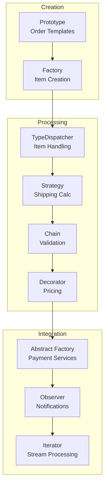

# Enterprise Order Processing Demo

A comprehensive demonstration showing 9 GoF patterns working together in a real-world e-commerce order processing system.

Source: `src/PatternKit.Examples/EnterpriseDemo/EnterpriseOrderDemo.cs`

---

## Scenario

Process e-commerce orders through multiple stages:
1. Create orders from reusable templates
2. Add different item types (physical, digital, subscription)
3. Calculate shipping based on method and weight
4. Validate orders through a pipeline
5. Calculate final price with taxes and discounts
6. Process payments via region-specific processors
7. Notify systems of status changes
8. Stream-process pending orders

---

## Quick Start

```csharp
using PatternKit.Examples.EnterpriseDemo;

// Run the complete demonstration
EnterpriseOrderDemo.Run();
```

---

## Patterns Used

| Pattern | Role in Demo |
|---------|--------------|
| **Prototype** | Create orders from templates with mutations |
| **Factory** | Create order items by type string |
| **TypeDispatcher** | Process items differently by concrete type |
| **Strategy** | Calculate shipping costs based on method |
| **Chain of Responsibility** | Validate orders through sequential checks |
| **Decorator** | Layer price adjustments (subtotal → shipping → tax → discount) |
| **Abstract Factory** | Region-specific payment & fraud services |
| **Observer** | Notify multiple systems of status changes |
| **Iterator/Flow** | Filter and process order streams |

---

## Pattern Map



---

## Code Walkthrough

### 1. Prototype Pattern — Order Templates

```csharp
public static Prototype<string, Order> CreateOrderTemplates()
{
    var standardOrder = new Order
    {
        Id = "template-std",
        CustomerId = "TEMPLATE",
        Region = Region.NorthAmerica,
        ShippingMethod = ShippingMethod.Standard
    };

    return Prototype<string, Order>.Create()
        .Map("standard", standardOrder, Order.DeepClone)
        .Map("express", expressOrder, Order.DeepClone)
        .Mutate("express", o => o.ShippingCost = 15.00m)
        .Default(standardOrder, Order.DeepClone)
        .Build();
}

// Usage: Quick order creation
var order = orderTemplates.Create("standard", o =>
{
    o.CustomerId = "CUST-001";
    o.Region = Region.NorthAmerica;
});
```

**Why Prototype**: Orders share common structure. Templates let you create many orders quickly with consistent defaults.

### 2. Factory Pattern — Item Creation

```csharp
public static Factory<string, OrderItem> CreateOrderItemFactory()
{
    return Factory<string, OrderItem>.Create()
        .Map("physical", () => new PhysicalItem("SKU-PHY", "Physical Product", 29.99m, 1, 0.5))
        .Map("digital", () => new DigitalItem("SKU-DIG", "Digital Download", 9.99m, 1, "https://..."))
        .Map("subscription", () => new SubscriptionItem("SKU-SUB", "Monthly", 14.99m, 1, 12))
        .Build();
}
```

**Why Factory**: Items are created by type string (from API, config, database). Factory maps strings to concrete types.

### 3. TypeDispatcher Pattern — Item Processing

```csharp
public static TypeDispatcher<OrderItem, string> CreateItemProcessor()
{
    return TypeDispatcher<OrderItem, string>.Create()
        .On<PhysicalItem>(item =>
            $"📦 Physical: {item.Name} ({item.WeightKg}kg) - Requires shipping")
        .On<DigitalItem>(item =>
            $"💾 Digital: {item.Name} - Download ready at {item.DownloadUrl}")
        .On<SubscriptionItem>(item =>
            $"🔄 Subscription: {item.Name} - {item.MonthsDuration} months")
        .Default(item => $"❓ Unknown: {item.Name}")
        .Build();
}

// Usage
foreach (var item in order.Items)
{
    var result = itemProcessor.Dispatch(item);
    Console.WriteLine(result);
}
```

**Why TypeDispatcher**: Different item types need different processing. TypeDispatcher routes by runtime type without switch statements.

### 4. Strategy Pattern — Shipping Calculation

```csharp
public static Strategy<Order, decimal> CreateShippingStrategy()
{
    return Strategy<Order, decimal>.Create()
        .When(o => o.ShippingMethod == ShippingMethod.Standard)
            .Then(o =>
            {
                var weight = o.Items.OfType<PhysicalItem>().Sum(i => i.WeightKg * i.Quantity);
                return (decimal)(weight * 2.5 + 5.0);
            })
        .When(o => o.ShippingMethod == ShippingMethod.Express)
            .Then(o =>
            {
                var weight = o.Items.OfType<PhysicalItem>().Sum(i => i.WeightKg * i.Quantity);
                return (decimal)(weight * 5.0 + 15.0);
            })
        .When(o => o.ShippingMethod == ShippingMethod.NextDay)
            .Then(o =>
            {
                var weight = o.Items.OfType<PhysicalItem>().Sum(i => i.WeightKg * i.Quantity);
                return (decimal)(weight * 10.0 + 30.0);
            })
        .Default(_ => 5.0m)
        .Build();
}
```

**Why Strategy**: Shipping rates vary by method. Strategy encapsulates each calculation algorithm.

### 5. Chain of Responsibility — Order Validation

```csharp
public static ResultChain<Order, ValidationResult> CreateValidationChain()
{
    return ResultChain<Order, ValidationResult>.Create()
        .When(o => o.Items.Count == 0)
            .Then(_ => new ValidationResult(false, "Order must have at least one item"))
        .When(o => o.Items.Any(i => i.Quantity <= 0))
            .Then(_ => new ValidationResult(false, "Invalid quantities found"))
        .When(o => o.Subtotal > 50000)
            .Then(_ => new ValidationResult(false, "Order exceeds $50,000 limit"))
        .Finally((in Order _, out ValidationResult? result, _) =>
        {
            result = new ValidationResult(true, null);
            return true;
        })
        .Build();
}
```

**Why Chain**: Multiple validation rules execute sequentially. Chain provides early exit on first failure.

### 6. Decorator Pattern — Price Calculation

```csharp
public static Decorator<Order, decimal> CreatePriceCalculator()
{
    return Decorator<Order, decimal>.Create(o => o.Subtotal)
        // Add shipping
        .After((o, price) => price + o.ShippingCost)
        // Apply regional tax
        .After((o, price) =>
        {
            var taxRate = o.Region switch
            {
                Region.NorthAmerica => 0.08m,
                Region.Europe => 0.20m,
                Region.Asia => 0.10m,
                _ => 0.0m
            };
            return price * (1 + taxRate);
        })
        // Apply discount
        .After((o, price) => price - o.Discount)
        .Build();
}
```

**Why Decorator**: Price calculation layers multiple transformations. Decorator composes them cleanly.

### 7. Abstract Factory — Regional Payment Services

```csharp
public static AbstractFactory<Region> CreatePaymentFactory()
{
    return AbstractFactory<Region>.Create()
        .Family(Region.NorthAmerica)
            .Product<IPaymentProcessor>(() => new StripeProcessor())
            .Product<IFraudDetector>(() => new USFraudDetector())
        .Family(Region.Europe)
            .Product<IPaymentProcessor>(() => new PayPalProcessor())
            .Product<IFraudDetector>(() => new EUFraudDetector())
        .Family(Region.Asia)
            .Product<IPaymentProcessor>(() => new AlipayProcessor())
            .Product<IFraudDetector>(() => new AsiaFraudDetector())
        .Build();
}

// Usage
var services = paymentFactory.GetFamily(order.Region);
var processor = services.Create<IPaymentProcessor>();
var fraudCheck = services.Create<IFraudDetector>();

if (!fraudCheck.IsFraudulent(order))
{
    processor.ProcessPayment(finalPrice);
}
```

**Why Abstract Factory**: Each region needs matching payment and fraud services. Abstract Factory ensures compatible product families.

### 8. Observer Pattern — Status Notifications

```csharp
public static Observer<OrderStatusChange> CreateOrderNotifications()
{
    var observer = Observer<OrderStatusChange>.Create().Build();

    // Email notification - all changes
    observer.Subscribe(change =>
        Console.WriteLine($"📧 Email: Order {change.Order.Id} → {change.NewStatus}"));

    // SMS - shipped orders only
    observer.Subscribe(
        c => c.NewStatus == OrderStatus.Shipped,
        change => Console.WriteLine($"📱 SMS: Order {change.Order.Id} shipped!"));

    // Analytics - all changes
    observer.Subscribe(change =>
        Console.WriteLine($"📊 Analytics: {change.Order.Id} recorded"));

    return observer;
}

// Usage
order.Status = OrderStatus.Shipped;
orderNotifications.Publish(new OrderStatusChange(order, oldStatus, newStatus));
```

**Why Observer**: Multiple systems need notifications without coupling. Observer broadcasts to all subscribers.

### 9. Iterator/Flow Pattern — Stream Processing

```csharp
public static Flow<Order> CreateOrderProcessingPipeline(IEnumerable<Order> orders)
{
    return Flow<Order>.From(orders)
        .Filter(o => o.Status == OrderStatus.Pending)
        .Filter(o => o.Items.Count > 0);
}

// Usage
var pendingOrders = CreateOrderProcessingPipeline(allOrders).ToList();
foreach (var order in pendingOrders)
{
    ProcessOrder(order);
}
```

**Why Iterator/Flow**: Process order streams lazily with filters. Flow composes filtering operations.

---

## Sample Output

```
╔═══════════════════════════════════════════════════════════════════════════╗
║         ENTERPRISE ORDER PROCESSING SYSTEM DEMONSTRATION                  ║
╚═══════════════════════════════════════════════════════════════════════════╝

▶ Step 1: Create Orders from Templates (Prototype Pattern)
  Created order ORD-a1b2c3d4 (Standard, North America)
  Created order ORD-e5f6g7h8 (Express, Europe)

▶ Step 3: Process Items by Type (TypeDispatcher Pattern)
  📦 Physical: Wireless Mouse (0.2kg) - Requires shipping
  📦 Physical: Mechanical Keyboard (1.2kg) - Requires shipping
  💾 Digital: Software License - Download ready at https://...

▶ Step 4: Calculate Shipping Costs (Strategy Pattern)
  Order 1 (Standard): $8.50
  Order 2 (Express): $16.50

▶ Step 5: Validate Orders (Chain of Responsibility Pattern)
  Order 1: ✓ Valid
  Order 2: ✓ Valid

▶ Step 6: Calculate Final Prices (Decorator Pattern)
  Order 1: Subtotal=$429.96 + Shipping=$8.50 + Tax - Discount=$20.00
           Final Price = $453.13

▶ Step 7: Process Payments (Abstract Factory Pattern)
  Processing Order 1 (US) with Stripe:
    🔍 US Fraud Detection: Checking order...
    💳 Stripe: Processing $453.13...

▶ Step 8: Send Notifications (Observer Pattern)
    📧 Email: Order ORD-a1b2c3d4 status changed to Processing
    📊 Analytics: Recorded status change for ORD-a1b2c3d4
```

---

## Pattern Comparison

| Need | Pattern | Why |
|------|---------|-----|
| Create similar objects | Prototype | Clone templates, apply mutations |
| Create by type name | Factory | Map strings to concrete types |
| Route by runtime type | TypeDispatcher | Type-safe dispatch without switches |
| Select algorithm | Strategy | Predicate-based selection |
| Sequential validation | Chain | Early exit, decoupled handlers |
| Layer transformations | Decorator | Compose before/after/around |
| Related service families | Abstract Factory | Ensure compatible products |
| Broadcast events | Observer | Decouple publishers from subscribers |
| Process streams | Iterator/Flow | Lazy filtering and transformation |

---

## Extending the Demo

- **Add fraud scoring**: Use `Decorator` to layer fraud checks with risk scores
- **Multi-currency**: Extend `Strategy` with currency conversion rules
- **Order history**: Add `Memento` for order state snapshots
- **Async payments**: Use `AsyncProxy` for payment processing with timeout

---

## See Also

- [Patterns Showcase](patterns-showcase.md) — 7-pattern integrated demo
- [Pricing Calculator](pricing-calculator.md) — Chain + Strategy pricing
- [Payment Processor Decorator](payment-processor-decorator.md) — Decorator layers
