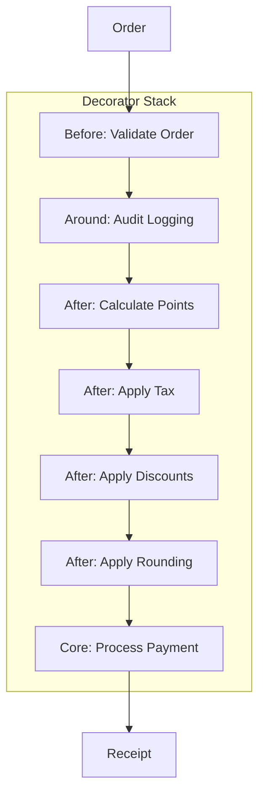

# Point of Sale - Decorator Pattern Demo

A comprehensive demonstration of the Decorator pattern building a flexible payment processing pipeline for retail and e-commerce scenarios.

Source: `src/PatternKit.Examples/PointOfSale/`

---

## Scenario

Build a payment processing system that can:
1. Calculate subtotals from line items
2. Apply various discounts (loyalty, employee, birthday, promotional)
3. Calculate taxes based on store location
4. Round totals using different strategies (banker's, nickel, etc.)
5. Track loyalty points earned
6. Log transactions for audit

---

## Quick Start

```csharp
using PatternKit.Examples.PointOfSale;

// Run all demonstration scenarios
Demo.Run();

// Or create a specific processor
var processor = PaymentProcessorDemo.CreateEcommerceProcessor(promotions);
var receipt = processor.Execute(order);
```

---

## Pattern Used

The **Decorator** pattern layers responsibilities onto a base payment processor:



---

## Processor Configurations

### 1. Simple Processor (Tax Only)

```csharp
public static Decorator<PurchaseOrder, PaymentReceipt> CreateSimpleProcessor()
{
    return Decorator<PurchaseOrder, PaymentReceipt>.Create(ProcessBasicPayment)
        .After(ApplyTaxCalculation)
        .Build();
}
```

**Use case**: Small businesses with straightforward tax requirements.

### 2. Standard Retail Processor

```csharp
public static Decorator<PurchaseOrder, PaymentReceipt> CreateStandardRetailProcessor()
{
    return Decorator<PurchaseOrder, PaymentReceipt>.Create(ProcessBasicPayment)
        .After(ApplyRounding(RoundingStrategy.Bankers))
        .After(ApplyTaxCalculation)
        .Build();
}
```

**Use case**: Retail stores needing tax calculation and proper rounding.

### 3. E-Commerce Processor (Full Featured)

```csharp
public static Decorator<PurchaseOrder, PaymentReceipt> CreateEcommerceProcessor(
    List<PromotionConfig> activePromotions)
{
    return Decorator<PurchaseOrder, PaymentReceipt>.Create(ProcessBasicPayment)
        .Before(ValidateOrder)                          // Input validation
        .After(ApplyRounding(RoundingStrategy.Bankers)) // Round totals
        .After(CalculateLoyaltyPoints)                  // Earn points
        .After(ApplyTaxCalculation)                     // Calculate taxes
        .After(ApplyLoyaltyDiscount)                    // Tier discounts
        .After(ApplyPromotionalDiscounts(activePromotions)) // Campaign discounts
        .Around(AddAuditLogging)                        // Full audit trail
        .Build();
}
```

**Use case**: E-commerce platforms with loyalty programs and promotional campaigns.

### 4. Cash Register Processor (Nickel Rounding)

```csharp
public static Decorator<PurchaseOrder, PaymentReceipt> CreateCashRegisterProcessor()
{
    return Decorator<PurchaseOrder, PaymentReceipt>.Create(ProcessBasicPayment)
        .After(ApplyRounding(RoundingStrategy.ToNickel)) // For penny-less countries
        .After(ApplyTaxCalculation)
        .After(ApplyEmployeeDiscount)
        .Around(AddTransactionLogging)
        .Build();
}
```

**Use case**: Countries that have eliminated penny currency (Canada, Australia).

### 5. Conditional Birthday Processor

```csharp
public static Decorator<PurchaseOrder, PaymentReceipt> CreateBirthdaySpecialProcessor(
    PurchaseOrder order)
{
    var builder = Decorator<PurchaseOrder, PaymentReceipt>.Create(ProcessBasicPayment)
        .After(ApplyRounding(RoundingStrategy.Bankers));

    // Conditionally add loyalty decorators
    if (!string.IsNullOrEmpty(order.Customer.LoyaltyTier))
    {
        builder = builder.After(CalculateLoyaltyPoints);
    }

    builder = builder.After(ApplyTaxCalculation);

    if (!string.IsNullOrEmpty(order.Customer.LoyaltyTier))
    {
        builder = builder.After(ApplyLoyaltyDiscount);
    }

    // Birthday discount if it's their birthday month
    if (IsBirthdayMonth(order.Customer))
    {
        builder = builder.After(ApplyBirthdayDiscount);
    }

    return builder.Build();
}
```

**Use case**: Personalized pricing based on customer attributes.

---

## Decorator Types Demonstrated

### Before Decorator — Input Validation

```csharp
private static PurchaseOrder ValidateOrder(PurchaseOrder order)
{
    if (order.Items.Count == 0)
        throw new InvalidOperationException("Order must have at least one item");

    if (order.Items.Any(i => i.Quantity <= 0))
        throw new InvalidOperationException("Item quantities must be positive");

    return order; // Pass through if valid
}
```

### After Decorator — Tax Calculation

```csharp
private static PaymentReceipt ApplyTaxCalculation(PurchaseOrder order, PaymentReceipt receipt)
{
    var taxableSubtotal = receipt.Subtotal - receipt.DiscountAmount;
    var totalTax = 0m;

    foreach (var item in order.Items.Where(i => !i.IsTaxExempt))
    {
        var stateTax = itemAmount * order.Store.StateTaxRate;
        var localTax = itemAmount * order.Store.LocalTaxRate;
        totalTax += stateTax + localTax;
    }

    return receipt with
    {
        TaxAmount = totalTax,
        FinalTotal = receipt.Subtotal - receipt.DiscountAmount + totalTax
    };
}
```

### After Decorator (Factory) — Promotional Discounts

```csharp
private static Decorator<PurchaseOrder, PaymentReceipt>.AfterTransform
    ApplyPromotionalDiscounts(List<PromotionConfig> promotions)
{
    return (order, receipt) =>
    {
        var totalDiscount = receipt.DiscountAmount;

        foreach (var promo in promotions.Where(p => p.IsValid(order.OrderDate)))
        {
            if (receipt.Subtotal >= promo.MinimumPurchase)
            {
                var discount = promo.DiscountPercent > 0
                    ? receipt.Subtotal * promo.DiscountPercent
                    : promo.DiscountAmount;
                totalDiscount += discount;
            }
        }

        return receipt with { DiscountAmount = totalDiscount };
    };
}
```

### After Decorator (Factory) — Rounding Strategies

```csharp
private static Decorator<PurchaseOrder, PaymentReceipt>.AfterTransform ApplyRounding(
    RoundingStrategy strategy)
{
    return (_, receipt) =>
    {
        var roundedTotal = strategy switch
        {
            RoundingStrategy.Bankers => Math.Round(receipt.FinalTotal, 2, MidpointRounding.ToEven),
            RoundingStrategy.Up => Math.Ceiling(receipt.FinalTotal * 100) / 100,
            RoundingStrategy.Down => Math.Floor(receipt.FinalTotal * 100) / 100,
            RoundingStrategy.ToNickel => Math.Round(receipt.FinalTotal * 20) / 20,
            RoundingStrategy.ToDime => Math.Round(receipt.FinalTotal * 10) / 10,
            _ => receipt.FinalTotal
        };

        return receipt with { FinalTotal = roundedTotal };
    };
}
```

### Around Decorator — Audit Logging

```csharp
private static PaymentReceipt AddAuditLogging(
    PurchaseOrder order,
    Decorator<PurchaseOrder, PaymentReceipt>.Component next)
{
    var startTime = DateTime.UtcNow;
    Console.WriteLine($"[AUDIT] Starting payment for order {order.OrderId}");

    try
    {
        var receipt = next(order); // Call the rest of the pipeline
        var elapsed = DateTime.UtcNow - startTime;

        Console.WriteLine($"[AUDIT] Completed in {elapsed.TotalMilliseconds:F2}ms");
        Console.WriteLine($"[AUDIT] Total: ${receipt.FinalTotal:F2}");

        return receipt;
    }
    catch (Exception ex)
    {
        Console.WriteLine($"[AUDIT] Failed: {ex.Message}");
        throw;
    }
}
```

---

## Sample Output

```
SCENARIO 3: E-commerce - Full Featured with Promotions
───────────────────────────────────────────────────────────────
[AUDIT] Starting payment processing for order ORD-003
[AUDIT] Customer: CUST-003 (Tier: Gold)
[AUDIT] Items: 3, Store: STORE-001

Scenario: E-commerce (Full Featured)
Order ID: ORD-003

Items:
  1x Programming Patterns              $  49.99 = $   49.99
  2x T-Shirt                           $  19.99 = $   39.98
  1x Laptop Computer                   $ 899.99 = $  899.99
     Discount:                                  -$   89.99

─────────────────────────────────────────────────────────────────
Subtotal:                                        $    989.96
Total Discounts:                                 -$   188.99
  • Fall Sale - 10% off electronics
  • $20 off orders over $100
  • Gold Member Discount
Tax:                                             $     68.08
═════════════════════════════════════════════════════════════════
TOTAL:                                           $    869.05
═════════════════════════════════════════════════════════════════

💰 Loyalty Points Earned: 1201 points

Processing Log:
  ℹ Payment processing started at 2024-12-31 10:30:00 UTC
  ℹ Loyalty points earned: 1201 (1.5x multiplier)
  ℹ Tax calculated: $68.08 (State: 7.25%, Local: 1.25%)
  ℹ Loyalty discount (Gold): -10% (-$98.99)
  ℹ Promotion applied: Fall Sale - 10% off electronics (-$89.99)
  ℹ Payment processing completed in 12ms

[AUDIT] Payment processed successfully in 12.34ms
[AUDIT] Final total: $869.05
```

---

## Domain Types

```csharp
public record PurchaseOrder
{
    public required string OrderId { get; set; }
    public required CustomerInfo Customer { get; set; }
    public required StoreLocation Store { get; set; }
    public List<OrderLineItem> Items { get; set; } = [];
    public DateTime OrderDate { get; set; } = DateTime.UtcNow;
}

public record CustomerInfo
{
    public required string CustomerId { get; set; }
    public string? LoyaltyTier { get; set; }        // Silver, Gold, Platinum
    public decimal LoyaltyPoints { get; set; }
    public DateTime? BirthDate { get; set; }
    public bool IsEmployee { get; set; }
}

public record StoreLocation
{
    public required string StoreId { get; set; }
    public required string State { get; set; }
    public required string Country { get; set; }
    public decimal StateTaxRate { get; set; }
    public decimal LocalTaxRate { get; set; }
}

public record PaymentReceipt
{
    public string OrderId { get; set; } = "";
    public decimal Subtotal { get; set; }
    public decimal TaxAmount { get; set; }
    public decimal DiscountAmount { get; set; }
    public decimal LoyaltyPointsEarned { get; set; }
    public decimal FinalTotal { get; set; }
    public List<string> AppliedPromotions { get; set; } = [];
    public List<ReceiptLineItem> LineItems { get; set; } = [];
    public List<string> ProcessingLog { get; set; } = [];
}
```

---

## Key Takeaways

### Decorator Execution Order

Decorators execute in **registration order** for Before/Around, and **reverse** for After:

```csharp
.Before(A)      // Executes 1st
.Before(B)      // Executes 2nd
.After(C)       // Executes 4th (receives output last)
.After(D)       // Executes 3rd (receives output first)
.Around(E)      // Wraps the entire execution
```

### Composability

Each decorator is independent and reusable:

```csharp
// Create different configurations by mixing decorators
var simple = Decorator<...>.Create(base).After(tax).Build();
var full = Decorator<...>.Create(base).Before(validate).After(tax).After(discount).Build();
```

### Conditional Decorators

Build processors dynamically based on runtime conditions:

```csharp
var builder = Decorator<...>.Create(base);
if (customer.HasLoyalty) builder = builder.After(loyaltyDiscount);
if (customer.IsBirthday) builder = builder.After(birthdayDiscount);
return builder.Build();
```

---

## Extending the Demo

- **Add currency conversion**: After decorator for international orders
- **Add gift wrapping**: Before decorator to add line items
- **Add fraud detection**: Around decorator that can short-circuit
- **Add split payments**: After decorator to handle multiple tenders

---

## See Also

- [Decorator Pattern Guide](../patterns/structural/decorator/guide.md)
- [Decorator API Reference](../patterns/structural/decorator/api-reference.md)
- [Enterprise Order Demo](enterprise-order.md) — Multi-pattern integration
