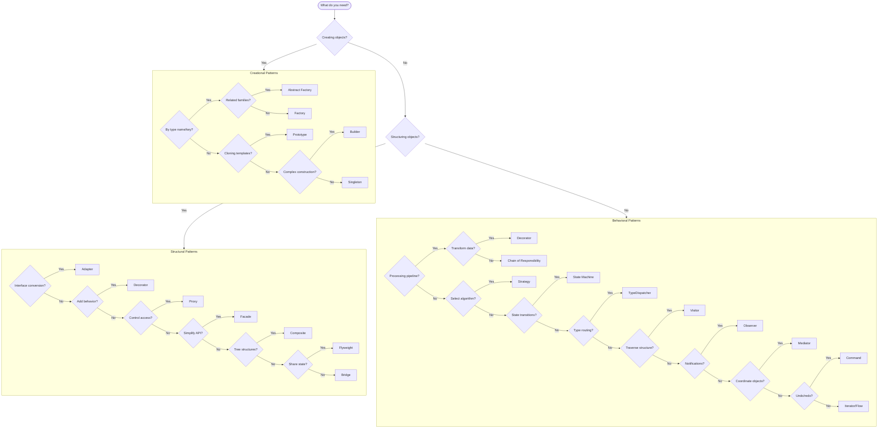

# Choosing the Right Pattern

A decision guide for selecting appropriate PatternKit patterns for your use case.

---

## Quick Reference Matrix

| If You Need To... | Consider |
|-------------------|----------|
| Create objects by type name | [Factory](#factory) |
| Create families of related objects | [Abstract Factory](#abstract-factory) |
| Clone and customize templates | [Prototype](#prototype) |
| Build complex objects step-by-step | [Builder](#builder) |
| Ensure single instance | [Singleton](#singleton) |
| Convert interfaces | [Adapter](#adapter) |
| Separate abstraction from implementation | [Bridge](#bridge) |
| Treat individual/group uniformly | [Composite](#composite) |
| Add behavior dynamically | [Decorator](#decorator) |
| Simplify complex subsystems | [Facade](#facade) |
| Share common state efficiently | [Flyweight](#flyweight) |
| Control access to objects | [Proxy](#proxy) |
| Process through handlers sequentially | [Chain of Responsibility](#chain-of-responsibility) |
| Encapsulate operations | [Command](#command) |
| Build domain-specific languages | [Interpreter](#interpreter) |
| Process collections lazily | [Iterator/Flow](#iteratorflow) |
| Coordinate multiple objects | [Mediator](#mediator) |
| Capture and restore state | [Memento](#memento) |
| Notify on changes | [Observer](#observer) |
| Select algorithms dynamically | [Strategy](#strategy) |
| Manage object lifecycle states | [State Machine](#state-machine) |
| Define algorithm skeleton | [Template Method](#template-method) |
| Route by runtime type | [TypeDispatcher](#typedispatcher) |
| Traverse object structures | [Visitor](#visitor) |

---

## Decision Tree



---

## Pattern Categories

### Creational Patterns

#### Factory

**Use when**:
- Creating objects by type name/key from config or API
- Object creation logic should be centralized
- You want to decouple creation from usage

**Example scenario**: Plugin systems, report generators, shape factories

```csharp
var factory = Factory<string, IShape>.Create()
    .Map("circle", () => new Circle())
    .Map("square", () => new Square())
    .Build();

var shape = factory.Create("circle");
```

**See**: [Factory Documentation](../patterns/creational/factory/index.md)

---

#### Abstract Factory

**Use when**:
- Creating families of related objects
- Objects must be compatible with each other
- You need to swap entire product families

**Example scenario**: Cross-platform UI, database providers, cloud services

```csharp
var factory = AbstractFactory<Platform>.Create()
    .Family(Platform.Windows)
        .Product<IButton>(() => new WindowsButton())
        .Product<ICheckbox>(() => new WindowsCheckbox())
    .Family(Platform.MacOS)
        .Product<IButton>(() => new MacButton())
        .Product<ICheckbox>(() => new MacCheckbox())
    .Build();

var family = factory.GetFamily(Platform.Windows);
var button = family.Create<IButton>();
```

**See**: [Abstract Factory Documentation](../patterns/creational/abstract-factory/index.md)

---

#### Prototype

**Use when**:
- Creating many similar objects from templates
- Object creation is expensive
- You want to customize clones with mutations

**Example scenario**: Game entities, document templates, test fixtures

```csharp
var templates = Prototype<string, Order>.Create()
    .Map("express", expressOrder, Order.DeepClone)
    .Mutate("express", o => o.Priority = Priority.High)
    .Build();

var order = templates.Create("express", o => o.CustomerId = "CUST-001");
```

**See**: [Prototype Documentation](../patterns/creational/prototype/index.md)

---

#### Builder

**Use when**:
- Constructing complex objects step-by-step
- You want fluent, readable construction
- Object has many optional parameters

**Example scenario**: Query builders, configuration objects, complex DTOs

```csharp
var email = Builder<Email>.Create()
    .With(e => e.To, "user@example.com")
    .With(e => e.Subject, "Hello")
    .With(e => e.Body, "Message content")
    .Build();
```

**See**: [Builder Documentation](../patterns/creational/builder/index.md)

---

#### Singleton

**Use when**:
- Exactly one instance must exist
- Global access point is needed
- Lazy initialization is desired

**Example scenario**: Configuration, logging, connection pools

```csharp
var singleton = Singleton<AppConfig>.Create(() => new AppConfig())
    .Build();

var config = singleton.Instance;
```

**See**: [Singleton Documentation](../patterns/creational/singleton/index.md)

---

### Structural Patterns

#### Adapter

**Use when**:
- Converting between incompatible interfaces
- Wrapping legacy code with modern API
- Integrating third-party libraries

**Example scenario**: Legacy system integration, API versioning

```csharp
var adapter = Adapter<LegacyData, ModernDto>.Create(
        legacy => new ModernDto(legacy.OldField))
    .Build();

var modern = adapter.Adapt(legacyData);
```

**See**: [Adapter Documentation](../patterns/structural/adapter/index.md)

---

#### Bridge

**Use when**:
- Abstraction and implementation should vary independently
- Avoiding class explosion from combinations
- Runtime switching of implementations

**Example scenario**: Multi-channel notifications, rendering engines

```csharp
var bridge = Bridge<Message, IChannel, bool>.Create()
    .Abstraction((msg, channel) => channel.Send(msg))
    .Build();

bridge.Execute(message, emailChannel);
bridge.Execute(message, smsChannel);
```

**See**: [Bridge Documentation](../patterns/structural/bridge/index.md)

---

#### Composite

**Use when**:
- Treating individual objects and compositions uniformly
- Building tree structures
- Recursive operations on hierarchies

**Example scenario**: File systems, UI components, organization charts

```csharp
var composite = Composite<FileSystemNode, long>.Create(
        leaf => leaf.Size,
        children => children.Sum())
    .Build();

var totalSize = composite.Calculate(rootFolder);
```

**See**: [Composite Documentation](../patterns/structural/composite/index.md)

---

#### Decorator

**Use when**:
- Adding responsibilities dynamically
- Behavior composition is needed
- Avoiding subclass explosion

**Example scenario**: Logging, caching, validation layers, middleware

```csharp
var processor = Decorator<Request, Response>.Create(HandleRequest)
    .Before(ValidateRequest)
    .After((req, resp) => AddHeaders(resp))
    .Around(AddLogging)
    .Build();
```

**See**: [Decorator Documentation](../patterns/structural/decorator/index.md)

---

#### Facade

**Use when**:
- Simplifying complex subsystem access
- Providing unified API
- Reducing coupling to subsystems

**Example scenario**: Order processing, media conversion, reporting

```csharp
var facade = Facade<OrderRequest, OrderResult>.Create()
    .Operation("submit", ProcessOrder)
    .Operation("cancel", CancelOrder)
    .Build();

var result = facade.Execute("submit", request);
```

**See**: [Facade Documentation](../patterns/structural/facade/index.md)

---

#### Flyweight

**Use when**:
- Many similar objects consume too much memory
- Intrinsic state can be shared
- Extrinsic state is passed at runtime

**Example scenario**: Text rendering, game particles, connection pooling

```csharp
var flyweight = Flyweight<char, GlyphData>.Create(
        ch => LoadGlyph(ch))
    .Build();

var glyph = flyweight.Get('A'); // Cached after first access
```

**See**: [Flyweight Documentation](../patterns/structural/flyweight/index.md)

---

#### Proxy

**Use when**:
- Controlling access to expensive objects
- Adding lazy initialization
- Security, caching, or logging wrappers

**Example scenario**: Remote services, lazy loading, access control

```csharp
// Virtual proxy (lazy init)
var proxy = Proxy<Query, Result>.Create()
    .VirtualProxy(() => new ExpensiveService())
    .CachingProxy()
    .LoggingProxy(Console.WriteLine)
    .Build();
```

**See**: [Proxy Documentation](../patterns/structural/proxy/index.md)

---

### Behavioral Patterns

#### Chain of Responsibility

**Use when**:
- Request should pass through handlers
- Handlers can process or pass along
- Decoupling sender from receivers

**Example scenario**: Middleware pipelines, validation chains, approval workflows

```csharp
var chain = ResultChain<Request, Response>.Create()
    .When(r => !r.IsValid)
        .Then(_ => new Response("Invalid"))
    .When(r => r.NeedsAuth)
        .Then(Authenticate)
    .Finally(Process)
    .Build();
```

**See**: [Chain Documentation](../patterns/behavioral/chain/index.md)

---

#### Command

**Use when**:
- Encapsulating requests as objects
- Supporting undo/redo
- Queuing or logging operations

**Example scenario**: Text editors, transaction systems, macro recording

```csharp
var command = Command<TextDocument>.Create()
    .Execute(doc => doc.Insert("Hello"))
    .Undo(doc => doc.Delete(5))
    .Build();

command.Execute(document);
command.Undo(document);
```

**See**: [Command Documentation](../patterns/behavioral/command/index.md)

---

#### Interpreter

**Use when**:
- Implementing domain-specific languages
- Parsing and evaluating expressions
- Building rule engines

**Example scenario**: Query languages, pricing rules, formula evaluation

```csharp
var interpreter = Interpreter<PricingContext, decimal>.Create()
    .Terminal("base", ctx => ctx.BasePrice)
    .Terminal("discount", ctx => ctx.DiscountPercent)
    .NonTerminal("final", (ctx, results) =>
        results["base"] * (1 - results["discount"]))
    .Build();
```

**See**: [Interpreter Documentation](../patterns/behavioral/interpreter/index.md)

---

#### Iterator/Flow

**Use when**:
- Processing collections lazily
- Filtering and transforming streams
- Memory-efficient data processing

**Example scenario**: Log processing, data pipelines, report generation

```csharp
var flow = Flow<Order>.From(orders)
    .Filter(o => o.Status == Status.Pending)
    .Filter(o => o.Total > 100);

foreach (var order in flow)
    Process(order);
```

**See**: [Iterator Documentation](../patterns/behavioral/iterator/index.md)

---

#### Mediator

**Use when**:
- Reducing direct coupling between objects
- Centralizing complex communications
- Implementing request/response patterns

**Example scenario**: Chat rooms, CQRS handlers, UI component coordination

```csharp
var mediator = Mediator<IRequest, IResponse>.Create()
    .Handler<CreateOrder, OrderResult>(HandleCreate)
    .Handler<GetOrder, OrderResult>(HandleGet)
    .Build();

var result = await mediator.Send(new CreateOrder(...));
```

**See**: [Mediator Documentation](../patterns/behavioral/mediator/index.md)

---

#### Memento

**Use when**:
- Capturing object state for later restoration
- Implementing undo/redo
- Creating checkpoints

**Example scenario**: Document editors, game save states, transaction rollback

```csharp
var memento = Memento<Document>.Create(
        doc => doc.Serialize(),
        data => Document.Deserialize(data))
    .Build();

var snapshot = memento.Save(document);
// ... make changes ...
memento.Restore(document, snapshot);
```

**See**: [Memento Documentation](../patterns/behavioral/memento/index.md)

---

#### Observer

**Use when**:
- Objects need to be notified of changes
- Publishers shouldn't know subscribers
- Event-driven architecture

**Example scenario**: UI updates, event sourcing, monitoring systems

```csharp
var observer = Observer<PriceChange>.Create().Build();

observer.Subscribe(change => UpdateUI(change));
observer.Subscribe(
    change => change.PercentChange > 5,
    change => SendAlert(change));

observer.Publish(new PriceChange(stock, 10.5m));
```

**See**: [Observer Documentation](../patterns/behavioral/observer/index.md)

---

#### Strategy

**Use when**:
- Multiple algorithms for same task
- Algorithm should be selected at runtime
- Encapsulating business rules

**Example scenario**: Pricing, shipping, validation, sorting

```csharp
var strategy = Strategy<Order, decimal>.Create()
    .When(o => o.IsExpress).Then(CalculateExpressShipping)
    .When(o => o.Total > 100).Then(_ => 0m) // Free shipping
    .Default(CalculateStandardShipping)
    .Build();

var cost = strategy.Execute(order);
```

**See**: [Strategy Documentation](../patterns/behavioral/strategy/index.md)

---

#### State Machine

**Use when**:
- Object behavior depends on state
- Managing state transitions
- Ensuring valid state sequences

**Example scenario**: Order processing, workflow engines, game states

```csharp
var machine = StateMachine<OrderState, OrderEvent>.Create()
    .State(OrderState.Pending)
        .On(OrderEvent.Pay).TransitionTo(OrderState.Paid)
        .On(OrderEvent.Cancel).TransitionTo(OrderState.Cancelled)
    .State(OrderState.Paid)
        .On(OrderEvent.Ship).TransitionTo(OrderState.Shipped)
    .Build();
```

**See**: [State Machine Documentation](../patterns/behavioral/state/index.md)

---

#### Template Method

**Use when**:
- Algorithm skeleton with customizable steps
- Common structure with variable parts
- Enforcing step order

**Example scenario**: Data processing, report generation, ETL pipelines

```csharp
var template = Template<DataFile, Report>.Create()
    .Step(LoadData)
    .Step(ValidateData)
    .Step(TransformData)
    .Step(GenerateReport)
    .Build();
```

**See**: [Template Method Documentation](../patterns/behavioral/template/index.md)

---

#### TypeDispatcher

**Use when**:
- Routing by runtime type
- Type-safe alternative to switch statements
- Processing heterogeneous collections

**Example scenario**: Shape rendering, message handling, AST processing

```csharp
var dispatcher = TypeDispatcher<Shape, double>.Create()
    .On<Circle>(c => Math.PI * c.Radius * c.Radius)
    .On<Rectangle>(r => r.Width * r.Height)
    .Default(_ => 0)
    .Build();

var area = dispatcher.Dispatch(shape);
```

**See**: [TypeDispatcher Documentation](../patterns/behavioral/type-dispatcher/index.md)

---

#### Visitor

**Use when**:
- Operations on object structures
- Adding operations without changing classes
- Processing complex hierarchies

**Example scenario**: AST processing, document export, validation

```csharp
var visitor = Visitor<AstNode>.Create()
    .Visit<FunctionNode>(ProcessFunction)
    .Visit<VariableNode>(ProcessVariable)
    .Build();

visitor.Accept(rootNode);
```

**See**: [Visitor Documentation](../patterns/behavioral/visitor/index.md)

---

## Common Combinations

### Pipeline Processing
**Chain + Decorator + Strategy**

Request flows through validation chain, gets decorated with logging/caching, uses strategy to select processing algorithm.

### Event-Driven Systems
**Observer + Mediator + Command**

Observer broadcasts events, Mediator routes to handlers, Commands encapsulate operations for undo/redo.

### Object Creation
**Factory + Prototype + Builder**

Factory creates by type, Prototype clones templates, Builder assembles complex objects.

### Access Control
**Proxy + Facade + Adapter**

Proxy controls access, Facade simplifies interface, Adapter converts between systems.

---

## Anti-Patterns to Avoid

### Over-Engineering
Don't use patterns when simple code suffices:
```csharp
// Overkill for simple case
var factory = Factory<string, string>.Create()
    .Map("hello", () => "Hello, World!")
    .Build();

// Just use a method
string GetGreeting() => "Hello, World!";
```

### Wrong Pattern Choice
- Don't use **Decorator** when you need access control → Use **Proxy**
- Don't use **Strategy** when you need type routing → Use **TypeDispatcher**
- Don't use **Chain** when all handlers must run → Use **Decorator**

### Mixing Concerns
Keep patterns focused:
- **Chain**: Decides IF to handle
- **Decorator**: Always handles, transforms data
- **Strategy**: Decides HOW to handle

---

## See Also

- [Composing Patterns](composing-patterns.md)
- [Performance Guide](performance.md)
- [Testing Patterns](testing.md)
