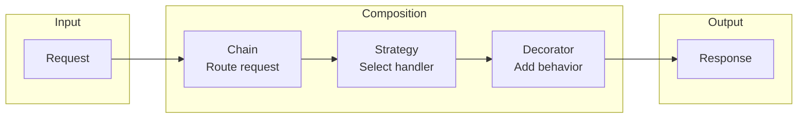

# Composing Patterns

A guide to combining PatternKit patterns for complex, real-world solutions.

---

## Why Compose Patterns?

Real-world problems rarely fit a single pattern. PatternKit's fluent API makes patterns composable by design—each pattern produces or consumes standard delegates, enabling seamless integration.



---

## Composition Principles

### 1. Delegate Compatibility

Patterns produce delegates that other patterns consume:

```csharp
// Strategy produces a Func<TIn, TOut>
var strategy = Strategy<Order, decimal>.Create()
    .When(o => o.IsExpress).Then(ExpressShipping)
    .Default(StandardShipping)
    .Build();

// Decorator consumes and wraps it
var decorated = Decorator<Order, decimal>.Create(
        order => strategy.Execute(order))  // Strategy as core
    .After((order, cost) => ApplyDiscount(cost))
    .Build();
```

### 2. Single Responsibility

Each pattern handles one concern:

| Pattern | Responsibility |
|---------|----------------|
| Chain | Route to appropriate handler |
| Strategy | Select algorithm |
| Decorator | Add cross-cutting behavior |
| Proxy | Control access |
| Observer | Notify interested parties |

### 3. Composition Order Matters

```csharp
// Logging sees cached results (cache hit = no "Calculating" log)
var cacheThenLog = Proxy<int, int>.Create(Calculate)
    .CachingProxy()           // Layer 1: Cache
    .LoggingProxy(Log)        // Layer 2: Log
    .Build();

// Logging sees all calls (including cache hits)
var logThenCache = Proxy<int, int>.Create(Calculate)
    .LoggingProxy(Log)        // Layer 1: Log
    .CachingProxy()           // Layer 2: Cache
    .Build();
```

---

## Common Composition Patterns

### Request Pipeline

**Chain → Strategy → Decorator**

Process requests through validation, route to appropriate handler, add cross-cutting concerns.

```csharp
// 1. Chain: Validate and route
var validationChain = ResultChain<ApiRequest, ApiResponse>.Create()
    .When(r => string.IsNullOrEmpty(r.ApiKey))
        .Then(_ => new ApiResponse(401, "Unauthorized"))
    .When(r => r.RateLimitExceeded)
        .Then(_ => new ApiResponse(429, "Too Many Requests"))
    .Build();

// 2. Strategy: Select handler based on endpoint
var routingStrategy = Strategy<ApiRequest, ApiResponse>.Create()
    .When(r => r.Endpoint.StartsWith("/users"))
        .Then(HandleUsersEndpoint)
    .When(r => r.Endpoint.StartsWith("/orders"))
        .Then(HandleOrdersEndpoint)
    .Default(r => new ApiResponse(404, "Not Found"))
    .Build();

// 3. Decorator: Add logging and metrics
var pipeline = Decorator<ApiRequest, ApiResponse>.Create(request =>
    {
        // Try validation first
        if (validationChain.TryExecute(request, out var errorResponse))
            return errorResponse;

        // Route to handler
        return routingStrategy.Execute(request);
    })
    .Before(request => Log($"Request: {request.Endpoint}"))
    .After((request, response) => RecordMetrics(request, response))
    .Around(AddTiming)
    .Build();

// Usage
var response = pipeline.Execute(new ApiRequest("/users/123", apiKey));
```

---

### Event-Driven Processing

**Observer → Mediator → Command**

Publish events, route to handlers, execute with undo support.

```csharp
// 1. Observer: Event bus
var eventBus = Observer<DomainEvent>.Create().Build();

// 2. Mediator: Route events to handlers
var mediator = Mediator<DomainEvent, Unit>.Create()
    .Handler<OrderCreated, Unit>(HandleOrderCreated)
    .Handler<OrderShipped, Unit>(HandleOrderShipped)
    .Handler<OrderCancelled, Unit>(HandleOrderCancelled)
    .Build();

// 3. Command: Encapsulate operations with undo
var commandHistory = new Stack<ICommand<Order>>();

var createOrderCommand = Command<Order>.Create()
    .Execute(order =>
    {
        order.Status = OrderStatus.Created;
        eventBus.Publish(new OrderCreated(order));
    })
    .Undo(order =>
    {
        order.Status = OrderStatus.Draft;
        eventBus.Publish(new OrderReverted(order));
    })
    .Build();

// Wire observer to mediator
eventBus.Subscribe(async evt => await mediator.Send(evt));

// Execute with history tracking
createOrderCommand.Execute(order);
commandHistory.Push(createOrderCommand);

// Undo if needed
if (commandHistory.Any())
{
    var cmd = commandHistory.Pop();
    cmd.Undo(order);
}
```

---

### Factory with Prototype Templates

**Factory → Prototype → Builder**

Create by type, clone from templates, configure with builder.

```csharp
// 1. Prototype: Define templates
var templates = Prototype<string, OrderConfig>.Create()
    .Map("domestic", new OrderConfig
    {
        ShippingZone = Zone.Domestic,
        Currency = "USD",
        TaxRate = 0.08m
    }, OrderConfig.Clone)
    .Map("international", new OrderConfig
    {
        ShippingZone = Zone.International,
        Currency = "USD",
        TaxRate = 0.0m
    }, OrderConfig.Clone)
    .Build();

// 2. Factory: Create orders by type using templates
var orderFactory = Factory<string, Order>.Create()
    .Map("domestic", () =>
    {
        var config = templates.Create("domestic");
        return new Order(config);
    })
    .Map("international", () =>
    {
        var config = templates.Create("international");
        return new Order(config);
    })
    .Build();

// 3. Builder: Configure the created order
var order = orderFactory.Create("domestic");
var configuredOrder = Builder<Order>.From(order)
    .With(o => o.CustomerId, "CUST-001")
    .With(o => o.Items, new[] { item1, item2 })
    .With(o => o.Notes, "Rush delivery")
    .Build();
```

---

### Layered Access Control

**Proxy → Decorator → Facade**

Control access, add behavior, simplify interface.

```csharp
// 1. Core service
PaymentResult ProcessPayment(PaymentRequest request) =>
    paymentGateway.Process(request);

// 2. Proxy: Access control and caching
var securePayment = Proxy<PaymentRequest, PaymentResult>.Create(ProcessPayment)
    .ProtectionProxy(req =>
        authService.HasPermission(req.UserId, "payments:process"))
    .CachingProxy() // Idempotency check
    .Build();

// 3. Decorator: Add logging and retry
var robustPayment = Decorator<PaymentRequest, PaymentResult>.Create(
        req => securePayment.Execute(req))
    .Around((req, next) =>
    {
        for (int i = 0; i < 3; i++)
        {
            try { return next(req); }
            catch (TransientException) when (i < 2)
            {
                Thread.Sleep(1000 * (i + 1));
            }
        }
        throw new PaymentException("Max retries exceeded");
    })
    .After((req, result) => auditLog.Record(req, result))
    .Build();

// 4. Facade: Simplified interface
var paymentFacade = Facade<PaymentCommand, PaymentResult>.Create()
    .Operation("charge", cmd => robustPayment.Execute(
        new PaymentRequest(cmd.Amount, cmd.CustomerId, PaymentType.Charge)))
    .Operation("refund", cmd => robustPayment.Execute(
        new PaymentRequest(cmd.Amount, cmd.CustomerId, PaymentType.Refund)))
    .Operation("void", cmd => robustPayment.Execute(
        new PaymentRequest(cmd.Amount, cmd.CustomerId, PaymentType.Void)))
    .Build();

// Simple usage
var result = paymentFacade.Execute("charge", new PaymentCommand(99.99m, customerId));
```

---

### Type-Safe Message Processing

**TypeDispatcher → Strategy → Observer**

Route by type, select processing strategy, notify subscribers.

```csharp
// 1. Observer: Notification hub
var notifications = Observer<ProcessingResult>.Create().Build();

// 2. Strategy: Processing strategies per message type
var priorityStrategy = Strategy<EmailMessage, DeliveryPriority>.Create()
    .When(m => m.Subject.Contains("URGENT")).Then(_ => DeliveryPriority.Immediate)
    .When(m => m.Recipients.Count > 100).Then(_ => DeliveryPriority.Batch)
    .Default(_ => DeliveryPriority.Normal)
    .Build();

// 3. TypeDispatcher: Route messages by type
var messageProcessor = TypeDispatcher<IMessage, ProcessingResult>.Create()
    .On<EmailMessage>(msg =>
    {
        var priority = priorityStrategy.Execute(msg);
        var result = emailService.Send(msg, priority);
        notifications.Publish(new ProcessingResult(msg.Id, result));
        return result;
    })
    .On<SmsMessage>(msg =>
    {
        var result = smsService.Send(msg);
        notifications.Publish(new ProcessingResult(msg.Id, result));
        return result;
    })
    .On<PushNotification>(msg =>
    {
        var result = pushService.Send(msg);
        notifications.Publish(new ProcessingResult(msg.Id, result));
        return result;
    })
    .Default(msg =>
    {
        var result = new ProcessingResult(msg.Id, "Unknown message type");
        notifications.Publish(result);
        return result;
    })
    .Build();

// Wire up observers
notifications.Subscribe(r => logger.Log($"Processed: {r.MessageId}"));
notifications.Subscribe(
    r => !r.Success,
    r => alertService.Alert($"Failed: {r.MessageId}"));

// Process messages
foreach (var message in messageQueue)
{
    messageProcessor.Dispatch(message);
}
```

---

### State-Driven Workflow

**State Machine → Observer → Command**

Manage transitions, notify on state changes, support undo.

```csharp
// 1. Observer: State change notifications
var stateChanges = Observer<StateChange<OrderState>>.Create().Build();

// 2. State Machine: Define valid transitions
var orderStateMachine = StateMachine<OrderState, OrderEvent>.Create()
    .State(OrderState.Draft)
        .On(OrderEvent.Submit).TransitionTo(OrderState.Pending)
    .State(OrderState.Pending)
        .On(OrderEvent.Approve).TransitionTo(OrderState.Approved)
        .On(OrderEvent.Reject).TransitionTo(OrderState.Rejected)
    .State(OrderState.Approved)
        .On(OrderEvent.Ship).TransitionTo(OrderState.Shipped)
        .On(OrderEvent.Cancel).TransitionTo(OrderState.Cancelled)
    .State(OrderState.Shipped)
        .On(OrderEvent.Deliver).TransitionTo(OrderState.Delivered)
        .On(OrderEvent.Return).TransitionTo(OrderState.Returned)
    .OnTransition((from, evt, to) =>
    {
        stateChanges.Publish(new StateChange<OrderState>(from, to, evt));
    })
    .Build();

// 3. Command: State changes with undo
var transitionHistory = new Stack<(Order, OrderState)>();

Command<Order> CreateTransitionCommand(OrderEvent evt) =>
    Command<Order>.Create()
        .Execute(order =>
        {
            var previousState = order.State;
            if (orderStateMachine.TryFire(order.State, evt, out var newState))
            {
                transitionHistory.Push((order, previousState));
                order.State = newState;
            }
        })
        .Undo(order =>
        {
            if (transitionHistory.Any())
            {
                var (_, previousState) = transitionHistory.Pop();
                order.State = previousState;
            }
        })
        .Build();

// Wire observers
stateChanges.Subscribe(change =>
    logger.Log($"Order state: {change.From} → {change.To}"));

stateChanges.Subscribe(
    change => change.To == OrderState.Shipped,
    change => emailService.SendShippingNotification(change));

// Usage
var submitCommand = CreateTransitionCommand(OrderEvent.Submit);
submitCommand.Execute(order);
```

---

### Data Pipeline

**Iterator/Flow → Decorator → Strategy**

Stream data, transform it, apply processing strategies.

```csharp
// 1. Strategy: Determine processing based on data
var processingStrategy = Strategy<DataRecord, ProcessingMode>.Create()
    .When(r => r.Size > 1_000_000).Then(_ => ProcessingMode.Async)
    .When(r => r.Priority == Priority.High).Then(_ => ProcessingMode.Immediate)
    .Default(_ => ProcessingMode.Batch)
    .Build();

// 2. Decorator: Add transformation layers
var transformer = Decorator<DataRecord, ProcessedRecord>.Create(
        record => ProcessCore(record))
    .Before(record => ValidateRecord(record))
    .After((record, result) => EnrichWithMetadata(result))
    .Build();

// 3. Flow: Stream processing
var pipeline = Flow<DataRecord>.From(dataSource)
    .Filter(r => r.IsValid)
    .Filter(r => !r.IsProcessed);

// Combine everything
foreach (var record in pipeline)
{
    var mode = processingStrategy.Execute(record);

    switch (mode)
    {
        case ProcessingMode.Immediate:
            var result = transformer.Execute(record);
            SaveImmediately(result);
            break;

        case ProcessingMode.Batch:
            batchQueue.Enqueue(record);
            break;

        case ProcessingMode.Async:
            _ = Task.Run(() => transformer.Execute(record));
            break;
    }
}

// Process batched items
foreach (var batch in batchQueue.GetBatches(100))
{
    var results = batch.Select(r => transformer.Execute(r));
    SaveBatch(results);
}
```

---

### Visitor with Interpreter

**Visitor → Interpreter → TypeDispatcher**

Traverse structure, interpret expressions, dispatch by type.

```csharp
// AST node types
abstract record Expression;
record NumberExpr(double Value) : Expression;
record BinaryExpr(Expression Left, string Op, Expression Right) : Expression;
record VariableExpr(string Name) : Expression;

// 1. TypeDispatcher: Evaluate nodes by type
TypeDispatcher<Expression, double> CreateEvaluator(Dictionary<string, double> variables)
{
    TypeDispatcher<Expression, double> evaluator = null!;

    evaluator = TypeDispatcher<Expression, double>.Create()
        .On<NumberExpr>(n => n.Value)
        .On<VariableExpr>(v => variables.GetValueOrDefault(v.Name, 0))
        .On<BinaryExpr>(b =>
        {
            var left = evaluator.Dispatch(b.Left);
            var right = evaluator.Dispatch(b.Right);
            return b.Op switch
            {
                "+" => left + right,
                "-" => left - right,
                "*" => left * right,
                "/" => right != 0 ? left / right : 0,
                _ => 0
            };
        })
        .Default(_ => 0)
        .Build();

    return evaluator;
}

// 2. Visitor: Collect all variables used
var variableCollector = Visitor<Expression>.Create()
    .Visit<VariableExpr>((v, vars) =>
    {
        ((HashSet<string>)vars).Add(v.Name);
    })
    .Visit<BinaryExpr>((b, vars, visit) =>
    {
        visit(b.Left, vars);
        visit(b.Right, vars);
    })
    .Build();

// 3. Interpreter: Define evaluation rules
var interpreter = Interpreter<EvalContext, double>.Create()
    .Terminal("evaluate", ctx =>
    {
        var evaluator = CreateEvaluator(ctx.Variables);
        return evaluator.Dispatch(ctx.Expression);
    })
    .Build();

// Usage
var expression = new BinaryExpr(
    new VariableExpr("x"),
    "+",
    new BinaryExpr(
        new NumberExpr(10),
        "*",
        new VariableExpr("y")));

// Find required variables
var usedVars = new HashSet<string>();
variableCollector.Accept(expression, usedVars);
// usedVars = { "x", "y" }

// Evaluate with context
var context = new EvalContext(expression, new Dictionary<string, double>
{
    ["x"] = 5,
    ["y"] = 3
});

var result = interpreter.Execute(context); // 5 + (10 * 3) = 35
```

---

## Composition Guidelines

### Do

- **Start simple**: Begin with one pattern, add others as needed
- **Document the flow**: Diagram how patterns connect
- **Test each layer**: Verify each pattern works in isolation
- **Consider performance**: Composition adds overhead

### Don't

- **Over-compose**: Not every problem needs multiple patterns
- **Create circular dependencies**: Patterns should flow one direction
- **Mix sync and async carelessly**: Use async variants throughout
- **Ignore error handling**: Each layer should handle its errors

---

## Anti-Patterns

### Composition Spaghetti

```csharp
// Bad: Deeply nested, hard to follow
var result = decorator.Execute(
    proxy.Execute(
        chain.Execute(
            strategy.Execute(
                factory.Create(input)))));
```

```csharp
// Better: Clear pipeline with named stages
var created = factory.Create(input);
var selected = strategy.Execute(created);
var validated = chain.Execute(selected);
var secured = proxy.Execute(validated);
var result = decorator.Execute(secured);
```

### Redundant Layers

```csharp
// Bad: Both add logging
var proxy = Proxy<int, int>.Create(Calculate)
    .LoggingProxy(Log)
    .Build();

var decorator = Decorator<int, int>.Create(x => proxy.Execute(x))
    .After((x, r) => Log($"Result: {r}")) // Duplicate logging
    .Build();
```

### Wrong Pattern Order

```csharp
// Bad: Validation after processing
var wrong = Decorator<Request, Response>.Create(Process)
    .After((req, _) => Validate(req)) // Too late!
    .Build();

// Good: Validation before processing
var correct = Decorator<Request, Response>.Create(Process)
    .Before(req => Validate(req))
    .Build();
```

---

## See Also

- [Choosing Patterns](choosing-patterns.md)
- [Performance Guide](performance.md)
- [Testing Patterns](testing.md)
