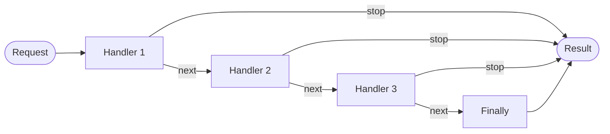

# Chain of Responsibility Pattern

> **TL;DR**: Build a middleware-style pipeline where each handler can process, continue, or short-circuit the chain.

## Quick Example

```csharp
// Side-effect chain (logging, validation, auth gates)
var authChain = ActionChain<HttpRequest>.Create()
    .When(r => r.Path.StartsWith("/admin") && !r.HasAuth)
        .ThenStop(r => r.Deny("unauthorized"))
    .When(r => r.Headers.ContainsKey("X-Request-Id"))
        .ThenContinue(r => Log.Info($"Request: {r.Headers["X-Request-Id"]}"))
    .Finally((in r, next) => { r.Process(); next(in r); })
    .Build();

authChain.Execute(request);

// Result chain (routing, parsing, price computation)
var router = ResultChain<Request, Response>.Create()
    .When(r => r.Path == "/health")
        .Then(r => new Response(200, "OK"))
    .When(r => r.Path.StartsWith("/api/"))
        .Then(r => HandleApi(r))
    .Finally((in r, out Response? res, _) => { res = new(404, "Not Found"); return true; })
    .Build();

router.Execute(in request, out var response);
```

## What It Is

Chain of Responsibility allows multiple handlers to process a request in sequence. Each handler decides whether to:
- **Process and stop**: Handle the request and short-circuit
- **Process and continue**: Do work then pass to the next handler
- **Skip**: Pass directly to the next handler

Key characteristics:

- **Ordered execution**: Handlers run in registration order
- **Short-circuit capability**: Any handler can stop the chain
- **Middleware pattern**: Similar to ASP.NET Core middleware
- **First-match-wins**: For result chains, first producer wins

## Pattern Variants

| Variant | Description | Use Case |
|---------|-------------|----------|
| `ActionChain<TCtx>` | Sync chain for side effects | Validation, logging, auth |
| `ResultChain<TIn, TOut>` | Sync chain that produces a result | Routing, parsing |
| `AsyncActionChain<TCtx>` | Async chain for side effects | Async validation, external calls |
| `AsyncResultChain<TIn, TOut>` | Async chain that produces a result | Async routing, API calls |

## When to Use

- **Request processing pipelines**: HTTP middleware, validation chains
- **Authorization gates**: Multi-step authentication/authorization
- **Rule engines**: Ordered business rules with early exit
- **Fallback systems**: Try multiple strategies until one succeeds
- **Logging/auditing**: Cross-cutting concerns with conditional flow

## When to Avoid

- **Simple conditionals**: For 2-3 conditions, use switch or if/else
- **First-match dispatch**: Use [Strategy](../strategy/index.md) for simpler predicate matching
- **Type-based routing**: Use [TypeDispatcher](../type-dispatcher/index.md) for type-specific handling
- **No continuation needed**: Use Strategy when handlers don't need `next`

## Diagram



## Comparison with Strategy

| Aspect | Chain | Strategy |
|--------|-------|----------|
| Handler continuation | Yes - explicit `next` | No - first match wins |
| Multiple handlers | Multiple can run | Single handler runs |
| Short-circuit | Explicit in each handler | Implicit when predicate matches |
| Result production | Optional (ResultChain) | Always produces result |

## See Also

- [Comprehensive Guide](guide.md) - Detailed usage and patterns
- [API Reference](api-reference.md) - Complete API documentation
- [Real-World Examples](real-world-examples.md) - Production-ready examples
- [Strategy Pattern](../strategy/index.md) - For simpler first-match dispatch
- [TypeDispatcher](../type-dispatcher/index.md) - For type-based routing
