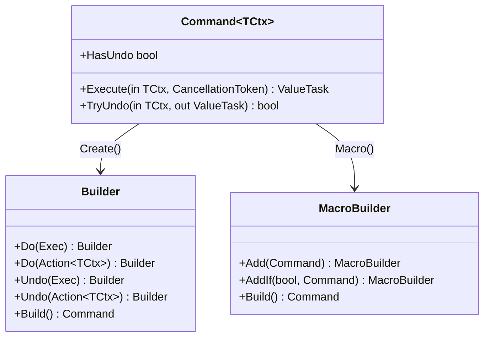

# Command Pattern

> **TL;DR**: Encapsulate an action and optional undo as a reusable, composable command object.

## Quick Example

```csharp
// Single command with undo
var increment = Command<Counter>.Create()
    .Do(c => c.Value++)
    .Undo(c => c.Value--)
    .Build();

await increment.Execute(counter);     // Value: 1
if (increment.TryUndo(counter, out var undo))
    await undo;                        // Value: 0

// Macro (composite) command
var pipeline = Command<BuildContext>.Macro()
    .Add(compileCommand)
    .AddIf(runTests, testCommand)
    .Add(packageCommand)
    .Build();

await pipeline.Execute(buildContext); // Runs all in order
```

## What It Is

Command encapsulates a unit of work (action) plus an optional inverse (undo) so operations can be executed, queued, composed, retried, or reversed uniformly.

Key characteristics:

- **Encapsulated operations**: Actions become first-class objects
- **Optional undo**: Support reversible operations with TryUndo
- **Macro composition**: Combine commands into ordered sequences
- **Allocation-light**: Uses ValueTask for efficient async

## When to Use

- **Undo/redo systems**: Editor actions, optimistic UI, reversible changes
- **Operation queuing**: Schedule, log, or retry actions uniformly
- **Macro composition**: Combine operations into pipelines
- **Transaction-like behavior**: Execute then rollback on failure
- **Command logging**: Audit trail of operations

## When to Avoid

- **Simple one-off calls**: Direct method calls are simpler
- **No undo needed**: Use Strategy or direct calls
- **Complex state restoration**: Use [Memento](../memento/index.md) instead

## Pattern Structure



## Macro Behavior

Macro commands execute in registration order and undo in reverse:

```
Execute: [A] → [B] → [C]
Undo:    [C] → [B] → [A]  (skips commands without undo)
```

## See Also

- [Comprehensive Guide](guide.md) - Detailed usage and patterns
- [API Reference](api-reference.md) - Complete API documentation
- [Real-World Examples](real-world-examples.md) - Production-ready examples
- [Memento Pattern](../memento/index.md) - For complex state restoration
- [Chain Pattern](../chain/index.md) - For middleware pipelines
