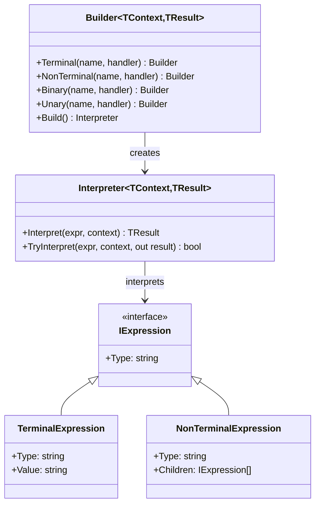

# Interpreter Pattern

> **TL;DR**: Define a grammar for a language and provide an interpreter that evaluates expressions in that language.

## Quick Example

```csharp
// Create an arithmetic expression interpreter
var calculator = Interpreter.Create<object, double>()
    .Terminal("number", token => double.Parse(token))
    .Binary("add", (left, right) => left + right)
    .Binary("mul", (left, right) => left * right)
    .Build();

// Build and evaluate an expression: 1 + (2 * 3)
var expr = NonTerminal("add",
    Terminal("number", "1"),
    NonTerminal("mul",
        Terminal("number", "2"),
        Terminal("number", "3")));

double result = calculator.Interpret(expr); // 7.0
```

## What It Is

The Interpreter pattern provides a way to evaluate sentences in a language by defining a grammar as a set of classes. Each class represents a rule in the grammar, and the pattern provides an interpreter that evaluates these rules.

PatternKit's implementation uses a fluent builder API to define:

- **Terminal expressions**: Leaf nodes that produce values from literal tokens (numbers, strings, identifiers)
- **Non-terminal expressions**: Composite nodes that combine child results (add, multiply, if-then-else)
- **Context**: Optional state passed during interpretation (variables, environment)

The interpreter recursively evaluates the expression tree, producing a final result.

## When to Use

- **Domain-specific languages (DSLs)**: Building custom languages for configuration, rules, or queries
- **Mathematical expressions**: Calculators, formula evaluators, spreadsheet engines
- **Business rule engines**: Pricing rules, discount calculations, eligibility checks
- **Query languages**: Filter expressions, search syntax, data transformations
- **Configuration languages**: Templating systems, conditional configuration

## When to Avoid

- **Complex grammars**: For full programming languages, use a parser generator instead
- **Performance-critical paths**: Interpreter overhead may be too high for hot paths
- **Simple conditionals**: If you only need basic if/else logic, use [Strategy](../strategy/index.md) instead
- **Type dispatch**: For handling different types, consider [TypeDispatcher](../type-dispatcher/index.md)

## Pattern Variants

| Variant | Description | Use Case |
|---------|-------------|----------|
| `Interpreter<TContext, TResult>` | Sync interpreter returning a value | Calculations, evaluations |
| `ActionInterpreter<TContext>` | Sync interpreter with side effects | Commands, state mutations |
| `AsyncInterpreter<TContext, TResult>` | Async interpreter returning a value | External lookups, I/O |
| `AsyncActionInterpreter<TContext>` | Async interpreter with side effects | Async commands |

## Diagram



## See Also

- [Comprehensive Guide](guide.md) - Detailed usage and patterns
- [API Reference](api-reference.md) - Complete API documentation
- [Real-World Examples](real-world-examples.md) - Production-ready examples
- [Strategy Pattern](../strategy/index.md) - For simple conditional logic
- [Composite Pattern](../../structural/composite/index.md) - For tree structures without interpretation
