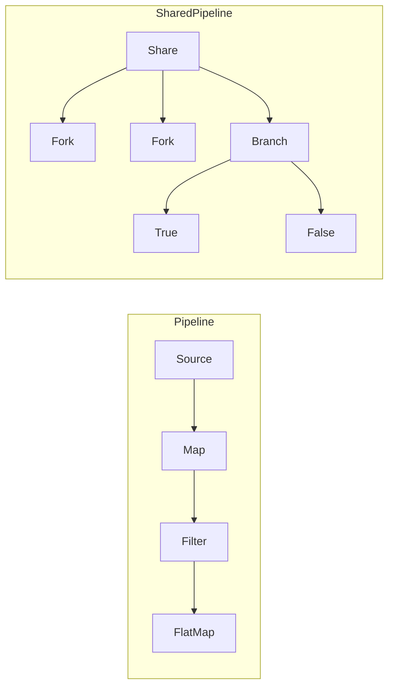

# Iterator / Flow Pattern Guide

Comprehensive guide to using the Iterator/Flow pattern in PatternKit.

## Overview

Flow provides a functional pipeline for transforming sequences with lazy evaluation. It extends the traditional Iterator pattern with LINQ-like operators plus sharing, forking, and branching capabilities.



## Getting Started

### Installation

```csharp
using PatternKit.Behavioral.Iterator;
```

### Basic Usage

```csharp
var result = Flow<int>.From(Enumerable.Range(1, 10))
    .Map(x => x * 2)           // Transform each element
    .Filter(x => x > 10)       // Keep matching elements
    .FlatMap(x => new[] { x, x + 1 }) // Expand each element
    .Tee(Console.WriteLine)    // Side effect (debugging)
    .ToList();                 // Materialize
```

## Core Concepts

### Lazy Evaluation

All Flow operators are lazy - they don't execute until terminal operations:

```csharp
// Nothing happens yet
var flow = Flow<int>.From(GetExpensiveData())
    .Map(Process)
    .Filter(Validate);

// Now it executes
var list = flow.ToList();
```

### Basic Operators

#### Map

Transform each element:

```csharp
Flow<int>.From(new[] { 1, 2, 3 })
    .Map(x => x * 2)  // 2, 4, 6
```

#### Filter

Keep elements matching predicate:

```csharp
Flow<int>.From(new[] { 1, 2, 3, 4, 5 })
    .Filter(x => x % 2 == 0)  // 2, 4
```

#### FlatMap

One-to-many transformation:

```csharp
Flow<string>.From(new[] { "hello", "world" })
    .FlatMap(s => s.ToCharArray())  // h, e, l, l, o, w, o, r, l, d
```

#### Tee

Side effect without transformation:

```csharp
Flow<int>.From(data)
    .Tee(x => Console.WriteLine($"Processing: {x}"))
    .Map(Process)  // Tee doesn't change the flow
```

### Terminal Operations

#### ToList / ToArray

Materialize the flow:

```csharp
var list = flow.ToList();
var array = flow.ToArray();
```

#### Fold

Reduce to a single value:

```csharp
var sum = Flow<int>.From(new[] { 1, 2, 3, 4, 5 })
    .Fold(0, (acc, x) => acc + x);  // 15

var max = Flow<int>.From(data)
    .Fold(int.MinValue, Math.Max);
```

#### FirstOption

Get first element safely:

```csharp
var first = Flow<int>.From(data)
    .Filter(x => x > 100)
    .FirstOption();  // Some(value) or None
```

## Sharing and Forking

### The Problem with Re-enumeration

Without sharing, each terminal operation re-executes the source:

```csharp
var flow = Flow<int>.From(ExpensiveSource());
var list1 = flow.ToList();  // Executes source
var list2 = flow.ToList();  // Executes source AGAIN!
```

### Share()

Buffer the source for replay:

```csharp
var shared = Flow<int>.From(ExpensiveSource()).Share();
var list1 = shared.Fork().ToList();  // Executes source, buffers
var list2 = shared.Fork().ToList();  // Reads from buffer
```

### Fork()

Create independent readers:

```csharp
var shared = Flow<int>.From(data).Share();

var doubled = shared.Fork().Map(x => x * 2);
var filtered = shared.Fork().Filter(x => x > 10);
var squared = shared.Fork().Map(x => x * x);

// Each fork processes independently
```

### Branch()

Partition by predicate:

```csharp
var shared = Flow<int>.From(Enumerable.Range(1, 10)).Share();
var (evens, odds) = shared.Branch(x => x % 2 == 0);

var evenSum = evens.Fold(0, (a, x) => a + x);  // 2+4+6+8+10 = 30
var oddSum = odds.Fold(0, (a, x) => a + x);    // 1+3+5+7+9 = 25
```

## Common Patterns

### Data Transformation Pipeline

```csharp
public class DataPipeline
{
    public List<ProcessedRecord> Process(IEnumerable<RawRecord> records)
    {
        return Flow<RawRecord>.From(records)
            .Filter(r => r.IsValid)
            .Map(r => Normalize(r))
            .Filter(r => !r.IsDuplicate)
            .Map(r => Enrich(r))
            .Map(r => Transform(r))
            .ToList();
    }
}
```

### Log Processing

```csharp
public class LogAnalyzer
{
    public AnalysisResult Analyze(IEnumerable<LogEntry> logs)
    {
        var shared = Flow<LogEntry>.From(logs).Share();

        var (errors, nonErrors) = shared.Branch(l => l.Level == "ERROR");
        var (warnings, info) = nonErrors.Branch(l => l.Level == "WARN");

        return new AnalysisResult
        {
            ErrorCount = errors.Fold(0, (c, _) => c + 1),
            WarningCount = warnings.Fold(0, (c, _) => c + 1),
            InfoCount = info.Fold(0, (c, _) => c + 1),
            TopErrors = errors
                .Map(e => e.Message)
                .ToList()
                .GroupBy(m => m)
                .OrderByDescending(g => g.Count())
                .Take(10)
                .ToList()
        };
    }
}
```

### Multi-Format Export

```csharp
public class Exporter
{
    public void Export(IEnumerable<Record> records)
    {
        var shared = Flow<Record>.From(records).Share();

        // JSON export
        var json = shared.Fork()
            .Map(r => JsonSerializer.Serialize(r))
            .ToList();
        File.WriteAllText("export.json", $"[{string.Join(",", json)}]");

        // CSV export
        var csv = shared.Fork()
            .Map(r => $"{r.Id},{r.Name},{r.Value}")
            .ToList();
        File.WriteAllLines("export.csv", csv);

        // Summary
        var summary = shared.Fork()
            .Fold(new Summary(), (s, r) =>
            {
                s.Count++;
                s.Total += r.Value;
                return s;
            });
        Console.WriteLine($"Exported {summary.Count} records, total: {summary.Total}");
    }
}
```

## Related Types

### ReplayableSequence

Multi-cursor random access:

```csharp
var seq = ReplayableSequence<int>.From(Enumerable.Range(1, 100));

var cursor1 = seq.CreateCursor();
var cursor2 = seq.CreateCursor();

// Cursors move independently
cursor1.MoveNext(); cursor1.MoveNext(); // at position 2
cursor2.MoveNext(); // at position 1

// Look ahead without moving
var next = cursor1.Peek(5); // Look 5 ahead
```

### WindowSequence

Sliding windows:

```csharp
// Sliding window
var windows = WindowSequence<int>.Create(
    Enumerable.Range(1, 5),
    windowSize: 3);
// [1,2,3], [2,3,4], [3,4,5]

// Batching (non-overlapping)
var batches = WindowSequence<int>.Create(
    Enumerable.Range(1, 10),
    windowSize: 3,
    stride: 3);
// [1,2,3], [4,5,6], [7,8,9], [10]

// Moving average
var data = new[] { 1.0, 2.0, 3.0, 4.0, 5.0 };
var movingAvg = WindowSequence<double>.Create(data, 3)
    .Select(w => w.Average())
    .ToList();
// 2.0, 3.0, 4.0
```

## Extending the Pattern

### Custom Operators

```csharp
public static class FlowExtensions
{
    public static Flow<T> Take<T>(this Flow<T> flow, int count)
    {
        return Flow<T>.From(TakeIterator(flow, count));

        static IEnumerable<T> TakeIterator(Flow<T> f, int n)
        {
            int taken = 0;
            foreach (var item in f)
            {
                if (taken++ >= n) yield break;
                yield return item;
            }
        }
    }

    public static Flow<T> Skip<T>(this Flow<T> flow, int count)
    {
        return Flow<T>.From(SkipIterator(flow, count));

        static IEnumerable<T> SkipIterator(Flow<T> f, int n)
        {
            int skipped = 0;
            foreach (var item in f)
            {
                if (skipped++ < n) continue;
                yield return item;
            }
        }
    }

    public static Flow<T> DistinctBy<T, TKey>(this Flow<T> flow, Func<T, TKey> keySelector)
    {
        return Flow<T>.From(DistinctIterator(flow, keySelector));

        static IEnumerable<T> DistinctIterator(Flow<T> f, Func<T, TKey> selector)
        {
            var seen = new HashSet<TKey>();
            foreach (var item in f)
            {
                if (seen.Add(selector(item)))
                    yield return item;
            }
        }
    }
}
```

## Best Practices

### When to Share

1. **Multiple consumers**: Fork before multiple terminal operations
2. **Expensive sources**: Database queries, network calls
3. **Side effects in source**: Prevent duplicate side effects

### Memory Considerations

1. **SharedFlow buffers**: All elements retained until GC
2. **Large datasets**: Consider streaming approaches
3. **Clear references**: Dispose flows when done

### Performance Tips

1. **Filter early**: Reduce elements before expensive operations
2. **Avoid unnecessary sharing**: Single consumer doesn't need Share
3. **Use Fold for aggregation**: More efficient than ToList + LINQ

## Troubleshooting

### Elements processed multiple times

Did you forget to `Share()` before forking?

```csharp
// Wrong
var flow = Flow<int>.From(source);
flow.Map(x => x * 2).ToList();
flow.Filter(x => x > 10).ToList();  // Re-enumerates source!

// Right
var shared = Flow<int>.From(source).Share();
shared.Fork().Map(x => x * 2).ToList();
shared.Fork().Filter(x => x > 10).ToList();
```

### Out of memory

SharedFlow buffers everything:

```csharp
// May run out of memory for large sources
var shared = Flow<byte>.From(ReadHugeFile()).Share();

// Better: stream without sharing if possible
Flow<byte>.From(ReadHugeFile())
    .Map(Process)
    .ToList();
```

## See Also

- [Overview](index.md)
- [API Reference](api-reference.md)
- [Real-World Examples](real-world-examples.md)
