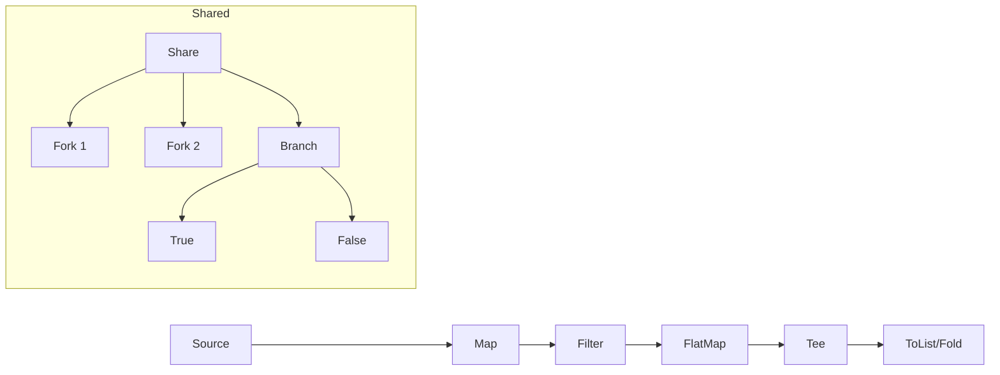

# Iterator / Flow Pattern

> **TL;DR**: Fluent functional pipeline with Map/Filter/FlatMap, plus forkable shared streams.

## Quick Example

```csharp
var result = Flow<int>.From(Enumerable.Range(1, 10))
    .Map(x => x * 2)           // 2,4,6,...,20
    .Filter(x => x % 4 == 0)   // 4,8,12,16,20
    .FlatMap(x => new[] { x, x + 1 }) // 4,5,8,9,12,13,16,17,20,21
    .Tee(x => Console.WriteLine($"Processing: {x}"))
    .ToList();

// Fork & branch without re-enumerating upstream
var shared = Flow<int>.From(Enumerable.Range(1, 6)).Share();
var (evens, odds) = shared.Branch(x => x % 2 == 0);
var evenSum = evens.Fold(0, (acc, x) => acc + x); // 12
var oddSum = odds.Fold(0, (acc, x) => acc + x);   // 9
```

## What It Is

Flow provides a functional pipeline for transforming sequences with lazy evaluation. It extends the Iterator pattern with LINQ-like operators plus the ability to fork and branch streams.

Key characteristics:

- **Lazy evaluation**: All operators defer until enumeration
- **Functional operators**: Map, Filter, FlatMap, Tee, Fold
- **Sharing**: `Share()` enables replay without re-executing upstream
- **Forking**: Create multiple independent readers from shared stream
- **Branching**: Partition streams by predicate
- **Composable**: Chain operators fluently

## When to Use

- **Data transformation**: ETL pipelines, data cleansing
- **Stream processing**: Log parsing, event processing
- **Multiple projections**: Different views of same data
- **Conditional routing**: Partition data by criteria
- **Debug instrumentation**: Tee for logging without affecting flow

## When to Avoid

- **Async streams**: Use `IAsyncEnumerable` or reactive extensions
- **Side-effect-heavy**: Operators assume pure transformations
- **Persistent streams**: Consider message brokers
- **Complex event processing**: Use dedicated CEP libraries

## Diagram



## Core Operators

| Operator | Description | Example |
|----------|-------------|---------|
| `Map<TOut>` | Transform each element | `.Map(x => x * 2)` |
| `Filter` | Keep elements matching predicate | `.Filter(x => x > 0)` |
| `FlatMap<TOut>` | One-to-many transformation | `.FlatMap(x => x.Items)` |
| `Tee` | Side effect without transformation | `.Tee(Console.WriteLine)` |
| `Fold<TAcc>` | Reduce to single value | `.Fold(0, (a, x) => a + x)` |
| `FirstOption` | Get first element as Option | `.FirstOption()` |

## Sharing & Forking

| Operation | Description |
|-----------|-------------|
| `Share()` | Buffer upstream for replay |
| `Fork()` | Create independent reader |
| `Fork(n)` | Create n independent readers |
| `Branch(pred)` | Split into (True, False) flows |

## Related Types

| Type | Purpose |
|------|---------|
| `Flow<T>` | Base functional pipeline |
| `SharedFlow<T>` | Forkable/branchable stream |
| `ReplayableSequence<T>` | Multi-cursor random access |
| `WindowSequence<T>` | Sliding/striding windows |

## See Also

- [Comprehensive Guide](guide.md) - Advanced streaming patterns
- [API Reference](api-reference.md) - Complete API documentation
- [Real-World Examples](real-world-examples.md) - Production-ready examples
- [Observer Pattern](../observer/index.md) - For push-based streams
