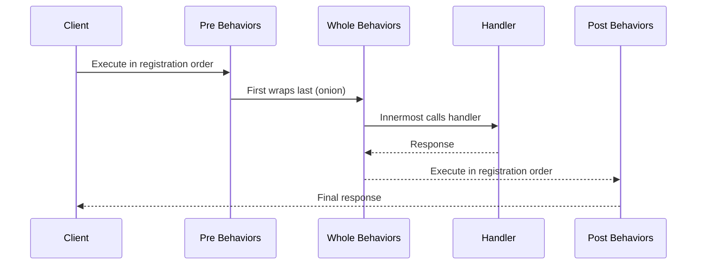

# Mediator Pattern API Reference

Complete API documentation for the Mediator pattern in PatternKit.

## Namespace

```csharp
using PatternKit.Behavioral.Mediator;
```

---

## Mediator

Allocation-light mediator supporting commands, notifications, and streaming.

```csharp
public sealed class Mediator
```

### Delegates

#### `PreBehavior`

```csharp
public delegate ValueTask PreBehavior(in object? request, CancellationToken ct);
```

Invoked before handler execution. Can validate, log, or throw to short-circuit.

#### `PostBehavior`

```csharp
public delegate ValueTask PostBehavior(in object? request, object? response, CancellationToken ct);
```

Invoked after handler (or stream) completion.

#### `WholeBehavior`

```csharp
public delegate ValueTask<object?> WholeBehavior(in object? request, CancellationToken ct, MediatorNext next);
```

Wraps the handler for around advice (retry, timing, exception decoration).

#### `MediatorNext`

```csharp
public delegate ValueTask<object?> MediatorNext(in object? request, CancellationToken ct);
```

Continuation delegate for whole behavior chains.

### Methods

| Method | Returns | Description |
|--------|---------|-------------|
| `Send<TRequest, TResponse>(in TRequest, CancellationToken)` | `ValueTask<TResponse?>` | Send command, receive response |
| `Publish<TNotification>(in TNotification, CancellationToken)` | `ValueTask` | Publish to all notification handlers |
| `Stream<TRequest, TItem>(in TRequest, CancellationToken)` | `IAsyncEnumerable<TItem>` | Stream items lazily |

### Static Methods

| Method | Returns | Description |
|--------|---------|-------------|
| `Create()` | `Builder` | Creates a new fluent builder |

### Exceptions

| Method | Exception | Condition |
|--------|-----------|-----------|
| `Send` | `InvalidOperationException` | No handler registered for request type |
| `Send` | `InvalidOperationException` | Response type mismatch |
| `Stream` | `InvalidOperationException` | No stream handler registered |

### Example

```csharp
var mediator = Mediator.Create()
    .Pre((in object req, CancellationToken _) =>
    {
        Console.WriteLine($"Processing: {req.GetType().Name}");
        return default;
    })
    .Command<GetUser, User>((in GetUser q, CancellationToken ct) =>
        new ValueTask<User>(userService.GetAsync(q.Id, ct)))
    .Notification<UserCreated>((in UserCreated n, CancellationToken _) =>
    {
        SendEmail(n.UserId);
        return default;
    })
    .Build();

var user = await mediator.Send<GetUser, User>(new GetUser(42));
await mediator.Publish(new UserCreated(42));
```

---

## Mediator.Builder

Fluent builder for configuring the mediator.

```csharp
public sealed class Builder
```

### Typed Delegates

```csharp
public delegate ValueTask<TResponse> CommandHandlerTyped<TRequest, TResponse>(in TRequest request, CancellationToken ct);
public delegate TResponse SyncCommandHandlerTyped<TRequest, out TResponse>(in TRequest request);
public delegate ValueTask NotificationHandlerTyped<TNotification>(in TNotification notification, CancellationToken ct);
public delegate void SyncNotificationHandlerTyped<TNotification>(in TNotification notification);
public delegate IAsyncEnumerable<TItem> StreamHandlerTyped<TRequest, out TItem>(in TRequest request, CancellationToken ct);
```

### Methods

| Method | Returns | Description |
|--------|---------|-------------|
| `Pre(PreBehavior)` | `Builder` | Add pre behavior (before handler) |
| `Post(PostBehavior)` | `Builder` | Add post behavior (after handler) |
| `Whole(WholeBehavior)` | `Builder` | Add whole behavior (wraps handler) |
| `Command<TReq, TRes>(CommandHandlerTyped)` | `Builder` | Register async command handler |
| `Command<TReq, TRes>(SyncCommandHandlerTyped)` | `Builder` | Register sync command handler |
| `Notification<T>(NotificationHandlerTyped)` | `Builder` | Register async notification handler |
| `Notification<T>(SyncNotificationHandlerTyped)` | `Builder` | Register sync notification handler |
| `Stream<TReq, TItem>(StreamHandlerTyped)` | `Builder` | Register streaming handler |
| `Build()` | `Mediator` | Build immutable mediator |

### Behavior Execution Order



### Example

```csharp
var mediator = Mediator.Create()
    // Behaviors
    .Pre((in object req, CancellationToken ct) =>
    {
        Log.Info($"Pre: {req.GetType().Name}");
        return default;
    })
    .Whole((in object req, CancellationToken ct, Mediator.MediatorNext next) =>
    {
        var sw = Stopwatch.StartNew();
        var result = await next(in req, ct);
        Log.Info($"Elapsed: {sw.ElapsedMilliseconds}ms");
        return result;
    })
    .Post((in object req, object? res, CancellationToken ct) =>
    {
        Log.Info($"Post: {res}");
        return default;
    })

    // Commands
    .Command<CreateOrder, Order>((in CreateOrder cmd, CancellationToken ct) =>
        orderService.CreateAsync(cmd, ct))

    // Notifications (multiple handlers allowed)
    .Notification<OrderCreated>((in OrderCreated n, CancellationToken _) =>
    {
        emailService.SendConfirmation(n.OrderId);
        return default;
    })
    .Notification<OrderCreated>((in OrderCreated n, CancellationToken _) =>
    {
        analyticsService.Track(n.OrderId);
        return default;
    })

    // Streaming
    .Stream<GetOrders, Order>((in GetOrders q, CancellationToken ct) =>
        orderService.GetAllAsync(q.UserId, ct))

    .Build();
```

---

## Message Types Comparison

| Feature | Command | Notification | Stream |
|---------|---------|--------------|--------|
| Handlers | Single | Multiple | Single |
| Response | Yes | No | Async sequence |
| Pre behaviors | Yes | Yes | Yes |
| Whole behaviors | Yes | No | Yes |
| Post behaviors | Yes | Yes | Yes (after completion) |
| Missing handler | Throws | No-op | Throws |

---

## Thread Safety

| Component | Thread-Safe |
|-----------|-------------|
| `Builder` | No - use from single thread |
| `Mediator` | Yes - immutable after build |
| `Send` | Yes - concurrent calls safe |
| `Publish` | Yes - concurrent calls safe |
| `Stream` | Yes - concurrent calls safe |

### Implementation Notes

- Handlers stored in `ReadOnlyDictionary` for immutability
- `ValueTask` everywhere for allocation-light async
- Typed handlers adapted to boxed signatures at build time
- Pre behaviors execute in registration order
- Whole behaviors wrap inside-out (last registered is innermost)
- Post behaviors execute in registration order

---

## Platform Support

| Feature | .NET Standard 2.0 | .NET Standard 2.1+ |
|---------|-------------------|-------------------|
| Commands | Yes | Yes |
| Notifications | Yes | Yes |
| Streaming | No | Yes |

---

## See Also

- [Overview](index.md)
- [Comprehensive Guide](guide.md)
- [Real-World Examples](real-world-examples.md)
