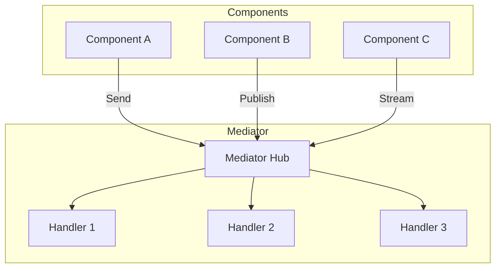

# Mediator Pattern Guide

Comprehensive guide to using the Mediator pattern in PatternKit.

## Overview

The Mediator pattern defines an object that encapsulates how a set of objects interact. This implementation provides a central hub for commands (request/response), notifications (fan-out), and streaming with composable behaviors.



## Getting Started

### Installation

```csharp
using PatternKit.Behavioral.Mediator;
```

### Basic Usage

```csharp
// Define messages
public record GetUser(int Id);
public record User(int Id, string Name);
public record UserCreated(int UserId);

// Build mediator
var mediator = Mediator.Create()
    .Command<GetUser, User>((in GetUser q, CancellationToken ct) =>
        new ValueTask<User>(new User(q.Id, "Alice")))
    .Notification<UserCreated>((in UserCreated n, CancellationToken _) =>
    {
        Console.WriteLine($"User {n.UserId} created");
        return default;
    })
    .Build();

// Use it
var user = await mediator.Send<GetUser, User>(new GetUser(42));
await mediator.Publish(new UserCreated(42));
```

## Core Concepts

### Commands (Request/Response)

Commands are single-handler messages that return a response:

```csharp
// Async handler
.Command<CreateOrder, Order>((in CreateOrder cmd, CancellationToken ct) =>
    orderService.CreateAsync(cmd, ct))

// Sync handler (wrapped automatically)
.Command<GetProduct, Product>((in GetProduct q) =>
    productRepo.Get(q.Id))
```

### Notifications (Fan-Out)

Notifications can have multiple handlers:

```csharp
.Notification<OrderPlaced>((in OrderPlaced n, CancellationToken _) =>
{
    emailService.SendConfirmation(n.OrderId);
    return default;
})
.Notification<OrderPlaced>((in OrderPlaced n, CancellationToken _) =>
{
    analyticsService.Track("order_placed", n.OrderId);
    return default;
})
```

### Streaming

For large result sets, use streaming (requires .NET Standard 2.1+):

```csharp
.Stream<GetAllOrders, Order>((in GetAllOrders q, CancellationToken ct) =>
    orderService.GetAllAsync(q.UserId, ct))

// Consumption
await foreach (var order in mediator.Stream<GetAllOrders, Order>(
    new GetAllOrders(userId), ct))
{
    Console.WriteLine(order.Id);
}
```

## Behaviors

Behaviors add cross-cutting concerns to your pipeline.

### Pre Behaviors

Execute before any handler:

```csharp
.Pre((in object req, CancellationToken ct) =>
{
    Console.WriteLine($"Processing: {req.GetType().Name}");
    return default;
})
```

### Post Behaviors

Execute after handler completion:

```csharp
.Post((in object req, object? res, CancellationToken ct) =>
{
    Console.WriteLine($"Completed: {req.GetType().Name} -> {res}");
    return default;
})
```

### Whole Behaviors

Wrap the handler (around advice):

```csharp
.Whole(async (in object req, CancellationToken ct, Mediator.MediatorNext next) =>
{
    var sw = Stopwatch.StartNew();
    try
    {
        return await next(in req, ct);
    }
    finally
    {
        Console.WriteLine($"Elapsed: {sw.ElapsedMilliseconds}ms");
    }
})
```

## Common Patterns

### CQRS with Mediator

Separate command and query handling:

```csharp
// Queries (read)
public record GetOrders(int UserId);
public record GetOrderById(int Id);

// Commands (write)
public record CreateOrder(int UserId, List<OrderItem> Items);
public record CancelOrder(int OrderId, string Reason);

var mediator = Mediator.Create()
    // Queries
    .Command<GetOrders, IEnumerable<Order>>((in GetOrders q, CancellationToken ct) =>
        queryService.GetOrdersAsync(q.UserId, ct))
    .Command<GetOrderById, Order?>((in GetOrderById q, CancellationToken ct) =>
        queryService.GetOrderAsync(q.Id, ct))

    // Commands
    .Command<CreateOrder, OrderResult>((in CreateOrder cmd, CancellationToken ct) =>
        commandService.CreateOrderAsync(cmd, ct))
    .Command<CancelOrder, bool>((in CancelOrder cmd, CancellationToken ct) =>
        commandService.CancelOrderAsync(cmd, ct))

    .Build();
```

### Validation Behavior

```csharp
.Pre(async (in object req, CancellationToken ct) =>
{
    if (req is IValidatable validatable)
    {
        var result = await validatable.ValidateAsync(ct);
        if (!result.IsValid)
            throw new ValidationException(result.Errors);
    }
})
```

### Logging Behavior

```csharp
.Pre((in object req, CancellationToken _) =>
{
    Log.Information("Request: {Type} {@Request}",
        req.GetType().Name, req);
    return default;
})
.Post((in object req, object? res, CancellationToken _) =>
{
    Log.Information("Response: {Type} {@Response}",
        req.GetType().Name, res);
    return default;
})
```

### Retry Behavior

```csharp
.Whole(async (in object req, CancellationToken ct, Mediator.MediatorNext next) =>
{
    const int maxRetries = 3;
    for (int i = 0; i < maxRetries; i++)
    {
        try
        {
            return await next(in req, ct);
        }
        catch (TransientException) when (i < maxRetries - 1)
        {
            await Task.Delay(TimeSpan.FromSeconds(Math.Pow(2, i)), ct);
        }
    }
    throw new MaxRetriesExceededException();
})
```

### Transaction Behavior

```csharp
.Whole(async (in object req, CancellationToken ct, Mediator.MediatorNext next) =>
{
    using var scope = new TransactionScope(TransactionScopeAsyncFlowOption.Enabled);
    var result = await next(in req, ct);
    scope.Complete();
    return result;
})
```

## Extending the Pattern

### Custom Handler Interface

```csharp
public interface IRequestHandler<TRequest, TResponse>
{
    ValueTask<TResponse> HandleAsync(TRequest request, CancellationToken ct);
}

// Register multiple handlers from container
public static Builder AddHandlers(this Builder builder, IServiceProvider services)
{
    foreach (var handler in services.GetServices<IRequestHandler>())
    {
        // Register dynamically
    }
    return builder;
}
```

### Dependency Injection Integration

```csharp
// Build mediator from DI container
public static Mediator BuildFromServices(IServiceProvider services)
{
    var builder = Mediator.Create();

    // Add behaviors from DI
    foreach (var behavior in services.GetServices<IMediatorBehavior>())
    {
        builder.Pre(behavior.BeforeAsync);
        builder.Post(behavior.AfterAsync);
    }

    // Add handlers from DI
    var handlers = services.GetServices<ICommandHandler>();
    foreach (var handler in handlers)
    {
        handler.Register(builder);
    }

    return builder.Build();
}
```

## Best Practices

### Message Design

1. **Immutable messages**: Use records for automatic equality
2. **Self-describing names**: `CreateOrder` not `DoOrder`
3. **Single responsibility**: One message = one operation
4. **Include context**: User ID, correlation ID in messages

### Handler Design

1. **Keep handlers focused**: One handler per message type
2. **Avoid handler logic in behaviors**: Behaviors are cross-cutting
3. **Use sync handlers when appropriate**: Avoid async overhead
4. **Handle cancellation**: Pass CancellationToken throughout

### Behavior Design

1. **Order matters**: Pre behaviors execute in registration order
2. **Whole behaviors wrap**: Last registered is innermost
3. **Keep behaviors generic**: Don't check message types in behaviors
4. **Handle exceptions**: Behaviors can catch and transform exceptions

## Troubleshooting

### "No command handler registered"

```csharp
// Ensure handler is registered for exact type
.Command<MyRequest, MyResponse>(...)

// Note: inheritance doesn't work - register concrete types
```

### "Response type mismatch"

```csharp
// Handler must return compatible type
.Command<GetUser, User?>(...) // Return User or null, not object
```

### Notifications not received

```csharp
// Handlers must be registered before Build()
var mediator = Mediator.Create()
    .Notification<MyEvent>(handler1)
    .Notification<MyEvent>(handler2) // Both will receive
    .Build();
```

## FAQ

### Can I register multiple command handlers?

No. Commands follow request/response semantics with a single handler. Use notifications for fan-out.

### Are handlers executed in parallel?

No. Commands have one handler; notifications execute handlers sequentially. For parallel execution, implement within the handler.

### Can behaviors short-circuit?

Yes. Pre behaviors can throw to prevent handler execution. Whole behaviors can skip calling `next`.

### Is the mediator scoped or singleton?

The mediator is immutable after `Build()` and can be registered as singleton. Use captured closures for scoped dependencies.

## See Also

- [Overview](index.md)
- [API Reference](api-reference.md)
- [Real-World Examples](real-world-examples.md)
