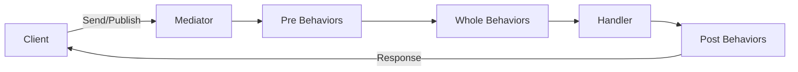

# Mediator Pattern

> **TL;DR**: Allocation-light mediator for commands, notifications, and streaming with composable behaviors.

## Quick Example

```csharp
var mediator = Mediator.Create()
    .Pre((in object req, CancellationToken _) => { Log.Info($"Processing {req.GetType().Name}"); return default; })
    .Command<GetUser, User>((in GetUser q, CancellationToken ct) => userService.GetAsync(q.Id, ct))
    .Notification<UserCreated>((in UserCreated n, CancellationToken _) => { SendWelcomeEmail(n.UserId); return default; })
    .Build();

// Request/Response
var user = await mediator.Send<GetUser, User>(new GetUser(42));

// Fire-and-forget notification
await mediator.Publish(new UserCreated(42));
```

## What It Is

Mediator provides a central hub for coordinating communication between loosely-coupled components. Instead of components referencing each other directly, they communicate through the mediator using typed messages.

Key characteristics:

- **Commands**: Request/response pattern with `Send<TRequest, TResponse>`
- **Notifications**: Fan-out to multiple handlers with `Publish<TNotification>`
- **Streaming**: Async enumerable results with `Stream<TRequest, TItem>`
- **Behaviors**: Pre/Post/Whole pipeline behaviors for cross-cutting concerns
- **Allocation-light**: ValueTask-based, minimal boxing
- **Immutable**: Thread-safe after `Build()`

## When to Use

- **Decoupled handlers**: Multiple handlers processing different request types
- **CQRS patterns**: Separate command and query handlers
- **Cross-cutting concerns**: Logging, validation, timing via behaviors
- **Complex orchestration**: Coordinate multiple services through a single entry point

## When to Avoid

- **Simple direct calls**: Overhead not justified for trivial operations
- **Tight coupling acceptable**: When components naturally belong together
- **Performance-critical paths**: Additional indirection has some cost
- **External messaging**: Use dedicated message brokers (RabbitMQ, Kafka)

## Diagram



## Message Types

| Type | Method | Handlers | Returns |
|------|--------|----------|---------|
| Command | `Send<TReq, TRes>` | Single | `ValueTask<TRes>` |
| Notification | `Publish<T>` | Multiple | `ValueTask` |
| Stream | `Stream<TReq, TItem>` | Single | `IAsyncEnumerable<TItem>` |

## Behavior Pipeline

| Behavior | When | Use Case |
|----------|------|----------|
| `Pre` | Before handler | Validation, logging, metrics |
| `Whole` | Wraps handler | Retry, timing, exception decoration |
| `Post` | After handler | Cleanup, audit logging |

## See Also

- [Comprehensive Guide](guide.md) - Detailed usage and CQRS patterns
- [API Reference](api-reference.md) - Complete API documentation
- [Real-World Examples](real-world-examples.md) - Production-ready examples
- [Observer Pattern](../observer/index.md) - For simpler pub/sub scenarios
