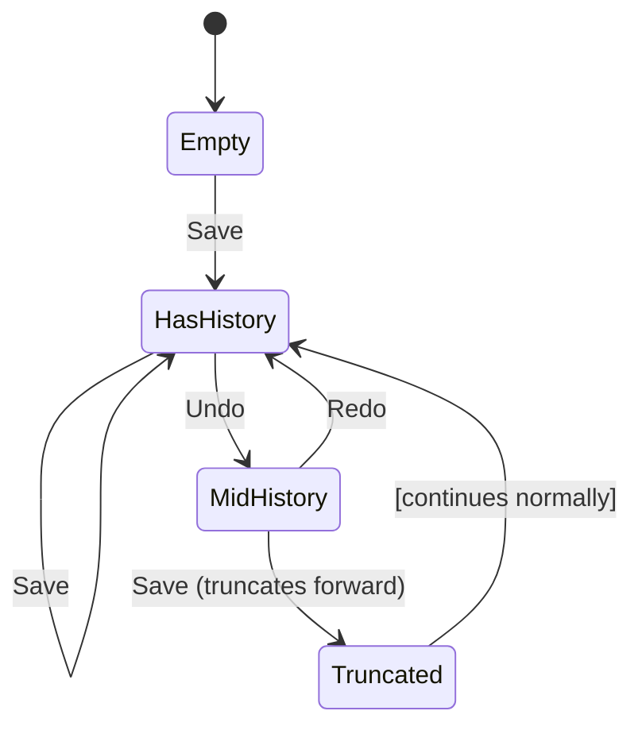

# Memento Pattern API Reference

Complete API documentation for the Memento pattern in PatternKit.

## Namespace

```csharp
using PatternKit.Behavioral.Memento;
```

---

## Memento\<TState\>

Generic snapshot/restore history engine with undo/redo capabilities.

```csharp
public sealed class Memento<TState>
```

### Type Parameters

| Parameter | Description |
|-----------|-------------|
| `TState` | The state type to snapshot |

### Delegates

#### `Cloner`

```csharp
public delegate TState Cloner(in TState state);
```

Creates a deep copy of the state for snapshot storage.

#### `Applier`

```csharp
public delegate void Applier(ref TState target, TState snapshot);
```

Restores state from a snapshot (can be partial merge).

### Properties

| Property | Type | Description |
|----------|------|-------------|
| `CurrentVersion` | `int` | Current version number (0 if empty) |
| `History` | `IReadOnlyList<Snapshot>` | Copy of all retained snapshots |
| `CanUndo` | `bool` | True if undo is available |
| `CanRedo` | `bool` | True if redo is available |

### Methods

| Method | Returns | Description |
|--------|---------|-------------|
| `Save(in TState, string? tag)` | `int` | Save snapshot, returns version |
| `Undo(ref TState)` | `bool` | Restore previous state |
| `Redo(ref TState)` | `bool` | Restore next state (if available) |
| `Restore(int version, ref TState)` | `bool` | Jump to specific version |
| `Clear()` | `void` | Clear all history |

### Static Methods

| Method | Returns | Description |
|--------|---------|-------------|
| `Create()` | `Builder` | Creates a new fluent builder |

### Example

```csharp
var history = Memento<Document>.Create()
    .CloneWith((in Document d) => new Document { Text = d.Text, Caret = d.Caret })
    .Capacity(100)
    .Build();

var doc = new Document();

int v1 = history.Save(in doc, tag: "initial");
doc.Text = "Hello";
int v2 = history.Save(in doc);
doc.Text = "Hello, World";
int v3 = history.Save(in doc);

history.Undo(ref doc); // doc.Text = "Hello"
history.Redo(ref doc); // doc.Text = "Hello, World"
history.Restore(v1, ref doc); // doc.Text = ""
```

---

## Memento\<TState\>.Snapshot

Immutable struct representing a saved state.

```csharp
public readonly struct Snapshot
```

### Properties

| Property | Type | Description |
|----------|------|-------------|
| `Version` | `int` | Unique version identifier |
| `State` | `TState` | The cloned state payload |
| `TimestampUtc` | `DateTime` | When snapshot was captured |
| `Tag` | `string?` | Optional human-readable label |
| `HasTag` | `bool` | Convenience: Tag != null |

### Example

```csharp
foreach (var snap in history.History)
{
    Console.WriteLine($"v{snap.Version}: {snap.Tag ?? "(no tag)"} @ {snap.TimestampUtc}");
}
```

---

## Memento\<TState\>.Builder

Fluent builder for configuring the memento.

```csharp
public sealed class Builder
```

### Methods

| Method | Returns | Description |
|--------|---------|-------------|
| `CloneWith(Cloner)` | `Builder` | Set clone function (required for reference types) |
| `ApplyWith(Applier)` | `Builder` | Set custom restore logic (partial merge) |
| `Equality(IEqualityComparer<TState>)` | `Builder` | Skip duplicate consecutive saves |
| `Capacity(int)` | `Builder` | Max snapshots to retain (0 = unbounded) |
| `Build()` | `Memento<TState>` | Build immutable memento |

### Configuration Details

| Method | Purpose | Default |
|--------|---------|---------|
| `CloneWith` | Deep clone for isolation | Value copy (`s => s`) |
| `ApplyWith` | Custom restore logic | Assignment (`target = snap`) |
| `Equality` | Duplicate detection | None (always save) |
| `Capacity` | Memory limit | 0 (unbounded) |

### Example

```csharp
// Full configuration
var history = Memento<EditorState>.Create()
    // Deep clone for reference types
    .CloneWith((in EditorState s) => new EditorState
    {
        Text = s.Text,
        SelectionStart = s.SelectionStart,
        SelectionLength = s.SelectionLength
    })
    // Partial apply (only restore text, preserve selection)
    .ApplyWith((ref EditorState live, EditorState snap) =>
    {
        live.Text = snap.Text;
    })
    // Skip saves when text unchanged
    .Equality(new TextOnlyComparer())
    // Keep last 50 versions
    .Capacity(50)
    .Build();
```

---

## Behavior Details

### Undo/Redo Semantics



| Scenario | Behavior |
|----------|----------|
| Save at end | Appends new version |
| Save mid-history | Truncates forward history |
| Undo at start | Returns false, no change |
| Redo at end | Returns false, no change |
| Restore evicted version | Returns false, no change |
| Capacity exceeded | FIFO eviction of oldest |

### Version Numbering

- Versions are monotonically increasing integers starting at 1
- Versions are never reused, even after eviction
- After eviction, gaps may exist in retained version numbers

---

## Thread Safety

| Component | Thread-Safe |
|-----------|-------------|
| `Builder` | No - use from single thread |
| `Memento<TState>` | Yes - internal locking |
| `Save` | Yes - synchronized |
| `Undo` | Yes - synchronized |
| `Redo` | Yes - synchronized |
| `Restore` | Yes - synchronized |
| `History` | Yes - returns copy |

### Implementation Notes

- All mutating operations use a private lock
- `History` property returns an array copy for safe iteration
- Cloner is called within the lock to ensure consistency
- Applier is called within the lock

---

## Complete Example

```csharp
using PatternKit.Behavioral.Memento;

// State class
public sealed class Canvas
{
    public List<Shape> Shapes { get; set; } = new();
    public string Background { get; set; } = "white";
}

// Custom comparer for duplicate detection
public class CanvasComparer : IEqualityComparer<Canvas>
{
    public bool Equals(Canvas? x, Canvas? y) =>
        x?.Shapes.Count == y?.Shapes.Count &&
        x?.Background == y?.Background;

    public int GetHashCode(Canvas obj) =>
        HashCode.Combine(obj.Shapes.Count, obj.Background);
}

// Build memento
var history = Memento<Canvas>.Create()
    .CloneWith((in Canvas c) => new Canvas
    {
        Shapes = new List<Shape>(c.Shapes),
        Background = c.Background
    })
    .Equality(new CanvasComparer())
    .Capacity(100)
    .Build();

// Usage
var canvas = new Canvas();
history.Save(in canvas, "blank");

canvas.Shapes.Add(new Rectangle(10, 10, 100, 50));
history.Save(in canvas, "added rectangle");

canvas.Background = "blue";
history.Save(in canvas);

// Undo background change
history.Undo(ref canvas);
Console.WriteLine(canvas.Background); // "white"

// Redo
history.Redo(ref canvas);
Console.WriteLine(canvas.Background); // "blue"

// Jump to initial
history.Restore(1, ref canvas);
Console.WriteLine(canvas.Shapes.Count); // 0
```

---

## See Also

- [Overview](index.md)
- [Comprehensive Guide](guide.md)
- [Real-World Examples](real-world-examples.md)
