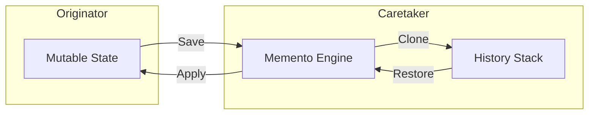

# Memento Pattern Guide

Comprehensive guide to using the Memento pattern in PatternKit.

## Overview

The Memento pattern captures and externalizes an object's internal state without violating encapsulation, so the object can be restored to this state later. This implementation provides a full history engine with undo/redo capabilities.



## Getting Started

### Installation

```csharp
using PatternKit.Behavioral.Memento;
```

### Basic Usage

```csharp
// Define your state
public sealed class Document
{
    public string Text { get; set; } = "";
    public int CursorPosition { get; set; }
}

// Create memento with clone function
var history = Memento<Document>.Create()
    .CloneWith((in Document d) => new Document
    {
        Text = d.Text,
        CursorPosition = d.CursorPosition
    })
    .Build();

// Use it
var doc = new Document();

history.Save(in doc, tag: "initial");
doc.Text = "Hello";
history.Save(in doc);
doc.Text = "Hello, World";
history.Save(in doc);

history.Undo(ref doc); // doc.Text = "Hello"
history.Redo(ref doc); // doc.Text = "Hello, World"
```

## Core Concepts

### Cloning

For reference types, you must provide a clone function to ensure snapshot isolation:

```csharp
// Simple value copy (structs, primitives)
var intHistory = Memento<int>.Create().Build();

// Deep clone for objects
var docHistory = Memento<Document>.Create()
    .CloneWith((in Document d) => new Document
    {
        Text = d.Text,
        CursorPosition = d.CursorPosition
    })
    .Build();

// Deep clone with collections
var listHistory = Memento<List<string>>.Create()
    .CloneWith((in List<string> list) => new List<string>(list))
    .Build();
```

### Applying (Restore Logic)

Customize how snapshots are restored:

```csharp
// Default: full assignment
// target = snapshot;

// Partial apply: only restore certain fields
var history = Memento<EditorState>.Create()
    .CloneWith((in EditorState s) => new EditorState
    {
        Document = s.Document,
        Selection = s.Selection,
        ViewState = s.ViewState
    })
    .ApplyWith((ref EditorState live, EditorState snap) =>
    {
        // Only restore document, preserve view state
        live.Document = snap.Document;
        live.Selection = snap.Selection;
        // live.ViewState preserved
    })
    .Build();
```

### Capacity Limits

Prevent unbounded memory growth:

```csharp
var history = Memento<Document>.Create()
    .CloneWith(...)
    .Capacity(100)  // Keep only last 100 versions
    .Build();

// Oldest snapshots evicted when capacity exceeded
for (int i = 0; i < 150; i++)
{
    doc.Text = $"Version {i}";
    history.Save(in doc);
}
// Only versions 51-150 retained
```

### Duplicate Suppression

Skip saves when state hasn't changed:

```csharp
public class DocumentComparer : IEqualityComparer<Document>
{
    public bool Equals(Document? x, Document? y) =>
        x?.Text == y?.Text && x?.CursorPosition == y?.CursorPosition;

    public int GetHashCode(Document obj) =>
        HashCode.Combine(obj.Text, obj.CursorPosition);
}

var history = Memento<Document>.Create()
    .CloneWith(...)
    .Equality(new DocumentComparer())
    .Build();

doc.Text = "Hello";
history.Save(in doc); // v1
history.Save(in doc); // Skipped (duplicate)
doc.Text = "World";
history.Save(in doc); // v2
```

## Common Patterns

### Text Editor Undo/Redo

```csharp
public class TextEditor
{
    private readonly Memento<EditorState> _history;
    private EditorState _state = new();

    public TextEditor()
    {
        _history = Memento<EditorState>.Create()
            .CloneWith((in EditorState s) => new EditorState
            {
                Text = s.Text,
                SelectionStart = s.SelectionStart,
                SelectionLength = s.SelectionLength
            })
            .Equality(new TextOnlyComparer()) // Ignore cursor changes
            .Capacity(1000)
            .Build();

        _history.Save(in _state, tag: "initial");
    }

    public void TypeText(string text)
    {
        _state.Text = _state.Text.Insert(_state.SelectionStart, text);
        _state.SelectionStart += text.Length;
        _history.Save(in _state);
    }

    public void Undo()
    {
        if (_history.CanUndo)
            _history.Undo(ref _state);
    }

    public void Redo()
    {
        if (_history.CanRedo)
            _history.Redo(ref _state);
    }
}
```

### Form Wizard with Checkpoints

```csharp
public class FormWizard
{
    private readonly Memento<WizardState> _history;
    private WizardState _state = new();

    public FormWizard()
    {
        _history = Memento<WizardState>.Create()
            .CloneWith((in WizardState s) => s.DeepClone())
            .Build();
    }

    public void StartStep(string stepName)
    {
        _history.Save(in _state, tag: $"start:{stepName}");
    }

    public void CompleteStep(string stepName)
    {
        _history.Save(in _state, tag: $"complete:{stepName}");
    }

    public void GoToStep(string stepName)
    {
        var snapshot = _history.History
            .LastOrDefault(s => s.Tag == $"complete:{stepName}");

        if (snapshot.Version > 0)
            _history.Restore(snapshot.Version, ref _state);
    }

    public IReadOnlyList<string> CompletedSteps =>
        _history.History
            .Where(s => s.Tag?.StartsWith("complete:") == true)
            .Select(s => s.Tag!.Replace("complete:", ""))
            .ToList();
}
```

### Game State Checkpoints

```csharp
public class GameManager
{
    private readonly Memento<GameState> _checkpoints;
    private GameState _state;

    public GameManager()
    {
        _checkpoints = Memento<GameState>.Create()
            .CloneWith((in GameState s) => s.DeepClone())
            .Capacity(10) // Keep last 10 checkpoints
            .Build();

        _state = new GameState();
        _checkpoints.Save(in _state, tag: "new-game");
    }

    public void SaveCheckpoint(string name)
    {
        _checkpoints.Save(in _state, tag: name);
    }

    public bool LoadCheckpoint(string name)
    {
        var checkpoint = _checkpoints.History
            .FirstOrDefault(s => s.Tag == name);

        if (checkpoint.Version > 0)
        {
            _checkpoints.Restore(checkpoint.Version, ref _state);
            return true;
        }
        return false;
    }

    public void QuickSave() => SaveCheckpoint("quicksave");
    public void QuickLoad() => LoadCheckpoint("quicksave");
}
```

### Transaction Preview

```csharp
public class TransactionPreview<T> where T : class, new()
{
    private readonly Memento<T> _preview;
    private T _state;

    public TransactionPreview(T initial, Func<T, T> cloner)
    {
        _state = initial;
        _preview = Memento<T>.Create()
            .CloneWith((in T s) => cloner(s))
            .Capacity(2) // Only need before/after
            .Build();
    }

    public T BeginPreview()
    {
        _preview.Save(in _state, tag: "before");
        return _state;
    }

    public void CommitPreview()
    {
        _preview.Save(in _state, tag: "after");
        // Clear preview history if desired
    }

    public void CancelPreview()
    {
        _preview.Undo(ref _state);
    }

    public (T Before, T After)? GetDiff()
    {
        var history = _preview.History;
        var before = history.FirstOrDefault(s => s.Tag == "before");
        var after = history.FirstOrDefault(s => s.Tag == "after");

        if (before.Version > 0 && after.Version > 0)
            return (before.State, after.State);
        return null;
    }
}
```

## Extending the Pattern

### Async Save/Restore

```csharp
public class AsyncMemento<T>
{
    private readonly Memento<T> _memento;
    private readonly SemaphoreSlim _lock = new(1, 1);

    public AsyncMemento(Memento<T> memento)
    {
        _memento = memento;
    }

    public async Task<int> SaveAsync(T state, string? tag = null, CancellationToken ct = default)
    {
        await _lock.WaitAsync(ct);
        try
        {
            return _memento.Save(in state, tag);
        }
        finally
        {
            _lock.Release();
        }
    }

    public async Task<bool> UndoAsync(Func<T> getState, Action<T> setState, CancellationToken ct = default)
    {
        await _lock.WaitAsync(ct);
        try
        {
            var state = getState();
            var result = _memento.Undo(ref state);
            if (result) setState(state);
            return result;
        }
        finally
        {
            _lock.Release();
        }
    }
}
```

### Observable History

```csharp
public class ObservableMemento<T> : INotifyPropertyChanged
{
    private readonly Memento<T> _memento;

    public event PropertyChangedEventHandler? PropertyChanged;

    public bool CanUndo => _memento.CanUndo;
    public bool CanRedo => _memento.CanRedo;
    public int CurrentVersion => _memento.CurrentVersion;

    public int Save(in T state, string? tag = null)
    {
        var version = _memento.Save(in state, tag);
        OnPropertyChanged(nameof(CanUndo));
        OnPropertyChanged(nameof(CanRedo));
        OnPropertyChanged(nameof(CurrentVersion));
        return version;
    }

    // ... similar for Undo, Redo, Restore
}
```

## Best Practices

### Clone Function Design

1. **Deep clone for reference types**: Mutating original affects snapshot
2. **Consider immutable state**: Records with `with` expressions
3. **Skip computed properties**: Only clone source of truth
4. **Handle null**: Check for null in clone function

### Memory Management

1. **Set capacity**: Unbounded history grows forever
2. **Use equality**: Skip duplicate saves
3. **Clear when done**: Call `Clear()` when history not needed
4. **Clone only essentials**: Don't clone cached/derived data

### Thread Safety

1. **Memento is thread-safe**: Internal locking protects state
2. **Your state might not be**: Clone functions should be thread-safe
3. **History is a copy**: Safe to enumerate without locks

## Troubleshooting

### Snapshot changes when original changes

Your clone function doesn't create a deep copy:

```csharp
// BAD: Shallow copy
.CloneWith((in MyState s) => s)

// GOOD: Deep copy
.CloneWith((in MyState s) => new MyState
{
    Items = new List<Item>(s.Items.Select(i => i.Clone()))
})
```

### Undo has no effect

Check that `ApplyWith` actually modifies the target:

```csharp
// BAD: Creates new object, doesn't modify ref
.ApplyWith((ref MyState live, MyState snap) =>
{
    live = new MyState(); // Wrong!
})

// GOOD: Modifies fields of existing object
.ApplyWith((ref MyState live, MyState snap) =>
{
    live.Value = snap.Value;
})
```

### Restore returns false

Version may have been evicted due to capacity:

```csharp
var history = Memento<int>.Create().Capacity(5).Build();
// Save versions 1-10, versions 1-5 evicted
history.Restore(3, ref state); // Returns false
```

## See Also

- [Overview](index.md)
- [API Reference](api-reference.md)
- [Real-World Examples](real-world-examples.md)
