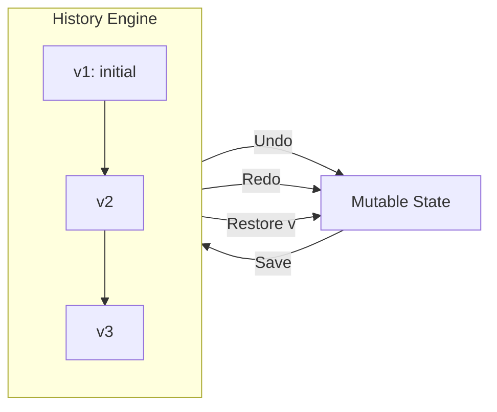

# Memento Pattern

> **TL;DR**: Generic snapshot/restore history engine with undo/redo, version tracking, and capacity limits.

## Quick Example

```csharp
public sealed class Document { public string Text = ""; public int Caret; }

var history = Memento<Document>.Create()
    .CloneWith((in Document d) => new Document { Text = d.Text, Caret = d.Caret })
    .Capacity(100)  // Keep last 100 versions
    .Build();

var doc = new Document();

history.Save(in doc, tag: "initial");   // v1
doc.Text = "Hello"; history.Save(in doc); // v2
doc.Text = "Hello, World"; history.Save(in doc); // v3

history.Undo(ref doc); // Back to "Hello"
history.Redo(ref doc); // Forward to "Hello, World"
history.Restore(1, ref doc); // Jump to "initial"
```

## What It Is

Memento captures and restores an object's internal state without violating encapsulation. This implementation provides a full history engine with time-travel capabilities.

Key characteristics:

- **Time travel**: Save, Undo, Redo, and jump to any retained version
- **Version IDs**: Monotonically increasing identifiers for each snapshot
- **Tagged checkpoints**: Human-readable labels for milestone navigation
- **Capacity bound**: FIFO eviction of oldest snapshots when limit reached
- **Duplicate suppression**: Optional equality comparer to skip unchanged states
- **Thread-safe**: Internal locking for concurrent access
- **Custom cloning**: Deep clone reference graphs for proper isolation

## When to Use

- **Undo/Redo**: Text editors, drawing applications, form wizards
- **State history**: Track changes over time with audit trail
- **Checkpoints**: Save milestone states for rollback
- **Transaction preview**: Preview changes before committing

## When to Avoid

- **Single rollback**: A simple clone variable is cheaper
- **Massive state**: Consider diffs or command replay for large objects
- **Cross-aggregate transactions**: Use Command pattern with explicit undo
- **Persistent history**: Use event sourcing for durable storage

## Diagram



## Undo/Redo Rules

| Operation | Behavior |
|-----------|----------|
| `Save` at end | Appends new version |
| `Save` mid-history | Truncates forward history (like editors) |
| `Undo` | Moves cursor backward, applies prior snapshot |
| `Redo` | Moves cursor forward if available |
| `Restore(v)` | Jumps directly to version if retained |
| Capacity exceeded | FIFO eviction of oldest snapshots |

## See Also

- [Comprehensive Guide](guide.md) - Advanced usage and patterns
- [API Reference](api-reference.md) - Complete API documentation
- [Real-World Examples](real-world-examples.md) - Production-ready examples
- [Command Pattern](../command/index.md) - For operation-based undo
