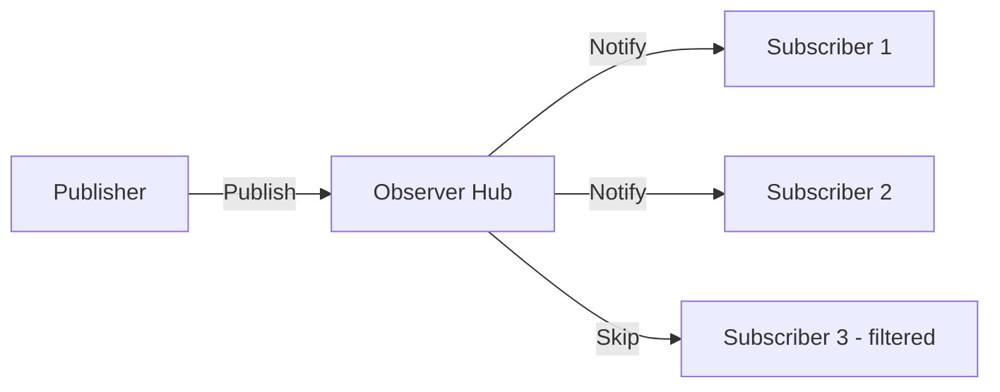

# Observer Pattern Guide

Comprehensive guide to using the Observer pattern in PatternKit.

## Overview

The Observer pattern defines a one-to-many dependency between objects so that when one object changes state, all its dependents are notified and updated automatically. This implementation provides a thread-safe event hub with predicate filtering.



## Getting Started

### Installation

```csharp
using PatternKit.Behavioral.Observer;
```

### Basic Usage

```csharp
// Create the hub
var hub = Observer<string>.Create()
    .OnError((ex, in msg) => Console.Error.WriteLine($"Handler failed: {ex.Message}"))
    .ThrowAggregate()
    .Build();

// Subscribe
var subscription = hub.Subscribe((in string msg) => Console.WriteLine(msg));

// Publish
hub.Publish("Hello, World!");

// Unsubscribe
subscription.Dispose();
```

## Core Concepts

### Event Hub

The central coordinator that manages subscriptions and delivers events:

```csharp
var hub = Observer<OrderEvent>.Create()
    .OnError((ex, in e) => Log.Error(ex, "Handler failed for {OrderId}", e.OrderId))
    .SwallowErrors()  // Don't let one handler break others
    .Build();
```

### Subscriptions

Subscribe to receive events:

```csharp
// Subscribe to all events
var allSub = hub.Subscribe((in OrderEvent e) => ProcessOrder(e));

// Subscribe with filter
var urgentSub = hub.Subscribe(
    (in OrderEvent e) => e.Priority == Priority.Urgent,
    (in OrderEvent e) => HandleUrgent(e));
```

### Publishing

Broadcast events to all matching subscribers:

```csharp
hub.Publish(new OrderEvent { OrderId = 123, Priority = Priority.Normal });
```

## Error Handling Policies

### ThrowAggregate (Default)

Run all handlers, collect exceptions, throw AggregateException:

```csharp
var hub = Observer<Event>.Create()
    .OnError((ex, in e) => Log.Warn(ex.Message))  // Called for each
    .ThrowAggregate()  // Throws AggregateException at end
    .Build();
```

### ThrowFirstError

Stop on first exception, propagate immediately:

```csharp
var hub = Observer<Event>.Create()
    .ThrowFirstError()  // Stops on first failure
    .Build();
```

### SwallowErrors

Never throw, errors go to sink only:

```csharp
var hub = Observer<Event>.Create()
    .OnError((ex, in e) => Log.Error(ex.Message))  // Always called
    .SwallowErrors()  // Never throws
    .Build();
```

## Common Patterns

### Event Bus

Loosely-coupled component communication:

```csharp
public abstract record AppEvent(DateTime Timestamp);
public record UserLoggedIn(DateTime Timestamp, string UserId) : AppEvent(Timestamp);
public record SettingsChanged(DateTime Timestamp, string Key) : AppEvent(Timestamp);

public class EventBus
{
    private readonly Observer<AppEvent> _hub;

    public EventBus()
    {
        _hub = Observer<AppEvent>.Create()
            .SwallowErrors()
            .Build();
    }

    public IDisposable Subscribe<T>(Action<T> handler) where T : AppEvent
    {
        return _hub.Subscribe(
            (in AppEvent e) => e is T,
            (in AppEvent e) => handler((T)e));
    }

    public void Publish(AppEvent @event) => _hub.Publish(@event);
}

// Usage
var bus = new EventBus();
bus.Subscribe<UserLoggedIn>(e => Console.WriteLine($"Welcome, {e.UserId}!"));
bus.Subscribe<SettingsChanged>(e => RefreshUI());

bus.Publish(new UserLoggedIn(DateTime.UtcNow, "alice"));
```

### Domain Events

Broadcast domain changes:

```csharp
public class Order
{
    private readonly Observer<OrderEvent> _events;

    public Order(Observer<OrderEvent> events)
    {
        _events = events;
    }

    public void Ship(string trackingNumber)
    {
        Status = OrderStatus.Shipped;
        TrackingNumber = trackingNumber;

        _events.Publish(new OrderShipped(Id, trackingNumber, DateTime.UtcNow));
    }
}

// Handlers registered elsewhere
hub.Subscribe((in OrderShipped e) => emailService.SendShippingNotification(e));
hub.Subscribe((in OrderShipped e) => analyticsService.TrackShipment(e));
```

### Price Feed

Real-time data distribution:

```csharp
public class StockFeed
{
    private readonly Observer<PriceUpdate> _hub;

    public StockFeed()
    {
        _hub = Observer<PriceUpdate>.Create()
            .OnError((ex, in p) => Log.Error(ex, "Price handler failed for {Symbol}", p.Symbol))
            .SwallowErrors()
            .Build();
    }

    public IDisposable SubscribeSymbol(string symbol, Action<PriceUpdate> handler) =>
        _hub.Subscribe(
            (in PriceUpdate p) => p.Symbol == symbol,
            (in PriceUpdate p) => handler(p));

    public IDisposable SubscribeMovements(decimal threshold, Action<PriceUpdate> handler) =>
        _hub.Subscribe(
            (in PriceUpdate p) => Math.Abs(p.Change) >= threshold,
            (in PriceUpdate p) => handler(p));

    public void PublishUpdate(PriceUpdate update) => _hub.Publish(update);
}
```

### Progress Reporting

Multiple progress displays:

```csharp
public class ProgressReporter
{
    private readonly Observer<ProgressUpdate> _hub;

    public ProgressReporter()
    {
        _hub = Observer<ProgressUpdate>.Create()
            .SwallowErrors()
            .Build();
    }

    public IDisposable Subscribe(Action<ProgressUpdate> handler) =>
        _hub.Subscribe((in ProgressUpdate p) => handler(p));

    public void Report(int current, int total, string message = "") =>
        _hub.Publish(new ProgressUpdate(current, total, message));
}

// Usage
var reporter = new ProgressReporter();

// UI progress bar
reporter.Subscribe(p => progressBar.Value = (int)(p.Current * 100.0 / p.Total));

// Console output
reporter.Subscribe(p => Console.Write($"\r[{p.Current}/{p.Total}] {p.Message}"));

// Log every 10%
int lastPercent = 0;
reporter.Subscribe(p =>
{
    int percent = p.Current * 100 / p.Total;
    if (percent / 10 > lastPercent / 10)
    {
        Log.Info("Progress: {Percent}%", percent);
        lastPercent = percent;
    }
});
```

## Extending the Pattern

### Async Handlers

Wrap async operations:

```csharp
public static IDisposable SubscribeAsync<T>(
    this Observer<T> hub,
    Func<T, Task> asyncHandler)
{
    return hub.Subscribe((in T e) =>
    {
        // Fire and forget with error handling
        _ = Task.Run(async () =>
        {
            try
            {
                await asyncHandler(e);
            }
            catch (Exception ex)
            {
                Log.Error(ex, "Async handler failed");
            }
        });
    });
}
```

### Buffered Publishing

Batch notifications:

```csharp
public class BufferedObserver<T>
{
    private readonly Observer<IReadOnlyList<T>> _hub;
    private readonly List<T> _buffer = new();
    private readonly int _batchSize;
    private readonly object _lock = new();

    public BufferedObserver(int batchSize)
    {
        _batchSize = batchSize;
        _hub = Observer<IReadOnlyList<T>>.Create().Build();
    }

    public void Add(T item)
    {
        IReadOnlyList<T>? batch = null;
        lock (_lock)
        {
            _buffer.Add(item);
            if (_buffer.Count >= _batchSize)
            {
                batch = _buffer.ToList();
                _buffer.Clear();
            }
        }

        if (batch != null)
            _hub.Publish(batch);
    }

    public void Flush()
    {
        IReadOnlyList<T>? batch = null;
        lock (_lock)
        {
            if (_buffer.Count > 0)
            {
                batch = _buffer.ToList();
                _buffer.Clear();
            }
        }

        if (batch != null)
            _hub.Publish(batch);
    }
}
```

### Typed Event Bus

Strong typing with multiple event types:

```csharp
public class TypedEventBus
{
    private readonly ConcurrentDictionary<Type, object> _hubs = new();

    public IDisposable Subscribe<T>(Action<T> handler)
    {
        var hub = GetHub<T>();
        return hub.Subscribe((in T e) => handler(e));
    }

    public void Publish<T>(T @event)
    {
        var hub = GetHub<T>();
        hub.Publish(@event);
    }

    private Observer<T> GetHub<T>()
    {
        return (Observer<T>)_hubs.GetOrAdd(typeof(T), _ =>
            Observer<T>.Create().SwallowErrors().Build());
    }
}
```

## Best Practices

### Subscription Management

1. **Dispose subscriptions**: Prevent memory leaks
2. **Use using statements**: For scoped subscriptions
3. **Track subscriptions**: Store IDisposable references

```csharp
public class Component : IDisposable
{
    private readonly List<IDisposable> _subscriptions = new();

    public Component(Observer<Event> hub)
    {
        _subscriptions.Add(hub.Subscribe(HandleEvent));
    }

    public void Dispose()
    {
        foreach (var sub in _subscriptions)
            sub.Dispose();
    }
}
```

### Error Handling

1. **Use SwallowErrors for resilience**: One handler shouldn't break others
2. **Always provide OnError**: Log failures
3. **Keep handlers simple**: Complex logic should be in separate methods

### Thread Safety

1. **Hub is thread-safe**: Publish and Subscribe from any thread
2. **Handlers may run concurrently**: If publishing from multiple threads
3. **Dispose is atomic**: Safe to call from any thread

## Troubleshooting

### Handlers not called

1. Check subscription wasn't disposed
2. Verify filter predicate matches
3. Ensure Publish is called after Subscribe

### Memory leak

1. Store and dispose subscription references
2. Use weak references for long-lived subscribers
3. Dispose subscriptions when component is destroyed

### Handler exceptions

1. Check error policy (ThrowAggregate vs SwallowErrors)
2. Verify OnError handler is registered
3. Look for exceptions in OnError sink

## See Also

- [Overview](index.md)
- [API Reference](api-reference.md)
- [Real-World Examples](real-world-examples.md)
