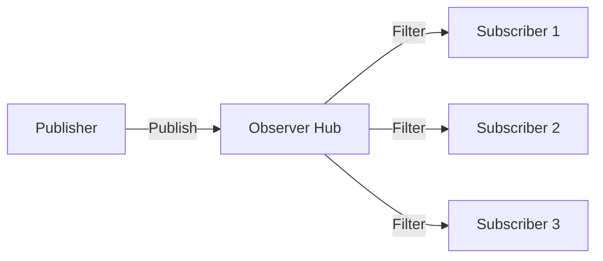

# Observer Pattern

> **TL;DR**: Thread-safe publish/subscribe event hub with fluent configuration and optional filtering.

## Quick Example

```csharp
var hub = Observer<string>.Create()
    .OnError((ex, in msg) => Log.Error($"Handler failed: {ex.Message}"))
    .ThrowAggregate()
    .Build();

// Subscribe
var subAll = hub.Subscribe((in string msg) => Console.WriteLine($"ALL: {msg}"));
var subWarn = hub.Subscribe(
    (in string msg) => msg.StartsWith("warn:"),
    (in string msg) => Console.WriteLine($"WARN: {msg}"));

// Publish
hub.Publish("hello");
hub.Publish("warn: low disk");

// Unsubscribe
subWarn.Dispose();
```

## What It Is

Observer provides a decoupled publish/subscribe mechanism for in-process event broadcasting. Subscribers receive strongly-typed events with optional predicate filtering.

Key characteristics:

- **Thread-safe**: Lock-free copy-on-write subscriptions
- **Typed events**: `Observer<TEvent>` delivers strongly-typed events
- **Predicate filters**: Deliver to handlers only when conditions match
- **Error policies**: ThrowAggregate, ThrowFirst, or Swallow
- **Immutable**: Thread-safe after `Build()`

## When to Use

- **Decoupled producers/consumers**: UI events, domain notifications
- **Many readers, few writers**: Telemetry, logging, instrumentation
- **Simple filtering**: Subscriber-side event filtering
- **In-process pub/sub**: Component communication within a process

## When to Avoid

- **Cross-process messaging**: Use message queues (RabbitMQ, Azure Service Bus)
- **Persistent events**: Use event sourcing or durable messaging
- **Complex routing**: Consider [Mediator](../mediator/index.md)

## Diagram



## Error Handling Policies

| Policy | Behavior |
|--------|----------|
| `ThrowAggregate()` | Run all handlers, throw `AggregateException` at end (default) |
| `ThrowFirstError()` | Stop on first exception, remaining handlers don't run |
| `SwallowErrors()` | Never throw from `Publish`, errors go to sink |

## See Also

- [Comprehensive Guide](guide.md) - Detailed usage and patterns
- [API Reference](api-reference.md) - Complete API documentation
- [Real-World Examples](real-world-examples.md) - Production-ready examples
- [Mediator Pattern](../mediator/index.md) - For request/response coordination
