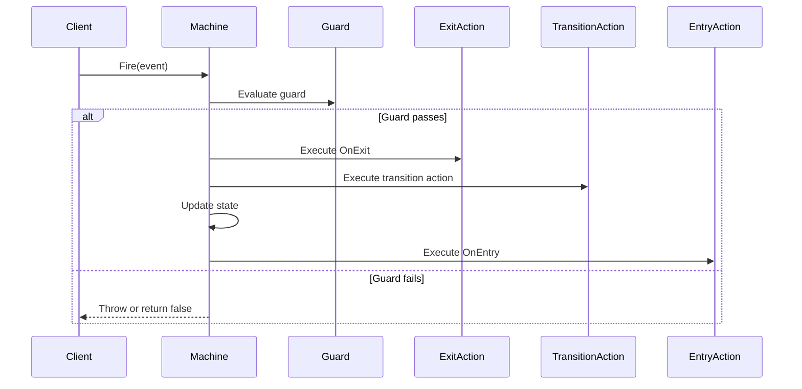

# State Machine Pattern API Reference

Complete API documentation for the State Machine pattern in PatternKit.

## Namespace

```csharp
using PatternKit.Behavioral.State;
```

---

## StateMachine\<TState, TEvent\>

Fluent state machine with typed states, events, and transitions.

```csharp
public sealed class StateMachine<TState, TEvent>
    where TState : notnull
    where TEvent : notnull
```

### Type Parameters

| Parameter | Description |
|-----------|-------------|
| `TState` | State type (typically enum) |
| `TEvent` | Event/trigger type (typically enum) |

### Properties

| Property | Type | Description |
|----------|------|-------------|
| `CurrentState` | `TState` | Current state of the machine |

### Methods

| Method | Returns | Description |
|--------|---------|-------------|
| `Fire(TEvent)` | `void` | Trigger event, transition if valid |
| `TryFire(TEvent)` | `bool` | Attempt trigger, returns success |
| `CanFire(TEvent)` | `bool` | Check if event is valid from current state |
| `GetPermittedTriggers()` | `IReadOnlyList<TEvent>` | List events valid from current state |

### Static Methods

| Method | Returns | Description |
|--------|---------|-------------|
| `Create(TState initial)` | `Builder` | Creates builder with initial state |

### Exceptions

| Method | Exception | Condition |
|--------|-----------|-----------|
| `Fire` | `InvalidOperationException` | No valid transition for event |

### Example

```csharp
var machine = StateMachine<OrderState, OrderEvent>.Create(OrderState.Pending)
    .State(OrderState.Pending)
        .On(OrderEvent.Pay).TransitionTo(OrderState.Paid)
        .On(OrderEvent.Cancel).TransitionTo(OrderState.Cancelled)
    .State(OrderState.Paid)
        .On(OrderEvent.Ship).TransitionTo(OrderState.Shipped)
    .Build();

machine.Fire(OrderEvent.Pay);
Console.WriteLine(machine.CurrentState); // Paid

if (machine.CanFire(OrderEvent.Ship))
    machine.Fire(OrderEvent.Ship);
```

---

## StateMachine\<TState, TEvent\>.Builder

Fluent builder for configuring the state machine.

```csharp
public sealed class Builder
```

### Methods

| Method | Returns | Description |
|--------|---------|-------------|
| `State(TState)` | `StateBuilder` | Configure a state |
| `Build()` | `StateMachine<TState, TEvent>` | Build immutable state machine |

---

## StateBuilder

Configuration for a specific state.

```csharp
public sealed class StateBuilder
```

### Methods

| Method | Returns | Description |
|--------|---------|-------------|
| `OnEntry(Action)` | `StateBuilder` | Action when entering state |
| `OnExit(Action)` | `StateBuilder` | Action when leaving state |
| `On(TEvent)` | `TransitionBuilder` | Configure transition for event |
| `State(TState)` | `StateBuilder` | Move to configuring another state |
| `Build()` | `StateMachine<TState, TEvent>` | Build from state context |

### Example

```csharp
.State(OrderState.Paid)
    .OnEntry(() => Console.WriteLine("Order paid!"))
    .OnExit(() => Console.WriteLine("Leaving paid state"))
    .On(OrderEvent.Ship).TransitionTo(OrderState.Shipped)
```

---

## TransitionBuilder

Configuration for a specific transition.

```csharp
public sealed class TransitionBuilder
```

### Methods

| Method | Returns | Description |
|--------|---------|-------------|
| `TransitionTo(TState)` | `StateBuilder` | Set target state |
| `When(Func<bool>)` | `TransitionBuilder` | Add guard condition |
| `Execute(Action)` | `TransitionBuilder` | Action during transition |

### Example

```csharp
.State(OrderState.Paid)
    .On(OrderEvent.Ship)
        .When(() => inventory.IsAvailable())
        .Execute(() => inventory.Reserve())
        .TransitionTo(OrderState.Shipped)
```

---

## Transition Types

### Simple Transition

```csharp
.On(Event.Trigger).TransitionTo(State.Target)
```

### Guarded Transition

```csharp
.On(Event.Trigger)
    .When(() => condition)
    .TransitionTo(State.Target)
```

### Transition with Action

```csharp
.On(Event.Trigger)
    .Execute(() => DoSomething())
    .TransitionTo(State.Target)
```

### Internal Transition (no state change)

```csharp
.On(Event.Trigger)
    .Execute(() => DoSomething())
    // No TransitionTo = internal transition
```

### Self Transition (re-entry)

```csharp
.State(State.Active)
    .On(Event.Refresh).TransitionTo(State.Active)
    // OnExit and OnEntry will fire
```

---

## Execution Order



---

## Thread Safety

| Component | Thread-Safe |
|-----------|-------------|
| `Builder` | No - use from single thread |
| `StateMachine` | Partially - state reads safe, Fire needs sync |
| `Fire` | No - external synchronization needed |
| `CanFire` | Yes - read-only |
| `GetPermittedTriggers` | Yes - read-only |

### Synchronizing State Changes

```csharp
// Option 1: Lock externally
lock (lockObj)
{
    if (machine.CanFire(event))
        machine.Fire(event);
}

// Option 2: Use TryFire
if (!machine.TryFire(event))
    HandleInvalidTransition();
```

---

## Complete Example

```csharp
using PatternKit.Behavioral.State;

public enum DocumentState { Draft, Review, Approved, Published, Archived }
public enum DocumentEvent { Submit, Approve, Reject, Publish, Archive }

public class DocumentWorkflow
{
    private readonly StateMachine<DocumentState, DocumentEvent> _machine;

    public DocumentWorkflow()
    {
        _machine = StateMachine<DocumentState, DocumentEvent>.Create(DocumentState.Draft)
            .State(DocumentState.Draft)
                .OnEntry(() => Log("Entered draft"))
                .On(DocumentEvent.Submit).TransitionTo(DocumentState.Review)

            .State(DocumentState.Review)
                .On(DocumentEvent.Approve)
                    .When(() => HasApprovalAuthority())
                    .Execute(() => RecordApproval())
                    .TransitionTo(DocumentState.Approved)
                .On(DocumentEvent.Reject)
                    .Execute(() => NotifyAuthor())
                    .TransitionTo(DocumentState.Draft)

            .State(DocumentState.Approved)
                .On(DocumentEvent.Publish).TransitionTo(DocumentState.Published)

            .State(DocumentState.Published)
                .OnEntry(() => NotifySubscribers())
                .On(DocumentEvent.Archive).TransitionTo(DocumentState.Archived)

            .State(DocumentState.Archived)
                .OnEntry(() => Log("Document archived"))

            .Build();
    }

    public DocumentState State => _machine.CurrentState;

    public void Submit() => _machine.Fire(DocumentEvent.Submit);
    public void Approve() => _machine.Fire(DocumentEvent.Approve);
    public void Reject() => _machine.Fire(DocumentEvent.Reject);
    public void Publish() => _machine.Fire(DocumentEvent.Publish);
    public void Archive() => _machine.Fire(DocumentEvent.Archive);

    public IReadOnlyList<DocumentEvent> AvailableActions =>
        _machine.GetPermittedTriggers();
}

// Usage
var workflow = new DocumentWorkflow();
workflow.Submit();   // Draft -> Review
workflow.Approve();  // Review -> Approved
workflow.Publish();  // Approved -> Published
```

---

## See Also

- [Overview](index.md)
- [Comprehensive Guide](guide.md)
- [Real-World Examples](real-world-examples.md)
