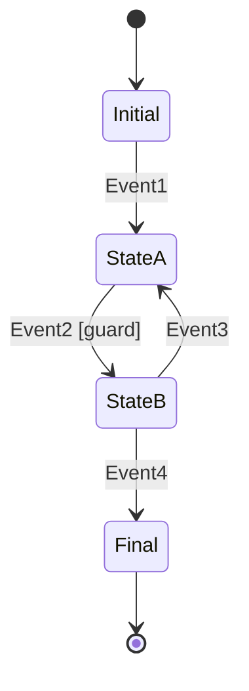

# State Machine Pattern Guide

Comprehensive guide to using the State Machine pattern in PatternKit.

## Overview

The State pattern allows an object to alter its behavior when its internal state changes. This implementation provides a fluent builder for defining states, transitions, guards, and actions.



## Getting Started

### Installation

```csharp
using PatternKit.Behavioral.State;
```

### Basic Usage

```csharp
public enum TrafficLight { Red, Yellow, Green }
public enum TimerTick { Tick }

var light = StateMachine<TrafficLight, TimerTick>.Create(TrafficLight.Red)
    .State(TrafficLight.Red)
        .On(TimerTick.Tick).TransitionTo(TrafficLight.Green)
    .State(TrafficLight.Green)
        .On(TimerTick.Tick).TransitionTo(TrafficLight.Yellow)
    .State(TrafficLight.Yellow)
        .On(TimerTick.Tick).TransitionTo(TrafficLight.Red)
    .Build();

light.Fire(TimerTick.Tick); // Red -> Green
light.Fire(TimerTick.Tick); // Green -> Yellow
light.Fire(TimerTick.Tick); // Yellow -> Red
```

## Core Concepts

### States

States are the discrete conditions your system can be in:

```csharp
public enum OrderState
{
    Pending,
    Validated,
    Paid,
    Shipped,
    Delivered,
    Cancelled
}
```

### Events (Triggers)

Events cause transitions between states:

```csharp
public enum OrderEvent
{
    Validate,
    Pay,
    Ship,
    Deliver,
    Cancel,
    Refund
}
```

### Transitions

Define how events cause state changes:

```csharp
.State(OrderState.Pending)
    .On(OrderEvent.Validate).TransitionTo(OrderState.Validated)
    .On(OrderEvent.Cancel).TransitionTo(OrderState.Cancelled)
```

### Guards

Conditionally allow or block transitions:

```csharp
.State(OrderState.Validated)
    .On(OrderEvent.Pay)
        .When(() => paymentService.IsAvailable())
        .TransitionTo(OrderState.Paid)
```

### Actions

Execute code during state transitions:

```csharp
.State(OrderState.Paid)
    .OnEntry(() => SendConfirmationEmail())
    .OnExit(() => LogStateChange())
    .On(OrderEvent.Ship)
        .Execute(() => ReserveInventory())
        .TransitionTo(OrderState.Shipped)
```

## Common Patterns

### Order Processing Workflow

```csharp
public class OrderWorkflow
{
    private readonly StateMachine<OrderState, OrderEvent> _machine;
    private readonly Order _order;

    public OrderWorkflow(Order order)
    {
        _order = order;
        _machine = StateMachine<OrderState, OrderEvent>.Create(OrderState.Pending)
            .State(OrderState.Pending)
                .OnEntry(() => _order.Status = "Pending")
                .On(OrderEvent.Validate)
                    .When(() => ValidateOrder())
                    .TransitionTo(OrderState.Validated)
                .On(OrderEvent.Cancel).TransitionTo(OrderState.Cancelled)

            .State(OrderState.Validated)
                .OnEntry(() => _order.Status = "Validated")
                .On(OrderEvent.Pay)
                    .When(() => ProcessPayment())
                    .Execute(() => SendReceipt())
                    .TransitionTo(OrderState.Paid)
                .On(OrderEvent.Cancel).TransitionTo(OrderState.Cancelled)

            .State(OrderState.Paid)
                .OnEntry(() =>
                {
                    _order.Status = "Paid";
                    _order.PaidAt = DateTime.UtcNow;
                })
                .On(OrderEvent.Ship)
                    .When(() => InventoryAvailable())
                    .Execute(() => CreateShipment())
                    .TransitionTo(OrderState.Shipped)
                .On(OrderEvent.Refund).TransitionTo(OrderState.Cancelled)

            .State(OrderState.Shipped)
                .OnEntry(() =>
                {
                    _order.Status = "Shipped";
                    SendTrackingEmail();
                })
                .On(OrderEvent.Deliver).TransitionTo(OrderState.Delivered)

            .State(OrderState.Delivered)
                .OnEntry(() =>
                {
                    _order.Status = "Delivered";
                    _order.DeliveredAt = DateTime.UtcNow;
                    RequestReview();
                })

            .State(OrderState.Cancelled)
                .OnEntry(() =>
                {
                    _order.Status = "Cancelled";
                    if (_order.PaidAt.HasValue)
                        ProcessRefund();
                })

            .Build();
    }

    public OrderState State => _machine.CurrentState;
    public IReadOnlyList<OrderEvent> AvailableActions => _machine.GetPermittedTriggers();

    public bool TryValidate() => _machine.TryFire(OrderEvent.Validate);
    public bool TryPay() => _machine.TryFire(OrderEvent.Pay);
    public bool TryShip() => _machine.TryFire(OrderEvent.Ship);
    public bool TryCancel() => _machine.TryFire(OrderEvent.Cancel);
}
```

### Document Review System

```csharp
public enum DocState { Draft, Submitted, UnderReview, Approved, Rejected, Published }
public enum DocEvent { Submit, Assign, Approve, Reject, Revise, Publish }

var workflow = StateMachine<DocState, DocEvent>.Create(DocState.Draft)
    .State(DocState.Draft)
        .On(DocEvent.Submit).TransitionTo(DocState.Submitted)

    .State(DocState.Submitted)
        .On(DocEvent.Assign)
            .When(() => HasAvailableReviewer())
            .Execute(() => AssignReviewer())
            .TransitionTo(DocState.UnderReview)

    .State(DocState.UnderReview)
        .On(DocEvent.Approve)
            .When(() => IsReviewerAuthorized())
            .TransitionTo(DocState.Approved)
        .On(DocEvent.Reject)
            .Execute(() => NotifyAuthor())
            .TransitionTo(DocState.Rejected)

    .State(DocState.Rejected)
        .On(DocEvent.Revise).TransitionTo(DocState.Draft)

    .State(DocState.Approved)
        .On(DocEvent.Publish)
            .When(() => HasPublishPermission())
            .TransitionTo(DocState.Published)

    .Build();
```

### Connection State Manager

```csharp
public enum ConnState { Disconnected, Connecting, Connected, Reconnecting, Failed }
public enum ConnEvent { Connect, Connected, Disconnect, Error, Retry, MaxRetries }

public class ConnectionManager
{
    private readonly StateMachine<ConnState, ConnEvent> _state;
    private int _retryCount = 0;
    private const int MaxRetries = 3;

    public ConnectionManager()
    {
        _state = StateMachine<ConnState, ConnEvent>.Create(ConnState.Disconnected)
            .State(ConnState.Disconnected)
                .OnEntry(() => _retryCount = 0)
                .On(ConnEvent.Connect)
                    .Execute(() => BeginConnect())
                    .TransitionTo(ConnState.Connecting)

            .State(ConnState.Connecting)
                .On(ConnEvent.Connected).TransitionTo(ConnState.Connected)
                .On(ConnEvent.Error).TransitionTo(ConnState.Reconnecting)

            .State(ConnState.Connected)
                .OnEntry(() => OnConnected?.Invoke())
                .On(ConnEvent.Disconnect).TransitionTo(ConnState.Disconnected)
                .On(ConnEvent.Error).TransitionTo(ConnState.Reconnecting)

            .State(ConnState.Reconnecting)
                .OnEntry(() => _retryCount++)
                .On(ConnEvent.Retry)
                    .When(() => _retryCount < MaxRetries)
                    .Execute(() => BeginConnect())
                    .TransitionTo(ConnState.Connecting)
                .On(ConnEvent.MaxRetries)
                    .When(() => _retryCount >= MaxRetries)
                    .TransitionTo(ConnState.Failed)

            .State(ConnState.Failed)
                .OnEntry(() => OnFailed?.Invoke())
                .On(ConnEvent.Connect)
                    .Execute(() => { _retryCount = 0; BeginConnect(); })
                    .TransitionTo(ConnState.Connecting)

            .Build();
    }

    public event Action? OnConnected;
    public event Action? OnFailed;
}
```

## Extending the Pattern

### State Context

Pass context through the state machine:

```csharp
public class StatefulEntity<TState, TEvent, TContext>
    where TState : notnull
    where TEvent : notnull
{
    private readonly StateMachine<TState, TEvent> _machine;
    public TContext Context { get; }

    // Builder pattern that captures context for guards/actions
}
```

### Hierarchical States

Implement nested states:

```csharp
// Parent state with sub-machine
public class HierarchicalState
{
    private readonly StateMachine<ParentState, ParentEvent> _parent;
    private readonly Dictionary<ParentState, StateMachine<ChildState, ChildEvent>> _children;
}
```

### Persistent State Machine

Save and restore state:

```csharp
public class PersistentStateMachine<TState, TEvent>
    where TState : notnull
    where TEvent : notnull
{
    private readonly StateMachine<TState, TEvent> _machine;
    private readonly IStateStore _store;

    public async Task<TState> LoadAsync(string id)
    {
        var savedState = await _store.GetAsync<TState>(id);
        // Rebuild machine at saved state
    }

    public async Task SaveAsync(string id)
    {
        await _store.SetAsync(id, _machine.CurrentState);
    }
}
```

## Best Practices

### State Design

1. **Finite states**: Keep state count manageable (< 15)
2. **Meaningful names**: `Shipped` not `State5`
3. **No dead ends**: Ensure all states have exit paths (or are final)
4. **Single responsibility**: Each state has clear meaning

### Transition Design

1. **Explicit guards**: Make conditions clear
2. **Fail-safe defaults**: Handle unexpected events gracefully
3. **Atomic actions**: Actions should be quick and not throw
4. **Avoid side effects in guards**: Guards should only read state

### Testing

```csharp
[Fact]
public void Order_WhenPaid_CanBeShipped()
{
    var machine = CreateOrderMachine(OrderState.Paid);

    Assert.True(machine.CanFire(OrderEvent.Ship));
    machine.Fire(OrderEvent.Ship);
    Assert.Equal(OrderState.Shipped, machine.CurrentState);
}

[Fact]
public void Order_WhenPending_CannotBeShipped()
{
    var machine = CreateOrderMachine(OrderState.Pending);

    Assert.False(machine.CanFire(OrderEvent.Ship));
    Assert.Throws<InvalidOperationException>(() => machine.Fire(OrderEvent.Ship));
}
```

## Troubleshooting

### "No valid transition"

Check that:
1. Event is registered for current state
2. Guard conditions pass
3. State was correctly configured

### Actions not executing

1. Actions only run on successful transitions
2. Check guard conditions
3. Verify OnEntry/OnExit vs transition actions

### State not changing

1. Guard returning false
2. Internal transition (no state change) configured
3. Exception in action (may interrupt)

## See Also

- [Overview](index.md)
- [API Reference](api-reference.md)
- [Real-World Examples](real-world-examples.md)
