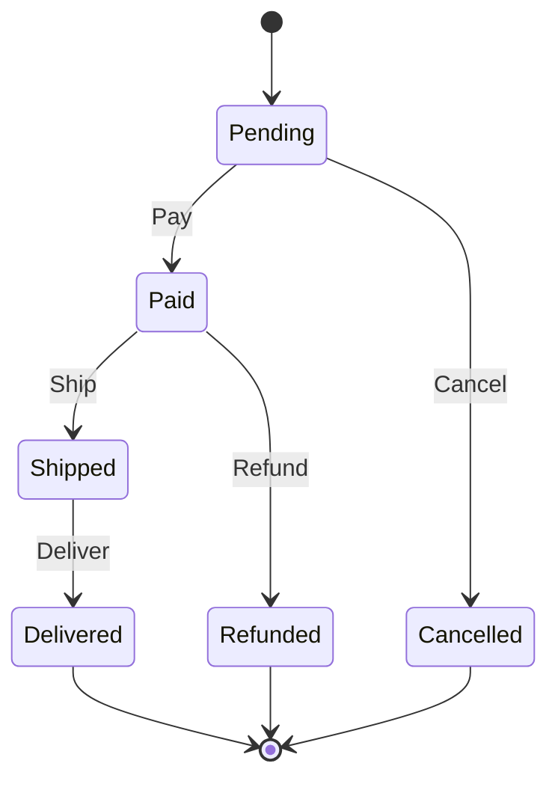

# State Machine Pattern

> **TL;DR**: Fluent state machine with typed states, guarded transitions, and entry/exit actions.

## Quick Example

```csharp
var machine = StateMachine<OrderState, OrderEvent>.Create(OrderState.Pending)
    .State(OrderState.Pending)
        .On(OrderEvent.Pay).TransitionTo(OrderState.Paid)
        .On(OrderEvent.Cancel).TransitionTo(OrderState.Cancelled)
    .State(OrderState.Paid)
        .OnEntry(() => SendConfirmationEmail())
        .On(OrderEvent.Ship).TransitionTo(OrderState.Shipped)
        .On(OrderEvent.Refund).TransitionTo(OrderState.Refunded)
    .State(OrderState.Shipped)
        .On(OrderEvent.Deliver).TransitionTo(OrderState.Delivered)
    .Build();

machine.Fire(OrderEvent.Pay);   // Pending -> Paid
machine.Fire(OrderEvent.Ship);  // Paid -> Shipped
Console.WriteLine(machine.CurrentState); // Shipped
```

## What It Is

State Machine encapsulates state-dependent behavior, allowing an object to change its behavior when its internal state changes. This implementation provides a fluent builder for defining states, transitions, and actions.

Key characteristics:

- **Typed states**: Strongly-typed state and event enums/types
- **Guarded transitions**: Conditional transitions with predicates
- **Entry/Exit actions**: Side effects when entering or leaving states
- **Transition actions**: Side effects during state transitions
- **Immutable**: Thread-safe after `Build()`
- **Introspection**: Query allowed transitions from current state

## When to Use

- **Workflow engines**: Order processing, approval flows
- **Protocol handling**: Network state machines, parsers
- **UI state**: Screen navigation, wizard steps
- **Game logic**: Character states, game phases
- **Device control**: Hardware state management

## When to Avoid

- **Simple conditionals**: If-else is clearer for 2-3 states
- **Parallel states**: Consider hierarchical state machines
- **Distributed state**: Use workflow orchestrators (Temporal, Dapr)
- **Persistence required**: Add explicit serialization

## Diagram



## Transition Types

| Type | Description |
|------|-------------|
| Simple | `On(Event).TransitionTo(State)` |
| Guarded | `On(Event).When(predicate).TransitionTo(State)` |
| Internal | `On(Event).Execute(action)` (no state change) |
| Self | `On(Event).TransitionTo(CurrentState)` (re-entry) |

## See Also

- [Comprehensive Guide](guide.md) - Advanced state machine patterns
- [API Reference](api-reference.md) - Complete API documentation
- [Real-World Examples](real-world-examples.md) - Production-ready examples
- [Strategy Pattern](../strategy/index.md) - For behavior selection without state
