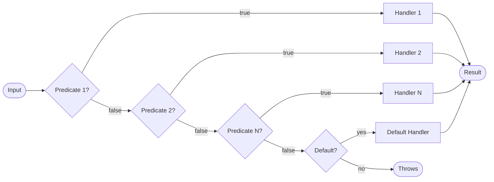

# Strategy Pattern

> **TL;DR**: First-match-wins predicate dispatch - evaluate conditions in order and execute the first matching handler.

## Quick Example

```csharp
// Classify input and return a result
var classify = Strategy<int, string>.Create()
    .When(n => n > 0).Then(_ => "positive")
    .When(n => n < 0).Then(_ => "negative")
    .Default(_ => "zero")
    .Build();

classify.Execute(42);   // "positive"
classify.Execute(-7);   // "negative"
classify.Execute(0);    // "zero"

// Try-style: non-throwing, returns success bool
var parser = TryStrategy<string, int>.Create()
    .Always((in s, out int r) => int.TryParse(s, out r))
    .Finally((in _, out int r) => { r = 0; return true; })
    .Build();

if (parser.Execute("123", out var n))
    Console.WriteLine(n); // 123
```

## What It Is

Strategy provides predicate-based dispatch where the first matching condition wins. It replaces cascading `if-else` or `switch` statements with a fluent, composable decision pipeline.

Key characteristics:

- **First-match-wins**: Predicates evaluated in registration order
- **Deterministic**: Only the first matching handler runs
- **Immutable**: Thread-safe after `Build()`
- **Type-safe**: Strongly-typed input and output

## Pattern Variants

| Variant | Description | Use Case |
|---------|-------------|----------|
| `Strategy<TIn, TOut>` | Returns result, throws if no match | Routing, mapping, labeling |
| `TryStrategy<TIn, TOut>` | Returns bool success + out result | Parsing, coercion, fallbacks |
| `ActionStrategy<TIn>` | Side effects only, no return | Logging, notifications |
| `AsyncStrategy<TIn, TOut>` | Async handlers returning result | I/O-based decisions |
| `AsyncActionStrategy<TIn>` | Async side effects | Async notifications |

## When to Use

- **Replace switch/if-else**: For conditional logic with multiple branches
- **Content negotiation**: Select serializer based on content type
- **Routing**: Map input to handler based on conditions
- **Parsing/coercion**: Try multiple parsers until one succeeds
- **Feature flags**: Select behavior based on configuration

## When to Avoid

- **Need continuation**: Use [Chain](../chain/index.md) when handlers can continue to next
- **Type-based dispatch**: Use [TypeDispatcher](../type-dispatcher/index.md) for runtime type routing
- **Complex state machines**: Use [State Machine](../state/index.md)
- **Single condition**: Simple `if` statement is clearer

## Diagram



## Comparison with Chain

| Aspect | Strategy | Chain |
|--------|----------|-------|
| Handler execution | Single handler runs | Multiple can run |
| Continuation | Implicit (first match) | Explicit via `next` |
| Result | Always produces (or throws) | Optional (ResultChain) |
| Short-circuit | Automatic | Manual via ThenStop |

## See Also

- [Comprehensive Guide](guide.md) - Detailed usage and patterns
- [API Reference](api-reference.md) - Complete API documentation
- [Real-World Examples](real-world-examples.md) - Production-ready examples
- [Chain Pattern](../chain/index.md) - For middleware-style pipelines
- [TypeDispatcher](../type-dispatcher/index.md) - For type-based dispatch
