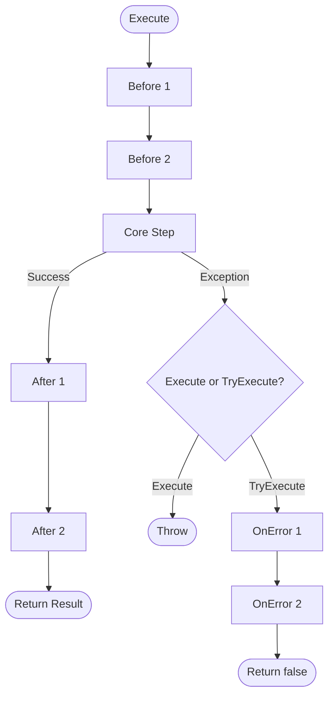

# Template Method Pattern API Reference

Complete API documentation for the Template Method pattern in PatternKit.

## Namespace

```csharp
using PatternKit.Behavioral.Template;
```

---

## Template\<TContext, TResult\>

Fluent template with Before/Step/After hooks and error handling.

```csharp
public sealed class Template<TContext, TResult>
```

### Type Parameters

| Parameter | Description |
|-----------|-------------|
| `TContext` | Input context type |
| `TResult` | Output result type |

### Methods

| Method | Returns | Description |
|--------|---------|-------------|
| `Execute(TContext)` | `TResult` | Execute template, throws on error |
| `TryExecute(TContext, out TResult, out string?)` | `bool` | Execute template, returns false on error |

### Static Methods

| Method | Returns | Description |
|--------|---------|-------------|
| `Create(Func<TContext, TResult>)` | `Builder` | Create builder with core step |

### Exceptions

| Method | Exception | Condition |
|--------|-----------|-----------|
| `Execute` | Any | Propagates exceptions from step or hooks |

### Example

```csharp
var template = Template<string, int>
    .Create(ctx => ctx.Split(' ').Length)
    .Before(ctx => Console.WriteLine($"Input: {ctx}"))
    .After((ctx, result) => Console.WriteLine($"Words: {result}"))
    .Build();

var wordCount = template.Execute("Hello World"); // 2
```

---

## Template\<TContext, TResult\>.Builder

Fluent builder for configuring the template.

```csharp
public sealed class Builder
```

### Delegates

```csharp
public delegate void BeforeHook(TContext context);
public delegate void AfterHook(TContext context, TResult result);
public delegate void ErrorHook(TContext context, string error);
```

### Methods

| Method | Returns | Description |
|--------|---------|-------------|
| `Before(BeforeHook)` | `Builder` | Add before hook (0..n) |
| `After(AfterHook)` | `Builder` | Add after hook (0..n) |
| `OnError(ErrorHook)` | `Builder` | Add error hook (0..n) |
| `Synchronized()` | `Builder` | Enable thread-safe execution |
| `Build()` | `Template<TContext, TResult>` | Build immutable template |

### Hook Execution Order

1. All `Before` hooks in registration order
2. Core `Step` function
3. All `After` hooks in registration order
4. On exception: `OnError` hooks (TryExecute only)

### Example

```csharp
var template = Template<Request, Response>
    .Create(req => ProcessRequest(req))
    .Before(req => ValidateRequest(req))
    .Before(req => LogRequest(req))
    .After((req, res) => LogResponse(res))
    .After((req, res) => UpdateMetrics(req, res))
    .OnError((req, err) => LogError(req, err))
    .Synchronized()
    .Build();
```

---

## AsyncTemplate\<TContext, TResult\>

Async variant with ValueTask-based execution.

```csharp
public sealed class AsyncTemplate<TContext, TResult>
```

### Methods

| Method | Returns | Description |
|--------|---------|-------------|
| `ExecuteAsync(TContext, CancellationToken)` | `ValueTask<TResult>` | Execute async, throws on error |
| `TryExecuteAsync(TContext, CancellationToken)` | `ValueTask<(bool, TResult?, string?)>` | Execute async, returns tuple |

### Static Methods

| Method | Returns | Description |
|--------|---------|-------------|
| `Create(Func<TContext, CancellationToken, ValueTask<TResult>>)` | `Builder` | Create builder with async step |

### Builder Methods

| Method | Returns | Description |
|--------|---------|-------------|
| `Before(Func<TContext, CancellationToken, ValueTask>)` | `Builder` | Add async before hook |
| `After(Func<TContext, TResult, CancellationToken, ValueTask>)` | `Builder` | Add async after hook |
| `OnError(Func<TContext, string, CancellationToken, ValueTask>)` | `Builder` | Add async error hook |
| `Build()` | `AsyncTemplate<TContext, TResult>` | Build immutable template |

### Example

```csharp
var template = AsyncTemplate<string, Data>
    .Create(async (url, ct) => await httpClient.GetFromJsonAsync<Data>(url, ct))
    .Before(async (url, ct) => await ValidateUrlAsync(url, ct))
    .After(async (url, data, ct) => await CacheAsync(url, data, ct))
    .OnError(async (url, err, ct) => await LogErrorAsync(url, err, ct))
    .Build();

var data = await template.ExecuteAsync("https://api.example.com/data", ct);
```

---

## TemplateMethod\<TContext, TResult\>

Abstract base class for inheritance-based template method.

```csharp
public abstract class TemplateMethod<TContext, TResult>
```

### Methods to Override

| Method | Description |
|--------|-------------|
| `Before(TContext)` | Optional: runs before step |
| `Step(TContext)` | Required: core algorithm |
| `After(TContext, TResult)` | Optional: runs after step |
| `OnError(TContext, Exception)` | Optional: handle errors |

### Public Methods

| Method | Returns | Description |
|--------|---------|-------------|
| `Execute(TContext)` | `TResult` | Run the template |

### Example

```csharp
public class DataProcessor : TemplateMethod<string, ProcessedData>
{
    protected override void Before(string path)
    {
        Console.WriteLine($"Loading: {path}");
    }

    protected override ProcessedData Step(string path)
    {
        var raw = File.ReadAllText(path);
        return Parse(raw);
    }

    protected override void After(string path, ProcessedData result)
    {
        Console.WriteLine($"Processed {result.RecordCount} records");
    }
}

var processor = new DataProcessor();
var result = processor.Execute("data.csv");
```

---

## Execution Flow



---

## Synchronized Execution

When `.Synchronized()` is called:

```csharp
var template = Template<int, string>
    .Create(n => ExpensiveComputation(n))
    .Synchronized()  // All executions serialize
    .Build();

// Thread-safe: only one execution at a time
Parallel.For(0, 10, i => template.Execute(i));
```

### Implementation Notes

- Uses a private `object` lock per template instance
- Ensures mutual exclusion for entire execute pipeline
- Useful for non-thread-safe resources
- Keep steps short to avoid contention

---

## Thread Safety

| Component | Thread-Safe |
|-----------|-------------|
| `Builder` | No - use from single thread |
| `Template` | Yes (immutable) |
| `Template.Execute` | No (unless Synchronized) |
| `Template.Execute` + `Synchronized()` | Yes |
| `AsyncTemplate` | Yes (immutable) |
| `AsyncTemplate.ExecuteAsync` | Yes (concurrent OK) |

---

## Complete Example

```csharp
using PatternKit.Behavioral.Template;

// Data pipeline template
var etlTemplate = Template<string, int>
    .Create(path =>
    {
        var lines = File.ReadAllLines(path);
        return lines.Count(l => !string.IsNullOrWhiteSpace(l));
    })
    .Before(path =>
    {
        if (!File.Exists(path))
            throw new FileNotFoundException($"File not found: {path}");
        Console.WriteLine($"[{DateTime.Now:HH:mm:ss}] Starting: {path}");
    })
    .Before(path =>
    {
        var size = new FileInfo(path).Length;
        Console.WriteLine($"File size: {size:N0} bytes");
    })
    .After((path, count) =>
    {
        Console.WriteLine($"[{DateTime.Now:HH:mm:ss}] Completed: {count} lines");
    })
    .OnError((path, error) =>
    {
        Console.Error.WriteLine($"[ERROR] {path}: {error}");
    })
    .Build();

// Execute with exception handling
var count = etlTemplate.Execute("data.txt");

// Execute without exceptions
if (etlTemplate.TryExecute("data.txt", out var result, out var error))
{
    Console.WriteLine($"Success: {result} lines");
}
else
{
    Console.WriteLine($"Failed: {error}");
}
```

---

## See Also

- [Overview](index.md)
- [Comprehensive Guide](guide.md)
- [Real-World Examples](real-world-examples.md)
