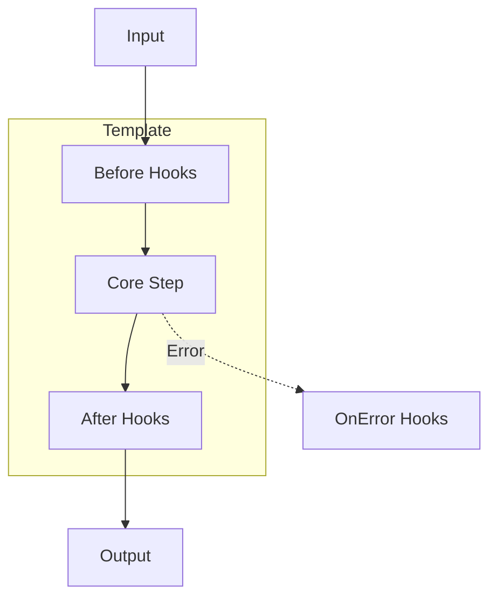

# Template Method Pattern Guide

Comprehensive guide to using the Template Method pattern in PatternKit.

## Overview

The Template Method pattern defines the skeleton of an algorithm, deferring some steps to subclasses or callbacks. This implementation provides both fluent configuration and inheritance-based approaches.



## Getting Started

### Installation

```csharp
using PatternKit.Behavioral.Template;
```

### Basic Usage

```csharp
// Define the template
var wordCounter = Template<string, int>
    .Create(text => text.Split(' ', StringSplitOptions.RemoveEmptyEntries).Length)
    .Before(text => Console.WriteLine($"Counting words in: {text[..20]}..."))
    .After((text, count) => Console.WriteLine($"Found {count} words"))
    .Build();

// Execute
var count = wordCounter.Execute("The quick brown fox jumps over the lazy dog");
// Output:
// Counting words in: The quick brown fox...
// Found 9 words
```

## Core Concepts

### The Core Step

The main algorithm is defined in `Create()`:

```csharp
var template = Template<InputType, OutputType>
    .Create(input => {
        // Your core algorithm here
        return result;
    });
```

### Before Hooks

Execute preparation logic before the core step:

```csharp
.Before(input => ValidateInput(input))
.Before(input => LogRequest(input))
.Before(input => StartTimer())
```

### After Hooks

Execute cleanup or post-processing after the core step:

```csharp
.After((input, result) => LogResult(result))
.After((input, result) => StopTimer())
.After((input, result) => UpdateMetrics(input, result))
```

### Error Hooks

Handle errors gracefully (only called with `TryExecute`):

```csharp
.OnError((input, errorMessage) => LogError(input, errorMessage))
.OnError((input, errorMessage) => NotifyAdmin(errorMessage))
```

## Common Patterns

### Data Processing Pipeline

```csharp
public class DataProcessor
{
    private readonly Template<string, ProcessedData> _template;

    public DataProcessor(ILogger logger, IMetrics metrics)
    {
        _template = Template<string, ProcessedData>
            .Create(path =>
            {
                var raw = File.ReadAllText(path);
                var parsed = Parse(raw);
                var validated = Validate(parsed);
                return Transform(validated);
            })
            .Before(path =>
            {
                if (!File.Exists(path))
                    throw new FileNotFoundException(path);
                logger.LogInformation("Processing: {Path}", path);
            })
            .After((path, result) =>
            {
                logger.LogInformation("Processed {Count} records", result.RecordCount);
                metrics.Increment("files_processed");
            })
            .OnError((path, error) =>
            {
                logger.LogError("Failed to process {Path}: {Error}", path, error);
                metrics.Increment("files_failed");
            })
            .Build();
    }

    public ProcessedData Process(string path) => _template.Execute(path);

    public bool TryProcess(string path, out ProcessedData? result, out string? error)
        => _template.TryExecute(path, out result, out error);
}
```

### HTTP Request Handler

```csharp
public class RequestHandler<TRequest, TResponse>
{
    private readonly Template<TRequest, TResponse> _template;

    public RequestHandler(
        Func<TRequest, TResponse> handler,
        IValidator<TRequest> validator,
        IAuditLog audit)
    {
        _template = Template<TRequest, TResponse>
            .Create(handler)
            .Before(req =>
            {
                var result = validator.Validate(req);
                if (!result.IsValid)
                    throw new ValidationException(result.Errors);
            })
            .Before(req => audit.LogRequest(req))
            .After((req, res) => audit.LogResponse(res))
            .OnError((req, err) => audit.LogError(req, err))
            .Build();
    }

    public TResponse Handle(TRequest request) => _template.Execute(request);
}
```

### Synchronized Resource Access

```csharp
var dbTemplate = Template<Query, Result>
    .Create(query =>
    {
        using var connection = OpenConnection();
        return connection.Execute(query);
    })
    .Before(query => ValidateQuery(query))
    .Synchronized()  // Thread-safe execution
    .Build();

// Safe for concurrent access
Parallel.For(0, 100, i =>
{
    var result = dbTemplate.Execute(new Query($"SELECT * FROM table_{i}"));
});
```

## Async Templates

For I/O-bound operations, use `AsyncTemplate`:

```csharp
var httpTemplate = AsyncTemplate<string, HttpResponse>
    .Create(async (url, ct) =>
    {
        using var client = new HttpClient();
        return await client.GetAsync(url, ct);
    })
    .Before(async (url, ct) =>
    {
        await ValidateUrlAsync(url, ct);
        Log.Info($"Fetching: {url}");
    })
    .After(async (url, response, ct) =>
    {
        await CacheResponseAsync(url, response, ct);
    })
    .OnError(async (url, error, ct) =>
    {
        await LogErrorAsync(url, error, ct);
    })
    .Build();

// Usage
var response = await httpTemplate.ExecuteAsync("https://api.example.com/data", ct);
```

## Inheritance-Based Template

For traditional GoF style, use `TemplateMethod` base class:

```csharp
public abstract class ReportGenerator : TemplateMethod<ReportRequest, Report>
{
    protected override void Before(ReportRequest request)
    {
        Console.WriteLine($"Generating {GetReportType()} report...");
    }

    // Subclasses must implement this
    protected abstract override Report Step(ReportRequest request);

    protected override void After(ReportRequest request, Report result)
    {
        Console.WriteLine($"Report generated: {result.Pages} pages");
    }

    protected abstract string GetReportType();
}

public class SalesReport : ReportGenerator
{
    protected override Report Step(ReportRequest request)
    {
        // Sales-specific report generation
        return new Report { Pages = 10, Type = "Sales" };
    }

    protected override string GetReportType() => "Sales";
}

public class InventoryReport : ReportGenerator
{
    protected override Report Step(ReportRequest request)
    {
        // Inventory-specific report generation
        return new Report { Pages = 5, Type = "Inventory" };
    }

    protected override string GetReportType() => "Inventory";
}
```

## Extending the Pattern

### Composable Templates

Chain templates together:

```csharp
public class TemplateChain<T>
{
    private readonly List<Template<T, T>> _templates = new();

    public TemplateChain<T> Add(Template<T, T> template)
    {
        _templates.Add(template);
        return this;
    }

    public T Execute(T input)
    {
        return _templates.Aggregate(input, (current, template) => template.Execute(current));
    }
}

// Usage
var chain = new TemplateChain<string>()
    .Add(normalizeTemplate)
    .Add(validateTemplate)
    .Add(transformTemplate);

var result = chain.Execute(input);
```

### Conditional Hooks

```csharp
public static class TemplateExtensions
{
    public static Template<TCtx, TRes>.Builder BeforeIf<TCtx, TRes>(
        this Template<TCtx, TRes>.Builder builder,
        Func<TCtx, bool> condition,
        Action<TCtx> hook)
    {
        return builder.Before(ctx =>
        {
            if (condition(ctx))
                hook(ctx);
        });
    }
}

// Usage
var template = Template<Request, Response>
    .Create(Process)
    .BeforeIf(r => r.RequiresValidation, Validate)
    .BeforeIf(r => r.RequiresAuth, Authenticate)
    .Build();
```

## Best Practices

### Hook Design

1. **Keep hooks focused**: Each hook should do one thing
2. **Don't throw in After hooks**: Core step already succeeded
3. **Handle cleanup in After**: Even if processing continues
4. **Use OnError for recovery**: Not for normal flow control

### Error Handling

1. **Use TryExecute for expected failures**: File not found, validation errors
2. **Use Execute for unexpected failures**: Let exceptions propagate
3. **Don't swallow exceptions in OnError**: Log and optionally rethrow
4. **After hooks run before OnError**: Cleanup still happens

### Synchronization

1. **Only use when needed**: Synchronized has overhead
2. **Keep steps short**: Avoid holding locks long
3. **Don't nest synchronized templates**: Risk of deadlock
4. **Consider async for I/O**: Don't block with sync template

## Troubleshooting

### Hooks not executing

1. Check registration order: Before must be before Build()
2. Exception in earlier hook stops chain
3. OnError only runs with TryExecute

### Execute vs TryExecute

| Aspect | Execute | TryExecute |
|--------|---------|------------|
| Returns | Result | bool + out params |
| On error | Throws | Returns false |
| OnError hooks | Not called | Called |
| After hooks | Called if success | Called if success |

### Synchronized not working

1. Each template instance has its own lock
2. Shared templates must be same instance
3. Builder creates new template each time

## See Also

- [Overview](index.md)
- [API Reference](api-reference.md)
- [Real-World Examples](real-world-examples.md)
