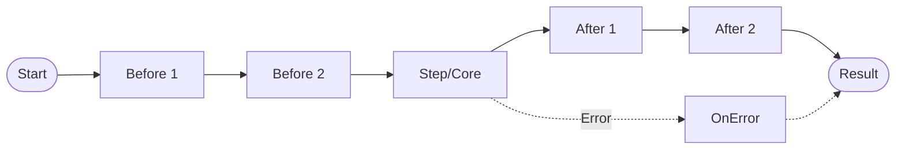

# Template Method Pattern

> **TL;DR**: Define a fixed workflow skeleton with customizable Before/Step/After hooks.

## Quick Example

```csharp
var template = Template<string, int>
    .Create(ctx => ctx.Split(' ').Length)  // Core step
    .Before(ctx => Console.WriteLine($"Processing: {ctx}"))
    .After((ctx, result) => Console.WriteLine($"Result: {result}"))
    .OnError((ctx, error) => Console.WriteLine($"Error: {error}"))
    .Build();

var wordCount = template.Execute("The quick brown fox"); // 4

// Non-throwing variant
if (template.TryExecute("test input", out var result, out var error))
    Console.WriteLine($"Words: {result}");
```

## What It Is

Template Method defines the skeleton of an algorithm, deferring some steps to subclasses or callbacks. This fluent implementation allows composing workflows with hooks for customization.

Key characteristics:

- **Fixed skeleton**: Core algorithm structure is immutable
- **Customizable hooks**: Before, After, OnError callbacks
- **Multiple hooks**: Chain multiple callbacks per phase
- **Synchronized option**: Thread-safe execution with locking
- **Non-throwing path**: `TryExecute` for graceful error handling
- **Immutable**: Thread-safe after `Build()`

## When to Use

- **Data processing pipelines**: ETL with pre/post processing
- **Request handling**: Validation, processing, logging
- **Document generation**: Header, content, footer workflows
- **Testing frameworks**: Setup, test, teardown patterns
- **Batch operations**: Init, process items, cleanup

## When to Avoid

- **Highly variable workflows**: Use Chain or Strategy instead
- **Complex branching**: Consider State Machine
- **Async-heavy operations**: Use AsyncTemplate variant
- **Dynamic composition**: Chain pattern more flexible

## Diagram



## Execution Modes

| Method | Behavior | Error Handling |
|--------|----------|----------------|
| `Execute(ctx)` | Throws on failure | Exception propagates |
| `TryExecute(ctx, out result, out error)` | Returns false on failure | Error message captured |

## Variants

| Variant | Description |
|---------|-------------|
| `Template<TContext, TResult>` | Fluent sync template |
| `AsyncTemplate<TContext, TResult>` | Async/await support |
| `TemplateMethod<TContext, TResult>` | Inheritance-based (classic GoF) |

## See Also

- [Comprehensive Guide](guide.md) - Advanced patterns and composition
- [API Reference](api-reference.md) - Complete API documentation
- [Real-World Examples](real-world-examples.md) - Production-ready examples
- [Chain Pattern](../chain/index.md) - For variable-length pipelines
