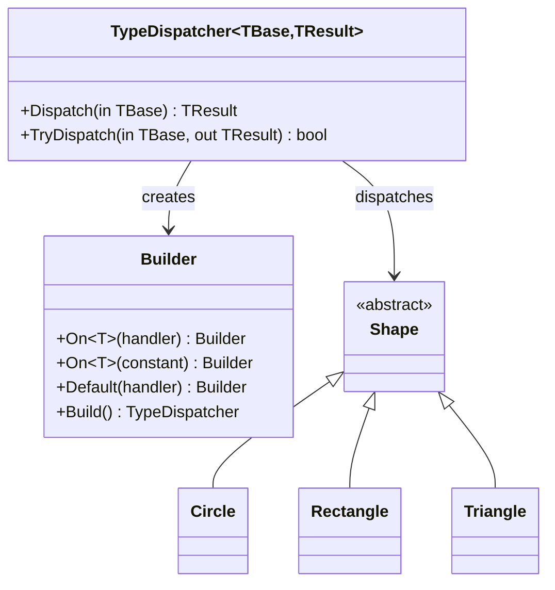

# TypeDispatcher Pattern

> **TL;DR**: Dispatch to type-specific handlers based on the runtime type of an object, with first-match-wins semantics.

## Quick Example

```csharp
// Define a type hierarchy
public abstract record Shape;
public record Circle(double Radius) : Shape;
public record Rectangle(double Width, double Height) : Shape;
public record Triangle(double Base, double Height) : Shape;

// Create a dispatcher for calculating area
var areaCalculator = TypeDispatcher<Shape, double>.Create()
    .On<Circle>(c => Math.PI * c.Radius * c.Radius)
    .On<Rectangle>(r => r.Width * r.Height)
    .On<Triangle>(t => 0.5 * t.Base * t.Height)
    .Default(_ => 0)
    .Build();

// Dispatch based on runtime type
Shape shape = new Circle(5);
double area = areaCalculator.Dispatch(shape); // 78.54
```

## What It Is

TypeDispatcher provides a fluent, type-safe way to handle objects differently based on their concrete runtime type. It's similar to pattern matching or a type switch, but with a builder API that allows handlers to be registered dynamically.

Key characteristics:

- **First-match-wins**: Handlers are evaluated in registration order
- **Type-safe**: Handlers receive strongly-typed instances
- **Fluent builder**: Register handlers using `On<T>()` method chaining
- **Optional default**: Handle unmatched types with a fallback

> **Note**: This is NOT the Gang of Four Visitor pattern. TypeDispatcher uses runtime type checks, not double dispatch. For true Visitor with double dispatch, see [Visitor](../visitor/index.md) and [FluentVisitor](../visitor/fluent-visitor.md).

## When to Use

- **Polymorphic operations**: When you need different logic for different subtypes
- **Avoiding switch statements**: Replace type-checking switch with fluent handlers
- **External operations**: Add operations to types you don't control
- **Discriminated unions**: Handle tagged union/sum types
- **Message handling**: Route messages based on their concrete type

## When to Avoid

- **True Visitor pattern needed**: When elements must control dispatch, use [FluentVisitor](../visitor/fluent-visitor.md)
- **Simple conditionals**: For 2-3 types, a switch expression may be clearer
- **Performance-critical**: Each dispatch checks predicates sequentially
- **Open types**: When new types are frequently added, consider [Strategy](../strategy/index.md)

## Pattern Variants

| Variant | Description | Use Case |
|---------|-------------|----------|
| `TypeDispatcher<TBase, TResult>` | Sync dispatcher returning a value | Calculations, transformations |
| `ActionTypeDispatcher<TBase>` | Sync dispatcher with side effects | Commands, logging |
| `AsyncTypeDispatcher<TBase, TResult>` | Async dispatcher returning a value | I/O operations |
| `AsyncActionTypeDispatcher<TBase>` | Async dispatcher with side effects | Async commands |

## Diagram



## Comparison with Visitor

| Aspect | TypeDispatcher | FluentVisitor |
|--------|----------------|---------------|
| Dispatch mechanism | Runtime type check | Double dispatch |
| Element involvement | None | Must implement `IVisitable` |
| Adding new types | Dispatcher unchanged | Add new `Accept` method |
| Adding new operations | Add handler | Add new visitor |
| Performance | Sequential predicate check | Direct method call |

## See Also

- [Comprehensive Guide](guide.md) - Detailed usage and patterns
- [API Reference](api-reference.md) - Complete API documentation
- [Real-World Examples](real-world-examples.md) - Production-ready examples
- [FluentVisitor](../visitor/fluent-visitor.md) - For true double-dispatch visitor
- [Strategy Pattern](../strategy/index.md) - For predicate-based dispatch
