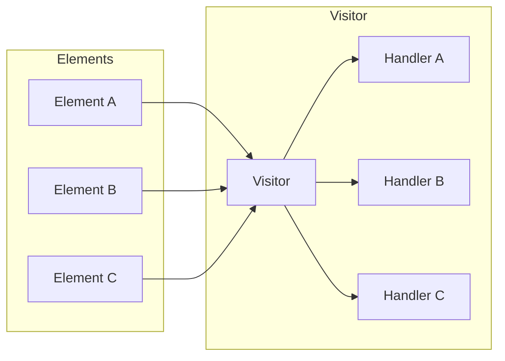

# Visitor Pattern Guide

Comprehensive guide to using the Visitor pattern in PatternKit.

## Overview

The Visitor pattern represents an operation to be performed on elements of an object structure. It lets you define new operations without changing the classes of the elements on which it operates. This implementation provides type-safe, fluent visitors with sync and async variants.



## Getting Started

### Installation

```csharp
using PatternKit.Behavioral.Visitor;
```

### Basic Usage

```csharp
// Define element types
public abstract record Shape;
public record Circle(double Radius) : Shape;
public record Rectangle(double Width, double Height) : Shape;
public record Triangle(double Base, double Height) : Shape;

// Create visitor
var areaCalculator = Visitor<Shape, double>.Create()
    .On<Circle>(c => Math.PI * c.Radius * c.Radius)
    .On<Rectangle>(r => r.Width * r.Height)
    .On<Triangle>(t => 0.5 * t.Base * t.Height)
    .Default(_ => 0)
    .Build();

// Use it
var shapes = new Shape[] { new Circle(5), new Rectangle(4, 6), new Triangle(3, 4) };
foreach (var shape in shapes)
{
    Console.WriteLine($"Area: {areaCalculator.Visit(shape)}");
}
```

## Core Concepts

### Visitor Types

| Type | Returns | Use Case |
|------|---------|----------|
| `Visitor<TBase, TResult>` | `TResult` | Transform elements |
| `ActionVisitor<TBase>` | `void` | Side effects only |
| `AsyncVisitor<TBase, TResult>` | `ValueTask<TResult>` | Async transformation |
| `AsyncActionVisitor<TBase>` | `ValueTask` | Async side effects |

### Handler Registration

Register handlers for specific types:

```csharp
var visitor = Visitor<Shape, string>.Create()
    .On<Circle>(c => $"Circle with radius {c.Radius}")
    .On<Rectangle>(r => $"Rectangle {r.Width}x{r.Height}")
    .Default(s => $"Unknown shape: {s.GetType().Name}")
    .Build();
```

### Default Handler

Handle unmatched types:

```csharp
// With default
var safe = Visitor<Shape, double>.Create()
    .On<Circle>(c => Math.PI * c.Radius * c.Radius)
    .Default(_ => 0)  // Returns 0 for unknown shapes
    .Build();

// Without default - throws if no match
var strict = Visitor<Shape, double>.Create()
    .On<Circle>(c => Math.PI * c.Radius * c.Radius)
    .Build();

strict.Visit(new Rectangle(4, 6)); // Throws InvalidOperationException
```

### TryVisit

Safe matching without exceptions:

```csharp
if (visitor.TryVisit(shape, out var result))
{
    Console.WriteLine($"Result: {result}");
}
else
{
    Console.WriteLine("No handler matched");
}
```

## Common Patterns

### Expression Evaluator

```csharp
public abstract record Expr;
public record Num(double Value) : Expr;
public record Add(Expr Left, Expr Right) : Expr;
public record Mul(Expr Left, Expr Right) : Expr;
public record Neg(Expr Operand) : Expr;

public class ExpressionEvaluator
{
    private readonly Visitor<Expr, double> _visitor;

    public ExpressionEvaluator()
    {
        Func<Expr, double> eval = null!;

        _visitor = Visitor<Expr, double>.Create()
            .On<Num>(n => n.Value)
            .On<Add>(a => eval(a.Left) + eval(a.Right))
            .On<Mul>(m => eval(m.Left) * eval(m.Right))
            .On<Neg>(n => -eval(n.Operand))
            .Build();

        eval = e => _visitor.Visit(e);
    }

    public double Evaluate(Expr expr) => _visitor.Visit(expr);
}

// Usage
var expr = new Add(new Num(3), new Mul(new Num(4), new Num(5)));
var evaluator = new ExpressionEvaluator();
Console.WriteLine(evaluator.Evaluate(expr)); // 23
```

### Document Renderer

```csharp
public abstract record DocElement;
public record Paragraph(string Text) : DocElement;
public record Heading(int Level, string Text) : DocElement;
public record CodeBlock(string Language, string Code) : DocElement;
public record List(string[] Items) : DocElement;

public class HtmlRenderer
{
    private readonly Visitor<DocElement, string> _visitor;

    public HtmlRenderer()
    {
        _visitor = Visitor<DocElement, string>.Create()
            .On<Paragraph>(p => $"<p>{Escape(p.Text)}</p>")
            .On<Heading>(h => $"<h{h.Level}>{Escape(h.Text)}</h{h.Level}>")
            .On<CodeBlock>(c =>
                $"<pre><code class=\"language-{c.Language}\">{Escape(c.Code)}</code></pre>")
            .On<List>(l =>
                $"<ul>{string.Join("", l.Items.Select(i => $"<li>{Escape(i)}</li>"))}</ul>")
            .Default(_ => "<!-- unknown element -->")
            .Build();
    }

    public string Render(IEnumerable<DocElement> elements) =>
        string.Join("\n", elements.Select(e => _visitor.Visit(e)));

    private static string Escape(string s) =>
        System.Web.HttpUtility.HtmlEncode(s);
}
```

### API Error Mapper

```csharp
public class ErrorMapper
{
    private readonly Visitor<Exception, ProblemDetails> _visitor;

    public ErrorMapper()
    {
        _visitor = Visitor<Exception, ProblemDetails>.Create()
            .On<ValidationException>(ex => new ProblemDetails
            {
                Status = 400,
                Title = "Validation Error",
                Detail = string.Join("; ", ex.Errors)
            })
            .On<NotFoundException>(ex => new ProblemDetails
            {
                Status = 404,
                Title = "Not Found",
                Detail = ex.Message
            })
            .On<UnauthorizedException>(_ => new ProblemDetails
            {
                Status = 401,
                Title = "Unauthorized",
                Detail = "Authentication required"
            })
            .Default(ex => new ProblemDetails
            {
                Status = 500,
                Title = "Internal Server Error",
                Detail = "An unexpected error occurred"
            })
            .Build();
    }

    public ProblemDetails Map(Exception ex) => _visitor.Visit(ex);
}
```

### Async Event Handler

```csharp
public abstract record DomainEvent(Guid Id, DateTime OccurredAt);
public record OrderPlaced(Guid Id, DateTime OccurredAt, string OrderId) : DomainEvent(Id, OccurredAt);
public record OrderShipped(Guid Id, DateTime OccurredAt, string OrderId, string Tracking) : DomainEvent(Id, OccurredAt);

public class EventProcessor
{
    private readonly AsyncActionVisitor<DomainEvent> _handler;

    public EventProcessor(IEmailService email, IAnalytics analytics)
    {
        _handler = AsyncActionVisitor<DomainEvent>.Create()
            .On<OrderPlaced>(async (e, ct) =>
            {
                await email.SendOrderConfirmationAsync(e.OrderId, ct);
                await analytics.TrackAsync("order_placed", e.OrderId, ct);
            })
            .On<OrderShipped>(async (e, ct) =>
            {
                await email.SendShippingNotificationAsync(e.OrderId, e.Tracking, ct);
            })
            .Default(async (e, ct) =>
            {
                await Task.CompletedTask;
                Console.WriteLine($"Unhandled event: {e.GetType().Name}");
            })
            .Build();
    }

    public ValueTask ProcessAsync(DomainEvent @event, CancellationToken ct) =>
        _handler.VisitAsync(@event, ct);
}
```

## Enterprise Guidance

### Architecture & Organization

- **Centralize composition**: Create dedicated static factories (e.g., `ReceiptRendering.CreateRenderer()`)
- **Favor composition over mega-visitors**: Split by module (Billing, Catalog, POS) and compose at the edge
- **Keep handlers small**: Delegate complex logic to services

### Error Handling & Defaults

- **Always add Default**: For resilience and observability; log unknown types and continue
- **Result visitors**: Prefer returning error objects vs throwing in handlers; reserve throws for exceptional conditions
- **Action visitors**: Aim for idempotency; guard external side effects

### Performance

- **Registration order matters**: Put frequent types first
- **Avoid per-call allocations**: Cache dependencies; reuse buffers
- **Large hierarchies**: Consider pre-sharding by "family" or using multiple visitors

## Extending the Pattern

### Combining Visitors

```csharp
public class CompositeVisitor<TBase, TResult>
{
    private readonly List<Visitor<TBase, TResult>> _visitors = new();

    public void Add(Visitor<TBase, TResult> visitor) =>
        _visitors.Add(visitor);

    public IEnumerable<TResult> VisitAll(TBase element) =>
        _visitors.Select(v => v.Visit(element));
}
```

### Visitor with Context

```csharp
public class ContextualVisitor<TBase, TContext, TResult>
{
    private readonly Visitor<(TBase Element, TContext Context), TResult> _inner;

    public TResult Visit(TBase element, TContext context) =>
        _inner.Visit((element, context));
}
```

## Best Practices

### Handler Registration Order

More specific types should be registered before base types:

```csharp
// Correct order
.On<SpecificException>(...)
.On<BaseException>(...)
.Default(...)

// Wrong order - SpecificException never matched
.On<BaseException>(...)
.On<SpecificException>(...) // Never reached!
```

### Use Default Handler

Always provide a default for production code:

```csharp
// Good - graceful degradation
.Default(_ => defaultResult)

// Risky - may throw at runtime
// No default
```

### Concurrency & Thread Safety

- Built visitors are immutable and thread-safe: Register once, share many
- Ensure downstream services are thread-safe or scoped appropriately (e.g., per-request)

### Testing Strategy

- BDD tests per visitor: cover match, default, and ordering behavior
- Add negative tests (unknown type) and concurrency smoke tests for action visitors
- Use example-driven tests to document behavior to new team members

### Migration Tips

- Replace `switch`/`if` chains with `On<T>` registrations incrementally
- Start with a thin visitor over existing logic; move logic into focused handlers gradually
- Keep old code behind feature toggles while validating behavior parity

## Troubleshooting

### "No handler matched"

1. Check handler registration
2. Verify type hierarchy
3. Add Default handler

### Wrong handler called

1. Check registration order (specific before general)
2. Verify exact type matching

### Async deadlock

1. Use `await` not `.Result`
2. Pass CancellationToken
3. Use `ConfigureAwait(false)` in libraries

## See Also

- [Overview](index.md)
- [API Reference](api-reference.md)
- [Real-World Examples](real-world-examples.md)
