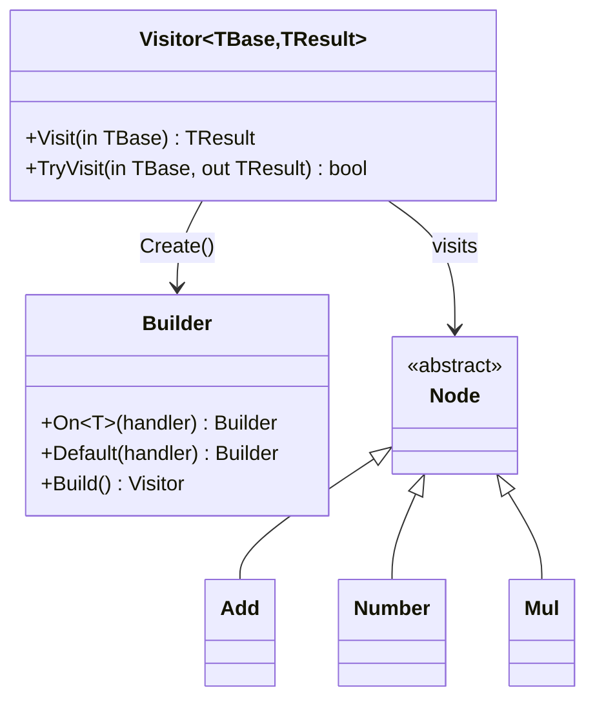

# Visitor Pattern (Fluent)

> **TL;DR**: Dispatch operations by runtime type using a fluent builder - add new operations without modifying visited types.

## Quick Example

```csharp
// Result visitor: produces a value
var formatter = Visitor<Node, string>.Create()
    .On<Add>(_ => "+")
    .On<Number>(n => $"#{n.Value}")
    .Default(_ => "?")
    .Build();

formatter.Visit(new Add(...));    // "+"
formatter.Visit(new Number(7));   // "#7"

// Action visitor: side effects only
var counter = ActionVisitor<Node>.Create()
    .On<Number>(_ => count++)
    .On<Add>(_ => Log("add"))
    .Default(_ => { })
    .Build();

counter.Visit(node);
```

## What It Is

Visitor separates operations from the objects they operate on. PatternKit's fluent visitor provides type-safe dispatch by runtime type with a builder API.

Key characteristics:

- **Non-intrusive**: No `Accept` method required on visited types
- **First-match-wins**: Handlers evaluated in registration order
- **Type-safe**: Strongly-typed handlers receive concrete types
- **Immutable**: Thread-safe after `Build()`

## Pattern Variants

| Variant | Description | Use Case |
|---------|-------------|----------|
| `Visitor<TBase, TResult>` | Sync visitor returning a value | Formatting, transformation |
| `ActionVisitor<TBase>` | Sync visitor for side effects | Logging, counting |
| `AsyncVisitor<TBase, TResult>` | Async visitor returning a value | I/O operations |
| `AsyncActionVisitor<TBase>` | Async visitor for side effects | Async notifications |

## When to Use

- **Stable type hierarchies**: AST nodes, payments, UI elements
- **Multiple operations**: Add formatters, validators, analyzers
- **Avoid class modification**: Operations external to types
- **Centralized behavior**: One place for type-specific logic

## When to Avoid

- **Few operations**: Virtual methods may be simpler
- **Pattern matching suffices**: C# switch expressions work well
- **Frequently changing types**: Each new type needs new handlers

## Diagram



## See Also

- [Comprehensive Guide](guide.md) - Detailed usage and patterns
- [API Reference](api-reference.md) - Complete API documentation
- [Real-World Examples](real-world-examples.md) - Production-ready examples
- [TypeDispatcher](../type-dispatcher/index.md) - Similar pattern, different semantics
- [Strategy](../strategy/index.md) - Predicate-based dispatch
