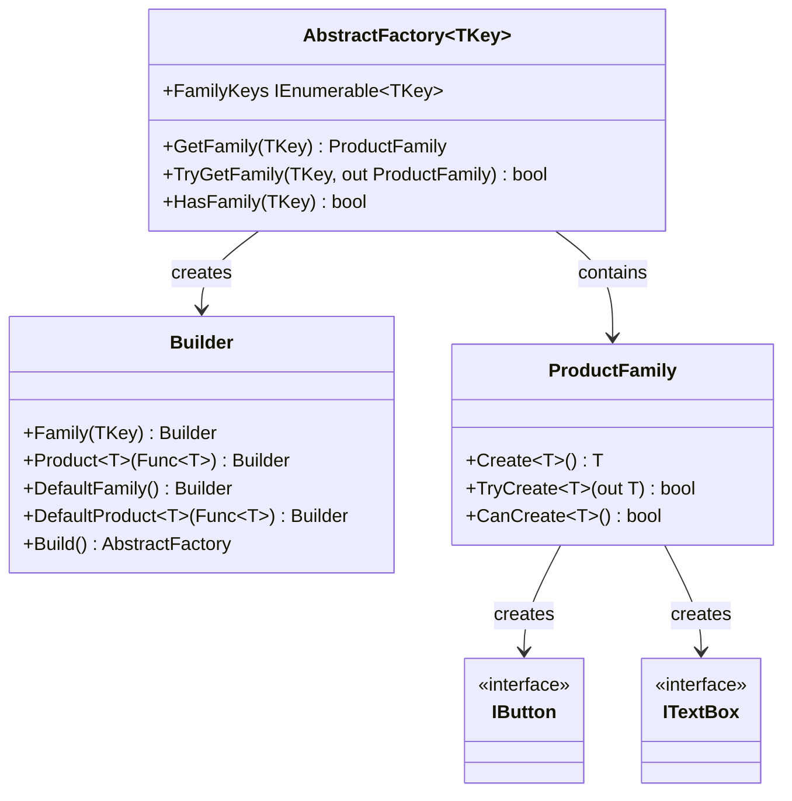

# Abstract Factory Pattern

> **TL;DR**: Create families of related objects that work together, without specifying their concrete classes.

## Quick Example

```csharp
// Define product interfaces
public interface IButton { string Render(); }
public interface ITextBox { string Render(); }

// Create a factory with product families
var uiFactory = AbstractFactory<string>.Create()
    .Family("light")
        .Product<IButton>(() => new LightButton())
        .Product<ITextBox>(() => new LightTextBox())
    .Family("dark")
        .Product<IButton>(() => new DarkButton())
        .Product<ITextBox>(() => new DarkTextBox())
    .Build();

// Get a family and create products
var family = uiFactory.GetFamily("dark");
IButton button = family.Create<IButton>();   // DarkButton
ITextBox textBox = family.Create<ITextBox>(); // DarkTextBox
```

## What It Is

Abstract Factory provides a way to encapsulate a group of individual factories that have a common theme. It creates families of related or dependent objects without specifying their concrete classes.

Key characteristics:

- **Family-based**: Groups related products that work together
- **Type-safe**: Generic product creation with compile-time safety
- **Runtime selection**: Choose product families at runtime
- **Isolated creation**: Client code doesn't know concrete product types

> **Note**: Abstract Factory differs from Factory Method. Factory Method creates single products by key, while Abstract Factory creates families of related products that are designed to work together.

## When to Use

- **Cross-platform UI**: Different UI widget families per platform (Windows, macOS, Linux)
- **Theme systems**: Light/dark themes with matching components
- **Database providers**: SQL Server, PostgreSQL with matching connections, commands
- **Document formats**: PDF, Word, Excel with matching readers, writers
- **Game skins**: Different visual styles for game elements

## When to Avoid

- **Single products**: Use [Factory](../factory/index.md) for single product creation
- **Simple construction**: Use constructors or [Builder](../builder/index.md) for complex single objects
- **No family relationship**: Products don't need to work together
- **Static selection**: Family is known at compile time

## Pattern Structure



## Comparison with Factory

| Aspect | Abstract Factory | Factory |
|--------|------------------|---------|
| Product scope | Families of products | Single products |
| Key purpose | Product compatibility | Product creation |
| Typical use | UI themes, platforms | Configuration-based instantiation |
| API | `GetFamily(key).Create<T>()` | `Create(key)` |

## See Also

- [Comprehensive Guide](guide.md) - Detailed usage and patterns
- [API Reference](api-reference.md) - Complete API documentation
- [Real-World Examples](real-world-examples.md) - Production-ready examples
- [Factory Pattern](../factory/index.md) - For single product creation
- [Builder Pattern](../builder/index.md) - For complex object construction
