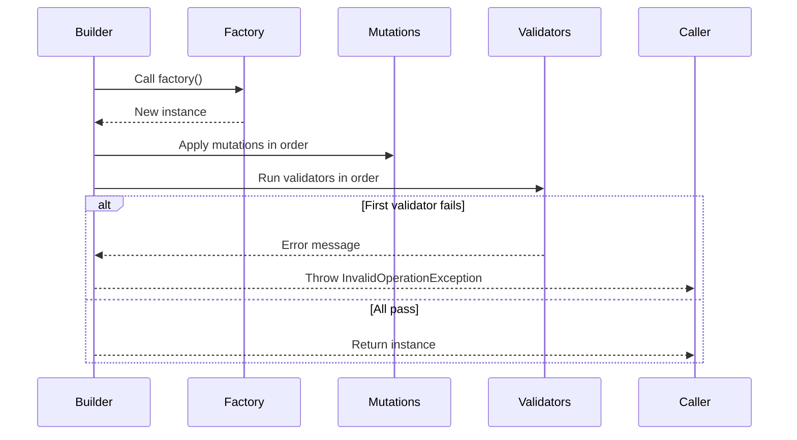
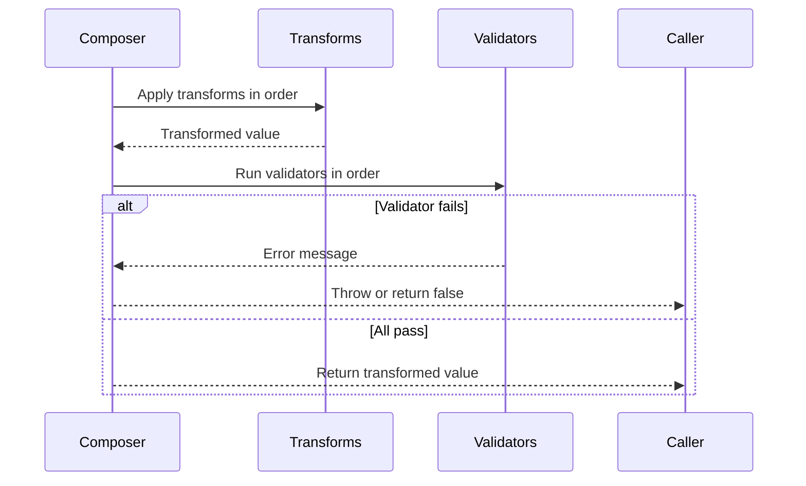

# Builder Pattern API Reference

Complete API documentation for the Builder pattern in PatternKit.

## Namespace

```csharp
using PatternKit.Creational.Builder;
```

---

## MutableBuilder\<T\>

Builder for configuring mutable objects with mutations and validations.

```csharp
public sealed class MutableBuilder<T>
```

### Type Parameters

| Parameter | Description |
|-----------|-------------|
| `T` | The type of object to build |

### Static Methods

| Method | Returns | Description |
|--------|---------|-------------|
| `New(Func<T> factory)` | `MutableBuilder<T>` | Create builder with factory |

### Instance Methods

| Method | Returns | Description |
|--------|---------|-------------|
| `With(Action<T> mutation)` | `MutableBuilder<T>` | Append mutation |
| `Require(Func<T, string?> validator)` | `MutableBuilder<T>` | Append validation |
| `Build()` | `T` | Create and validate instance |

### Exceptions

| Method | Exception | Condition |
|--------|-----------|-----------|
| `Build` | `InvalidOperationException` | First failing validation message |

### Example

```csharp
var person = MutableBuilder<Person>
    .New(() => new Person())
    .With(p => p.Name = "Ada")
    .With(p => p.Age = 30)
    .Require(p => p.Age >= 0 ? null : "Age must be positive")
    .Build();
```

---

## Composer\<T\>

Functional composition builder with transforms and validators.

```csharp
public sealed class Composer<T>
```

### Static Methods

| Method | Returns | Description |
|--------|---------|-------------|
| `Create()` | `Builder` | Create a new builder |

### Methods (after Build)

| Method | Returns | Description |
|--------|---------|-------------|
| `Apply(T input)` | `T` | Transform and validate |
| `TryApply(T input, out T result, out string? error)` | `bool` | Safe transform |

### Builder Methods

| Method | Returns | Description |
|--------|---------|-------------|
| `Transform(Func<T, T> transform)` | `Builder` | Add transformation |
| `Validate(Func<T, string?> validator)` | `Builder` | Add validation |
| `Build()` | `Composer<T>` | Build immutable composer |

### Example

```csharp
var normalizer = Composer<string>
    .Create()
    .Transform(s => s.Trim())
    .Transform(s => s.ToLowerInvariant())
    .Validate(s => s.Length > 0 ? null : "Empty string")
    .Build();

var result = normalizer.Apply("  HELLO  "); // "hello"
```

---

## ChainBuilder\<T\>

Builder for processing chains.

```csharp
public sealed class ChainBuilder<T>
```

### Static Methods

| Method | Returns | Description |
|--------|---------|-------------|
| `Create()` | `ChainBuilder<T>` | Create a new builder |

### Instance Methods

| Method | Returns | Description |
|--------|---------|-------------|
| `Add(IHandler<T> handler)` | `ChainBuilder<T>` | Add handler to chain |
| `Add(Action<T> handler)` | `ChainBuilder<T>` | Add action handler |
| `Build()` | `IChain<T>` | Build the chain |

### Example

```csharp
var chain = ChainBuilder<Request>
    .Create()
    .Add(new LoggingHandler())
    .Add(new AuthHandler())
    .Add(new ProcessingHandler())
    .Build();

chain.Execute(request);
```

---

## BranchBuilder\<TIn, TOut\>

First-match router builder.

```csharp
public sealed class BranchBuilder<TIn, TOut>
```

### Static Methods

| Method | Returns | Description |
|--------|---------|-------------|
| `Create()` | `BranchBuilder<TIn, TOut>` | Create a new builder |

### Instance Methods

| Method | Returns | Description |
|--------|---------|-------------|
| `When(Func<TIn, bool> predicate, Func<TIn, TOut> handler)` | `BranchBuilder<TIn, TOut>` | Add conditional handler |
| `Default(Func<TIn, TOut> handler)` | `BranchBuilder<TIn, TOut>` | Set default handler |
| `Build()` | `IBranch<TIn, TOut>` | Build the router |

### Example

```csharp
var router = BranchBuilder<Request, Response>
    .Create()
    .When(r => r.Type == "GET", HandleGet)
    .When(r => r.Type == "POST", HandlePost)
    .Default(HandleUnknown)
    .Build();

var response = router.Route(request);
```

---

## Execution Order

### MutableBuilder



### Composer



---

## Thread Safety

| Component | Thread-Safe |
|-----------|-------------|
| `MutableBuilder` | No - single-threaded use |
| `Composer` (built) | Yes - immutable |
| `ChainBuilder` | No - single-threaded use |
| `BranchBuilder` | No - single-threaded use |
| Built chains/routers | Depends on handlers |

---

## Complete Example

```csharp
using PatternKit.Creational.Builder;

// Test data builder pattern
public class UserBuilder
{
    private readonly MutableBuilder<User> _builder;

    public UserBuilder()
    {
        _builder = MutableBuilder<User>
            .New(() => new User { Id = Guid.NewGuid(), CreatedAt = DateTime.UtcNow })
            .Require(u => !string.IsNullOrEmpty(u.Email) ? null : "Email required")
            .Require(u => u.Email?.Contains("@") == true ? null : "Invalid email");
    }

    public UserBuilder WithEmail(string email)
    {
        _builder.With(u => u.Email = email);
        return this;
    }

    public UserBuilder WithName(string first, string last)
    {
        _builder.With(u => u.FirstName = first);
        _builder.With(u => u.LastName = last);
        return this;
    }

    public UserBuilder WithRole(string role)
    {
        _builder.With(u => u.Roles.Add(role));
        return this;
    }

    public User Build() => _builder.Build();
}

// Usage
var admin = new UserBuilder()
    .WithEmail("admin@example.com")
    .WithName("Admin", "User")
    .WithRole("Admin")
    .WithRole("User")
    .Build();
```

---

## See Also

- [Overview](index.md)
- [Comprehensive Guide](guide.md)
- [Real-World Examples](real-world-examples.md)
