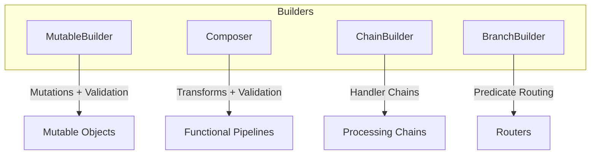

# Builder Pattern Guide

Comprehensive guide to using the Builder pattern in PatternKit.

## Overview

Builder separates the construction of a complex object from its representation. PatternKit provides multiple builder variants for different use cases.



## Getting Started

### Installation

```csharp
using PatternKit.Creational.Builder;
```

### MutableBuilder

Configure mutable objects with mutations and validations:

```csharp
var person = MutableBuilder<Person>
    .New(() => new Person())
    .With(p => p.Name = "Ada")
    .With(p => p.Age = 30)
    .Require(p => string.IsNullOrEmpty(p.Name) ? "Name required" : null)
    .Build();
```

### Composer

Functional composition with transforms:

```csharp
var pipeline = Composer<string>
    .Create()
    .Transform(s => s.Trim())
    .Transform(s => s.ToLower())
    .Validate(s => s.Length > 0 ? null : "Empty string")
    .Build();

var result = pipeline.Apply("  HELLO  "); // "hello"
```

## Core Concepts

### Mutations (With)

Mutations are in-place modifications applied in registration order:

```csharp
var builder = MutableBuilder<Widget>
    .New(() => new Widget())
    .With(w => w.Steps.Add("A"))  // First
    .With(w => w.Steps.Add("B"))  // Second
    .With(w => w.Steps.Add("C")); // Third

var widget = builder.Build(); // Steps = ["A", "B", "C"]
```

### Validations (Require)

Validations run after mutations, fail-fast on first error:

```csharp
var builder = MutableBuilder<Config>
    .New(() => new Config())
    .With(c => c.Port = -1)
    .Require(c => c.Port > 0 ? null : "Port must be positive")  // Fails
    .Require(c => c.Host != null ? null : "Host required");     // Not reached

// Throws InvalidOperationException: "Port must be positive"
builder.Build();
```

### Builder Reuse

Builders can produce multiple instances:

```csharp
var builder = MutableBuilder<Counter>
    .New(() => new Counter());

var c1 = builder.Build(); // Fresh instance

builder.With(c => c.Value++);
var c2 = builder.Build(); // Value = 1

builder.With(c => c.Value++);
var c3 = builder.Build(); // Value = 2
```

## Common Patterns

### Configuration Builder

```csharp
public class AppConfigBuilder
{
    private readonly MutableBuilder<AppConfig> _builder;

    public AppConfigBuilder()
    {
        _builder = MutableBuilder<AppConfig>
            .New(() => new AppConfig())
            .Require(c => c.DatabaseConnection != null ? null : "Database connection required")
            .Require(c => c.ApiKey != null ? null : "API key required");
    }

    public AppConfigBuilder WithDatabase(string connectionString)
    {
        _builder.With(c => c.DatabaseConnection = connectionString);
        return this;
    }

    public AppConfigBuilder WithApi(string key, string baseUrl)
    {
        _builder.With(c => c.ApiKey = key);
        _builder.With(c => c.ApiBaseUrl = baseUrl);
        return this;
    }

    public AppConfigBuilder WithLogging(LogLevel level)
    {
        _builder.With(c => c.LogLevel = level);
        return this;
    }

    public AppConfig Build() => _builder.Build();
}

// Usage
var config = new AppConfigBuilder()
    .WithDatabase("Server=localhost;Database=app")
    .WithApi("secret-key", "https://api.example.com")
    .WithLogging(LogLevel.Info)
    .Build();
```

### Test Data Builder

```csharp
public class OrderBuilder
{
    private readonly MutableBuilder<Order> _builder;

    public OrderBuilder()
    {
        _builder = MutableBuilder<Order>
            .New(() => new Order
            {
                Id = Guid.NewGuid(),
                CreatedAt = DateTime.UtcNow,
                Status = OrderStatus.Pending
            });
    }

    public OrderBuilder WithCustomer(string name, string email)
    {
        _builder.With(o => o.CustomerName = name);
        _builder.With(o => o.CustomerEmail = email);
        return this;
    }

    public OrderBuilder WithItem(string product, int quantity, decimal price)
    {
        _builder.With(o => o.Items.Add(new OrderItem
        {
            Product = product,
            Quantity = quantity,
            UnitPrice = price
        }));
        return this;
    }

    public OrderBuilder WithStatus(OrderStatus status)
    {
        _builder.With(o => o.Status = status);
        return this;
    }

    public Order Build() => _builder.Build();
}

// Test usage
var order = new OrderBuilder()
    .WithCustomer("Alice", "alice@example.com")
    .WithItem("Widget", 2, 9.99m)
    .WithItem("Gadget", 1, 19.99m)
    .WithStatus(OrderStatus.Paid)
    .Build();
```

### Fluent Validation Builder

```csharp
public static class ValidationExtensions
{
    public static MutableBuilder<T> RequireNotEmpty<T>(
        this MutableBuilder<T> builder,
        Func<T, string?> selector,
        string fieldName)
    {
        return builder.Require(obj =>
        {
            var value = selector(obj);
            return string.IsNullOrWhiteSpace(value)
                ? $"{fieldName} cannot be empty"
                : null;
        });
    }

    public static MutableBuilder<T> RequireRange<T>(
        this MutableBuilder<T> builder,
        Func<T, int> selector,
        int min,
        int max,
        string fieldName)
    {
        return builder.Require(obj =>
        {
            var value = selector(obj);
            return value >= min && value <= max
                ? null
                : $"{fieldName} must be between {min} and {max}";
        });
    }
}

// Usage
var user = MutableBuilder<User>
    .New(() => new User())
    .With(u => u.Name = "Alice")
    .With(u => u.Age = 25)
    .RequireNotEmpty(u => u.Name, "Name")
    .RequireRange(u => u.Age, 18, 120, "Age")
    .Build();
```

## Best Practices

### Prefer Static Lambdas

Avoid closure allocations:

```csharp
// Good - static lambda
.With(static p => p.Name = "default")

// Avoid - captures variable
string name = "default";
.With(p => p.Name = name)  // Allocates closure
```

### Validate Early

Put critical validations first:

```csharp
.Require(c => c.Required != null ? null : "Required field missing")
.Require(c => c.Optional?.IsValid() ?? true ? null : "Invalid optional")
```

### Keep Builders Focused

One builder per object type:

```csharp
// Good - focused builders
var orderBuilder = new OrderBuilder();
var customerBuilder = new CustomerBuilder();

// Avoid - mega-builder
var builder = new EverythingBuilder();
```

## Troubleshooting

### "InvalidOperationException: Name required"

A validation failed. Check the message for which validation and fix the configuration.

### Mutations not applied

Ensure Build() is called after all With() calls. Builders are mutable.

### Unexpected state

Builders accumulate state. Create a new builder for fresh instances:

```csharp
// Each test should use a new builder
var builder = new OrderBuilder();
var order = builder.Build();
```

## See Also

- [Overview](index.md)
- [API Reference](api-reference.md)
- [Real-World Examples](real-world-examples.md)
