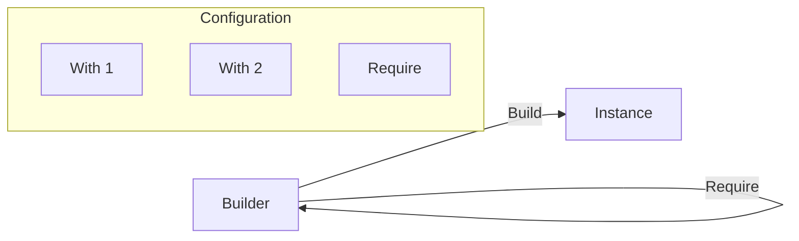

# Builder Pattern

> **TL;DR**: Fluent builders for constructing complex objects step by step with validation.

## Quick Example

```csharp
var person = MutableBuilder<Person>
    .New(() => new Person())
    .With(p => p.Name = "Ada")
    .With(p => p.Age = 30)
    .Require(p => string.IsNullOrEmpty(p.Name) ? "Name is required" : null)
    .Build();
```

## What It Is

Builder separates the construction of a complex object from its representation, allowing the same construction process to create different representations. PatternKit provides several builder variants:

| Variant | Purpose |
|---------|---------|
| `MutableBuilder<T>` | Configure mutable objects with mutations and validations |
| `Composer<T>` | Functional composition with transforms and validators |
| `ChainBuilder<T>` | Build linked chains of handlers/processors |
| `BranchBuilder<T>` | First-match routers and predicate-based builders |

Key characteristics:

- **Fluent API**: Chain configuration calls naturally
- **Validation**: Built-in support for validation before Build()
- **Immutable results**: Built objects are snapshots
- **Reusable**: Builders can produce multiple instances
- **Type-safe**: Strongly-typed throughout

## When to Use

- **Complex construction**: Objects with many optional parameters
- **Step-by-step assembly**: Configuration that builds incrementally
- **Validation requirements**: Ensure valid state before creation
- **Fluent DSLs**: Create readable configuration APIs

## When to Avoid

- **Simple objects**: Direct construction is clearer
- **Immutable records**: Use `with` expressions instead
- **No validation needed**: Skip builder overhead
- **Single configuration**: No reuse benefit

## Diagram



## Builder Variants

### MutableBuilder

Configure mutable objects:

```csharp
var widget = MutableBuilder<Widget>
    .New(() => new Widget())
    .With(w => w.Name = "Gear")
    .With(w => w.Size = 10)
    .Require(w => w.Size > 0 ? null : "Size must be positive")
    .Build();
```

### Composer

Functional transforms with validation:

```csharp
var pipeline = Composer<Data>
    .Create()
    .Transform(d => Normalize(d))
    .Transform(d => Enrich(d))
    .Validate(d => d.IsValid ? null : "Invalid data")
    .Build();

var result = pipeline.Apply(inputData);
```

### ChainBuilder

Build processing chains:

```csharp
var chain = ChainBuilder<Request>
    .Create()
    .Add(new AuthHandler())
    .Add(new ValidationHandler())
    .Add(new ProcessingHandler())
    .Build();
```

### BranchBuilder

First-match routing:

```csharp
var router = BranchBuilder<Request, Response>
    .Create()
    .When(r => r.Type == "A", HandleA)
    .When(r => r.Type == "B", HandleB)
    .Default(HandleDefault)
    .Build();
```

## See Also

- [Comprehensive Guide](guide.md) - Detailed usage and patterns
- [API Reference](api-reference.md) - Complete API documentation
- [Real-World Examples](real-world-examples.md) - Production-ready examples
- [MutableBuilder](mutablebuilder.md) - Mutable object builder details
- [Composer](composer.md) - Functional composition details
