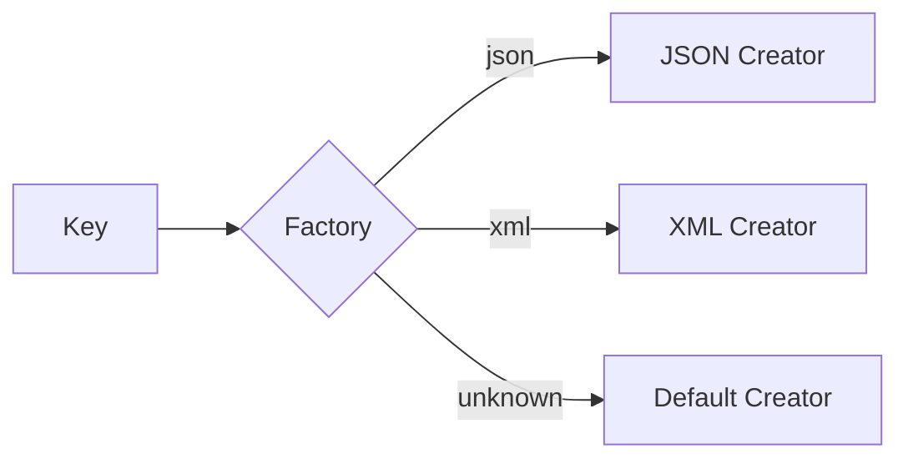

# Factory Pattern Guide

Comprehensive guide to using the Factory pattern in PatternKit.

## Overview

Factory provides an immutable registry mapping keys to creator delegates. It's ideal for type registration, plugin systems, and strategy selection by key.



## Getting Started

### Installation

```csharp
using PatternKit.Creational.Factory;
```

### Basic Usage

```csharp
// Simple factory (parameterless creators)
var shapes = Factory<string, IShape>
    .Create()
    .Map("circle", () => new Circle())
    .Map("square", () => new Square())
    .Default(() => new UnknownShape())
    .Build();

var circle = shapes.Create("circle");
```

### Factory with Input

```csharp
// Factory with input parameter
var math = Factory<string, int, int>
    .Create()
    .Map("double", (in int x) => x * 2)
    .Map("square", (in int x) => x * x)
    .Default((in int x) => x)
    .Build();

var result = math.Create("double", 5); // 10
```

## Core Concepts

### Key Mapping

Map keys to creator delegates:

```csharp
var factory = Factory<string, IService>
    .Create()
    .Map("serviceA", () => new ServiceA())
    .Map("serviceB", () => new ServiceB())
    .Build();
```

### Default Handling

Provide a fallback for unknown keys:

```csharp
// With default - returns fallback for unknown keys
var withDefault = Factory<string, string>
    .Create()
    .Map("a", () => "A")
    .Default(() => "unknown")
    .Build();

var result = withDefault.Create("xyz"); // "unknown"

// Without default - throws for unknown keys
var withoutDefault = Factory<string, string>
    .Create()
    .Map("a", () => "A")
    .Build();

withoutDefault.Create("xyz"); // Throws InvalidOperationException
```

### Key Comparers

Control key matching:

```csharp
// Case-insensitive keys
var factory = Factory<string, string>
    .Create(StringComparer.OrdinalIgnoreCase)
    .Map("json", () => "application/json")
    .Map("xml", () => "application/xml")
    .Build();

factory.Create("JSON"); // "application/json"
factory.Create("Json"); // "application/json"
```

## Common Patterns

### Content Type Registry

```csharp
public class ContentTypeFactory
{
    private readonly Factory<string, string> _factory;

    public ContentTypeFactory()
    {
        _factory = Factory<string, string>
            .Create(StringComparer.OrdinalIgnoreCase)
            .Map("json", () => "application/json")
            .Map("xml", () => "application/xml")
            .Map("html", () => "text/html; charset=utf-8")
            .Map("css", () => "text/css")
            .Map("js", () => "application/javascript")
            .Map("png", () => "image/png")
            .Map("jpg", () => "image/jpeg")
            .Map("jpeg", () => "image/jpeg")
            .Map("gif", () => "image/gif")
            .Map("svg", () => "image/svg+xml")
            .Map("pdf", () => "application/pdf")
            .Default(() => "application/octet-stream")
            .Build();
    }

    public string GetContentType(string extension) =>
        _factory.Create(extension.TrimStart('.'));
}
```

### Serializer Registry

```csharp
public interface ISerializer
{
    string Serialize<T>(T obj);
    T Deserialize<T>(string data);
}

public class SerializerFactory
{
    private readonly Factory<string, ISerializer> _factory;

    public SerializerFactory()
    {
        _factory = Factory<string, ISerializer>
            .Create(StringComparer.OrdinalIgnoreCase)
            .Map("json", () => new JsonSerializer())
            .Map("xml", () => new XmlSerializer())
            .Map("yaml", () => new YamlSerializer())
            .Build();
    }

    public ISerializer GetSerializer(string format) =>
        _factory.Create(format);

    public bool TryGetSerializer(string format, out ISerializer serializer) =>
        _factory.TryCreate(format, out serializer);
}
```

### Parser Factory with Context

```csharp
public record ParseContext(string Source, CultureInfo Culture);

public class ParserFactory
{
    private readonly Factory<Type, ParseContext, object> _factory;

    public ParserFactory()
    {
        _factory = Factory<Type, ParseContext, object>
            .Create()
            .Map(typeof(int), (in ParseContext ctx) =>
                int.Parse(ctx.Source, ctx.Culture))
            .Map(typeof(decimal), (in ParseContext ctx) =>
                decimal.Parse(ctx.Source, ctx.Culture))
            .Map(typeof(DateTime), (in ParseContext ctx) =>
                DateTime.Parse(ctx.Source, ctx.Culture))
            .Map(typeof(bool), (in ParseContext ctx) =>
                bool.Parse(ctx.Source))
            .Default((in ParseContext ctx) => ctx.Source)
            .Build();
    }

    public T Parse<T>(string source, CultureInfo culture = null) =>
        (T)_factory.Create(typeof(T), new ParseContext(source, culture ?? CultureInfo.InvariantCulture));
}
```

### Plugin System

```csharp
public interface IPlugin
{
    string Name { get; }
    void Execute();
}

public class PluginRegistry
{
    private Factory<string, IPlugin> _factory;

    public PluginRegistry()
    {
        var builder = Factory<string, IPlugin>.Create(StringComparer.OrdinalIgnoreCase);

        // Discover and register plugins
        foreach (var type in DiscoverPluginTypes())
        {
            var plugin = (IPlugin)Activator.CreateInstance(type);
            builder.Map(plugin.Name, () => (IPlugin)Activator.CreateInstance(type));
        }

        _factory = builder.Build();
    }

    public IPlugin GetPlugin(string name) => _factory.Create(name);

    public bool TryGetPlugin(string name, out IPlugin plugin) =>
        _factory.TryCreate(name, out plugin);
}
```

## Best Practices

### Use Static Lambdas

Avoid closure allocations:

```csharp
// Good - static lambdas
.Map("key", static () => new Service())

// Avoid - may capture variables
var dep = new Dependency();
.Map("key", () => new Service(dep))  // Captures dep
```

### Prefer TryCreate for Probing

```csharp
// When you expect missing keys
if (factory.TryCreate(key, out var result))
{
    // Use result
}
else
{
    // Handle missing gracefully
}

// When missing is exceptional
var result = factory.Create(key); // Throws if missing
```

### Immutability

Factories are immutable after Build():

```csharp
var builder = Factory<string, int>.Create();
builder.Map("a", () => 1);
var factory1 = builder.Build();

builder.Map("b", () => 2);  // Doesn't affect factory1
var factory2 = builder.Build();

// factory1 only has "a"
// factory2 has "a" and "b"
```

## Troubleshooting

### InvalidOperationException: No mapping

No mapping exists and no default configured:

```csharp
// Add a default
.Default(() => fallbackValue)

// Or use TryCreate
if (!factory.TryCreate(key, out var result))
    // Handle missing
```

### Wrong value returned

Check key comparer:

```csharp
// Case-sensitive by default
.Create()  // "JSON" != "json"

// Use case-insensitive for strings
.Create(StringComparer.OrdinalIgnoreCase)
```

### Last mapping wins

Later mappings replace earlier ones:

```csharp
.Map("key", () => 1)
.Map("key", () => 2)  // This wins
```

## See Also

- [Overview](index.md)
- [API Reference](api-reference.md)
- [Real-World Examples](real-world-examples.md)
