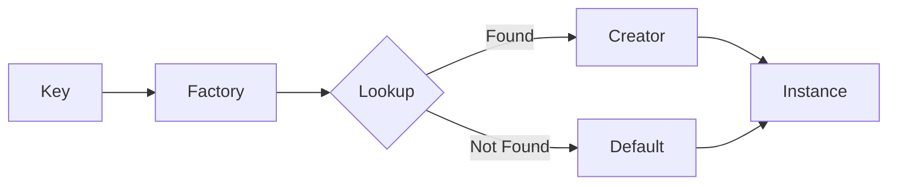

# Factory Pattern

> **TL;DR**: Immutable key-to-creator registry with optional defaults and input parameters.

## Quick Example

```csharp
var mime = Factory<string, string>
    .Create(StringComparer.OrdinalIgnoreCase)
    .Map("json", () => "application/json")
    .Map("html", () => "text/html; charset=utf-8")
    .Default(() => "application/octet-stream")
    .Build();

var contentType = mime.Create("JSON"); // "application/json"
var fallback = mime.Create("xyz");     // "application/octet-stream"
```

## What It Is

Factory Method defines an interface for creating objects but lets subclasses decide which class to instantiate. This implementation provides an immutable registry mapping keys to creator delegates.

PatternKit provides two factory variants:

| Variant | Description |
|---------|-------------|
| `Factory<TKey, TOut>` | Parameterless creators |
| `Factory<TKey, TIn, TOut>` | Creators with input parameter |

Key characteristics:

- **Immutable**: Thread-safe after Build()
- **Keyed lookup**: Fast dictionary-based resolution
- **Default support**: Fallback for unknown keys
- **Custom comparers**: Control key matching (case-insensitive, etc.)
- **Low overhead**: Single dictionary lookup, no reflection

## When to Use

- **Type registration**: Map identifiers to implementations
- **Content negotiation**: Format strings to handlers
- **Plugin systems**: Dynamic type resolution by key
- **Strategy selection**: Choose implementation by configuration

## When to Avoid

- **Predicate-based selection**: Use Strategy pattern instead
- **Complex construction**: Use Builder pattern
- **Single type**: Direct instantiation is simpler
- **DI container available**: Use container's factory features

## Diagram



## Factory Variants

### Parameterless Factory

```csharp
var shapes = Factory<string, IShape>
    .Create()
    .Map("circle", () => new Circle())
    .Map("square", () => new Square())
    .Default(() => new UnknownShape())
    .Build();

var shape = shapes.Create("circle");
```

### Factory with Input

```csharp
var math = Factory<string, int, int>
    .Create()
    .Map("double", (in int x) => x * 2)
    .Map("square", (in int x) => x * x)
    .Default((in int x) => x)
    .Build();

var result = math.Create("double", 5); // 10
```

### Safe Creation

```csharp
if (factory.TryCreate("unknown", out var result))
{
    // Use result
}
else
{
    // Handle missing key (no default configured)
}
```

## See Also

- [Comprehensive Guide](guide.md) - Detailed usage and patterns
- [API Reference](api-reference.md) - Complete API documentation
- [Real-World Examples](real-world-examples.md) - Production-ready examples
- [Abstract Factory](../abstract-factory/index.md) - For families of related objects
- [Strategy Pattern](../../behavioral/strategy/index.md) - For predicate-based selection
