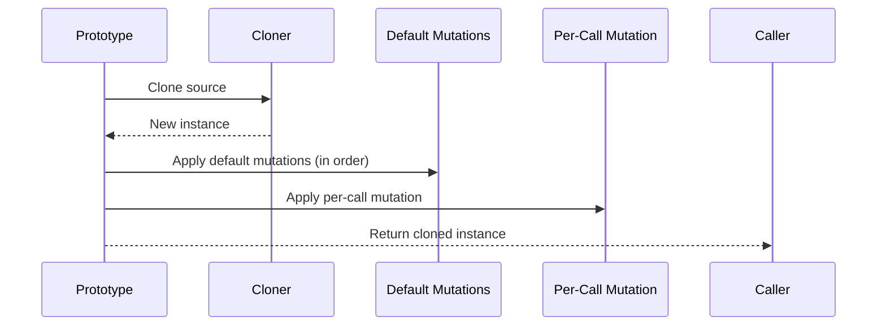
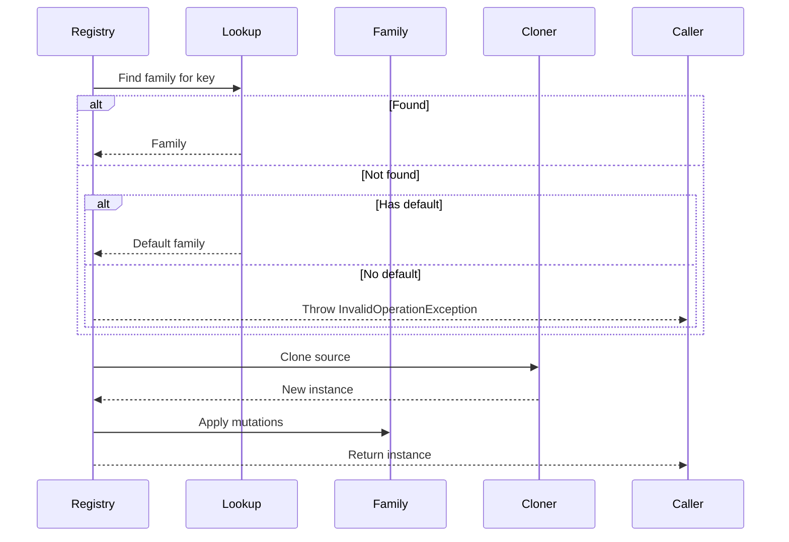

# Prototype Pattern API Reference

Complete API documentation for the Prototype pattern in PatternKit.

## Namespace

```csharp
using PatternKit.Creational.Prototype;
```

---

## Prototype\<T\>

Single-source prototype with cloner and optional default mutations.

```csharp
public sealed class Prototype<T>
```

### Type Parameters

| Parameter | Description |
|-----------|-------------|
| `T` | The prototype type to clone |

### Delegates

```csharp
public delegate T Cloner(in T source);
```

Delegate that clones a source instance into a new instance. The `in` parameter avoids struct copies.

### Static Methods

| Method | Returns | Description |
|--------|---------|-------------|
| `Create(T source, Cloner cloner)` | `Builder` | Create builder with source and cloner |

### Instance Methods

| Method | Returns | Description |
|--------|---------|-------------|
| `Create()` | `T` | Clone with default mutations only |
| `Create(Action<T>? mutate)` | `T` | Clone with default + per-call mutations |

### Example

```csharp
public record Widget { public string Name { get; set; } public int Size { get; set; } }

var proto = Prototype<Widget>
    .Create(new Widget { Name = "base", Size = 1 }, Clone)
    .With(w => w.Size++)
    .Build();

var a = proto.Create();                  // Size=2
var b = proto.Create(w => w.Size += 10); // Size=12

static Widget Clone(in Widget w) => new() { Name = w.Name, Size = w.Size };
```

---

## Prototype\<T\>.Builder

Builder for configuring the prototype.

```csharp
public sealed class Builder
```

### Methods

| Method | Returns | Description |
|--------|---------|-------------|
| `With(Action<T> mutate)` | `Builder` | Add default mutation applied to every clone |
| `Build()` | `Prototype<T>` | Build immutable prototype |

### Semantics

- **Mutations compose**: Multiple `With` calls chain in order
- **Build captures state**: Further modifications don't affect built prototypes
- **Cloner required**: Must be provided at `Create` time

---

## Prototype\<TKey, T\>

Registry of keyed prototype families.

```csharp
public sealed class Prototype<TKey, T> where TKey : notnull
```

### Type Parameters

| Parameter | Description |
|-----------|-------------|
| `TKey` | Key type for lookup (e.g., enum, string) |
| `T` | Prototype type to clone |

### Delegates

```csharp
public delegate T Cloner(in T source);
```

### Static Methods

| Method | Returns | Description |
|--------|---------|-------------|
| `Create(IEqualityComparer<TKey>? comparer = null)` | `Builder` | Create builder with optional comparer |

### Instance Methods

| Method | Returns | Description |
|--------|---------|-------------|
| `Create(TKey key)` | `T` | Clone for key, throws if missing |
| `Create(TKey key, Action<T>? mutate)` | `T` | Clone with per-call mutation |
| `TryCreate(TKey key, out T value)` | `bool` | Safe creation, returns false if missing |

### Exceptions

| Method | Exception | Condition |
|--------|-----------|-----------|
| `Create` | `InvalidOperationException` | No mapping for key and no default |

### Example

```csharp
enum ShapeKind { Circle, Square }

var shapes = Prototype<ShapeKind, Shape>
    .Create()
    .Map(ShapeKind.Circle, new Circle { Radius = 1 }, Clone)
    .Map(ShapeKind.Square, new Square { Side = 1 }, Clone)
    .Mutate(ShapeKind.Circle, s => s.Color = "red")
    .Default(new Shape { Name = "unknown" }, Clone)
    .Build();

var circle = shapes.Create(ShapeKind.Circle);           // Color="red"
var square = shapes.Create(ShapeKind.Square, s => s.Side = 5);
```

---

## Prototype\<TKey, T\>.Builder

Builder for keyed prototype registry.

```csharp
public sealed class Builder
```

### Methods

| Method | Returns | Description |
|--------|---------|-------------|
| `Map(TKey key, T source, Cloner cloner)` | `Builder` | Register prototype family for key |
| `Mutate(TKey key, Action<T> mutate)` | `Builder` | Add default mutation for key |
| `Default(T source, Cloner cloner)` | `Builder` | Set default prototype family |
| `DefaultMutate(Action<T> mutate)` | `Builder` | Add mutation to default |
| `Build()` | `Prototype<TKey, T>` | Build immutable registry |

### Semantics

- **Map before Mutate**: `Map` must be called before `Mutate` for each key
- **Last mapping wins**: Calling `Map` with same key replaces previous
- **Default is optional**: Without default, missing keys throw
- **Mutations compose**: Multiple `Mutate` calls chain in order

### Exceptions

| Method | Exception | Condition |
|--------|-----------|-----------|
| `Build` | `InvalidOperationException` | Mutate called without Map for a key |

---

## Execution Order

### Single Prototype



### Registry Prototype



---

## Thread Safety

| Component | Thread-Safe |
|-----------|-------------|
| `Builder` | No - single-threaded configuration |
| `Prototype<T>` | Yes - immutable after build |
| `Prototype<TKey, T>` | Yes - dictionary is read-only |
| `Create` | Yes - but cloner/mutations must be |

### Implementation Notes

- Single dictionary lookup per keyed Create call
- Cloner receives `in T` to avoid struct copies
- Delegate.Combine for mutation composition
- No reflection or LINQ in hot path

---

## Complete Example

```csharp
using PatternKit.Creational.Prototype;

// Define types
public class Enemy
{
    public Guid Id { get; set; }
    public string Name { get; set; } = "";
    public int Health { get; set; }
    public int Damage { get; set; }
    public Vector3 Position { get; set; }
}

// Create registry
public class EnemySpawner
{
    private readonly Prototype<string, Enemy> _enemies;

    public EnemySpawner()
    {
        _enemies = Prototype<string, Enemy>
            .Create(StringComparer.OrdinalIgnoreCase)
            .Map("goblin", new Enemy
            {
                Name = "Goblin",
                Health = 30,
                Damage = 5
            }, Clone)
            .Map("orc", new Enemy
            {
                Name = "Orc",
                Health = 80,
                Damage = 15
            }, Clone)
            .Map("boss", new Enemy
            {
                Name = "Boss",
                Health = 500,
                Damage = 50
            }, Clone)
            .Mutate("boss", e => e.Name = "Elite " + e.Name)
            .Default(new Enemy { Name = "Unknown", Health = 10, Damage = 1 }, Clone)
            .Build();
    }

    public Enemy Spawn(string type, Vector3 position) =>
        _enemies.Create(type, e =>
        {
            e.Id = Guid.NewGuid();
            e.Position = position;
        });

    public bool TrySpawn(string type, Vector3 position, out Enemy enemy)
    {
        if (_enemies.TryCreate(type, out enemy))
        {
            enemy.Id = Guid.NewGuid();
            enemy.Position = position;
            return true;
        }
        return false;
    }

    private static Enemy Clone(in Enemy e) => new()
    {
        Id = e.Id,
        Name = e.Name,
        Health = e.Health,
        Damage = e.Damage,
        Position = e.Position
    };
}

// Usage
var spawner = new EnemySpawner();
var goblin = spawner.Spawn("goblin", new Vector3(10, 0, 5));
var boss = spawner.Spawn("boss", new Vector3(50, 0, 50));
```

---

## See Also

- [Overview](index.md)
- [Comprehensive Guide](guide.md)
- [Real-World Examples](real-world-examples.md)
