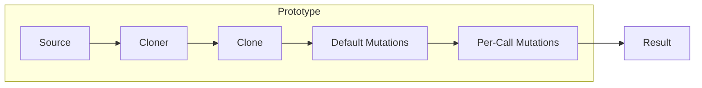

# Prototype Pattern Guide

Comprehensive guide to using the Prototype pattern in PatternKit.

## Overview

Prototype creates new objects by cloning a prototypical instance rather than calling constructors. This implementation adds fluent mutations, registry support, and immutable configuration.



## Getting Started

### Installation

```csharp
using PatternKit.Creational.Prototype;
```

### Basic Usage

```csharp
// Define a cloneable type
public class Widget
{
    public string Name { get; set; }
    public int Size { get; set; }
}

// Create prototype with cloner
var proto = Prototype<Widget>
    .Create(new Widget { Name = "base", Size = 1 }, Clone)
    .With(w => w.Size++)  // default mutation
    .Build();

// Clone instances
var a = proto.Create();                  // Size=2
var b = proto.Create(w => w.Size += 10); // Size=12

static Widget Clone(in Widget w) => new() { Name = w.Name, Size = w.Size };
```

## Core Concepts

### The Cloner Delegate

You provide a `Cloner` delegate that copies the source instance:

```csharp
public delegate T Cloner(in T source);
```

The `in` parameter avoids struct copies. Common implementations:

```csharp
// For classes - shallow copy
static Widget Clone(in Widget w) => new() { Name = w.Name, Size = w.Size };

// For records - use with expression
static Config Clone(in Config c) => c with { };

// For deep copy with nested objects
static Order Clone(in Order o) => new()
{
    Id = o.Id,
    Items = o.Items.Select(i => new OrderItem { Sku = i.Sku, Qty = i.Qty }).ToList()
};
```

### Default Mutations

Mutations applied to every clone:

```csharp
var proto = Prototype<Widget>
    .Create(source, Clone)
    .With(w => w.CreatedAt = DateTime.UtcNow)  // always set
    .With(w => w.Id = Guid.NewGuid())          // always unique
    .Build();
```

Mutations compose in order:

```csharp
.With(w => w.Size = 10)    // First
.With(w => w.Size *= 2)    // Second: Size becomes 20
```

### Per-Call Mutations

Additional mutations for specific clones:

```csharp
// Use default mutations only
var standard = proto.Create();

// Add extra mutation for this clone
var special = proto.Create(w => w.Size = 100);
```

Order: default mutations run first, then per-call.

## Prototype Registry

For multiple prototype families by key:

```csharp
enum ShapeKind { Circle, Square, Triangle }

var shapes = Prototype<ShapeKind, Shape>
    .Create()
    .Map(ShapeKind.Circle, new Circle { Radius = 1 }, CloneCircle)
    .Map(ShapeKind.Square, new Square { Side = 1 }, CloneSquare)
    .Mutate(ShapeKind.Circle, s => s.Color = "red")  // default for circles
    .Default(new Shape { Name = "unknown" }, CloneShape)
    .Build();
```

### Registry Methods

```csharp
// Direct creation (throws if missing without default)
var circle = shapes.Create(ShapeKind.Circle);

// With per-call mutation
var bigSquare = shapes.Create(ShapeKind.Square, s => s.Side = 10);

// Safe creation
if (shapes.TryCreate(ShapeKind.Triangle, out var triangle))
{
    // Use triangle
}
```

### Key Comparers

```csharp
// Case-insensitive string keys
var protos = Prototype<string, Config>
    .Create(StringComparer.OrdinalIgnoreCase)
    .Map("DEV", devConfig, Clone)
    .Map("PROD", prodConfig, Clone)
    .Build();

var cfg = protos.Create("dev");  // Matches "DEV"
```

## Common Patterns

### Test Data Builder

```csharp
public class TestDataFactory
{
    private readonly Prototype<Customer> _customer;
    private readonly Prototype<Order> _order;

    public TestDataFactory()
    {
        _customer = Prototype<Customer>
            .Create(new Customer
            {
                Name = "Test User",
                Email = "test@example.com",
                Status = CustomerStatus.Active
            }, Clone)
            .With(c => c.Id = Guid.NewGuid())
            .Build();

        _order = Prototype<Order>
            .Create(new Order
            {
                Status = OrderStatus.Pending,
                Items = new List<OrderItem>()
            }, CloneOrder)
            .With(o => o.Id = Guid.NewGuid())
            .With(o => o.CreatedAt = DateTime.UtcNow)
            .Build();
    }

    public Customer CreateCustomer(Action<Customer>? customize = null)
        => _customer.Create(customize);

    public Order CreateOrder(Action<Order>? customize = null)
        => _order.Create(customize);

    // Usage in tests
    // var customer = factory.CreateCustomer(c => c.Name = "VIP Customer");
    // var order = factory.CreateOrder(o => o.Items.Add(testItem));
}
```

### Configuration Templates

```csharp
var configs = Prototype<string, AppConfig>
    .Create(StringComparer.OrdinalIgnoreCase)
    .Map("development", new AppConfig
    {
        LogLevel = LogLevel.Debug,
        ConnectionString = "Server=localhost;...",
        EnableCaching = false
    }, Clone)
    .Map("production", new AppConfig
    {
        LogLevel = LogLevel.Warning,
        ConnectionString = "Server=proddb;...",
        EnableCaching = true
    }, Clone)
    .Mutate("development", c => c.FeatureFlags["debug"] = true)
    .Default(new AppConfig { LogLevel = LogLevel.Information }, Clone)
    .Build();

var devConfig = configs.Create("development");
var prodConfig = configs.Create("production", c => c.Region = "us-east-1");
```

### Game Entity Spawning

```csharp
enum EnemyType { Goblin, Orc, Dragon }

var enemies = Prototype<EnemyType, Enemy>
    .Create()
    .Map(EnemyType.Goblin, new Enemy
    {
        Name = "Goblin",
        Health = 30,
        Damage = 5,
        Speed = 1.5f
    }, Clone)
    .Map(EnemyType.Orc, new Enemy
    {
        Name = "Orc",
        Health = 80,
        Damage = 15,
        Speed = 1.0f
    }, Clone)
    .Map(EnemyType.Dragon, new Enemy
    {
        Name = "Dragon",
        Health = 500,
        Damage = 50,
        Speed = 2.0f,
        Abilities = new[] { "fire-breath", "fly" }
    }, CloneEnemy)
    .Build();

// Spawn with position
var goblin = enemies.Create(EnemyType.Goblin, e =>
{
    e.Id = Guid.NewGuid();
    e.Position = spawnPoint;
});
```

### Document Templates

```csharp
var templates = Prototype<string, Document>
    .Create(StringComparer.OrdinalIgnoreCase)
    .Map("invoice", new Document
    {
        Type = "Invoice",
        Template = LoadTemplate("invoice.html"),
        Styles = InvoiceStyles,
        Footer = "Thank you for your business"
    }, Clone)
    .Map("report", new Document
    {
        Type = "Report",
        Template = LoadTemplate("report.html"),
        Styles = ReportStyles,
        Header = "Confidential"
    }, Clone)
    .Build();

var invoice = templates.Create("invoice", d =>
{
    d.Title = "Invoice #12345";
    d.Data = orderData;
});
```

## Best Practices

### Use Static Lambdas for Cloners

```csharp
// Good - static, no closure
var proto = Prototype<Widget>
    .Create(source, static (in Widget w) => new Widget
    {
        Name = w.Name,
        Size = w.Size
    })
    .Build();

// Avoid - may capture variables
var multiplier = 2;
.With(w => w.Size *= multiplier)  // Captures multiplier
```

### Prefer Records for Simple Cloning

```csharp
public record Config(string Name, int Value);

var proto = Prototype<Config>
    .Create(new Config("base", 0), static (in Config c) => c with { })
    .With(c => /* record properties are init-only, use new record */)
    .Build();
```

### Validate Before Building

```csharp
var builder = Prototype<EnemyType, Enemy>.Create();

// Map must be called before Mutate for each key
builder.Map(EnemyType.Goblin, goblinSource, Clone);
builder.Mutate(EnemyType.Goblin, e => e.Buffed = true);

// This would throw at Build() time:
// builder.Mutate(EnemyType.Orc, e => e.Buffed = true); // No Map for Orc!

var proto = builder.Build();
```

## Thread Safety

| Component | Thread-Safe |
|-----------|-------------|
| `Builder` | No - single-threaded configuration |
| `Prototype<T>` | Yes - immutable after build |
| `Prototype<TKey, T>` | Yes - immutable after build |
| `Create` | Yes - cloner/mutations may not be |

Note: While the prototype registry is thread-safe, your cloner and mutation delegates must also be thread-safe if called from multiple threads.

## Troubleshooting

### InvalidOperationException: No prototype family

No mapping exists for the key and no default configured:

```csharp
// Add a default
.Default(fallbackSource, Clone)

// Or use TryCreate
if (!proto.TryCreate(key, out var value))
    // Handle missing
```

### InvalidOperationException: Map must be called before Mutate

Mutate was called for a key without first calling Map:

```csharp
// Wrong order
.Mutate(key, m => ...)  // No source/cloner yet!
.Map(key, source, Clone)

// Correct order
.Map(key, source, Clone)
.Mutate(key, m => ...)
```

### Clone modifications affect source

Your cloner is returning the same reference, not a new instance:

```csharp
// Wrong - returns same instance
static Widget WrongClone(in Widget w) => w;

// Correct - creates new instance
static Widget Clone(in Widget w) => new() { Name = w.Name, Size = w.Size };
```

## See Also

- [Overview](index.md)
- [API Reference](api-reference.md)
- [Real-World Examples](real-world-examples.md)
