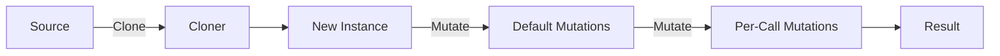

# Prototype Pattern

> **TL;DR**: Clone and configure instances from prototypical sources with mutations.

## Quick Example

```csharp
public record Widget { public string Name { get; set; } public int Size { get; set; } }

var proto = Prototype<Widget>
    .Create(new Widget { Name = "base", Size = 1 }, Clone)
    .With(w => w.Size++)  // default mutation
    .Build();

var a = proto.Create();                  // Name="base", Size=2
var b = proto.Create(w => w.Size += 10); // Name="base", Size=12

static Widget Clone(in Widget w) => new() { Name = w.Name, Size = w.Size };
```

## What It Is

Prototype specifies the kinds of objects to create using a prototypical instance, and creates new objects by copying this prototype. This implementation adds fluent configuration and mutation support.

PatternKit provides two prototype variants:

| Variant | Description |
|---------|-------------|
| `Prototype<T>` | Single source with cloner and mutations |
| `Prototype<TKey, T>` | Registry of named prototypes |

Key characteristics:

- **Clone-based creation**: Copy from source, no constructor needed
- **Fluent mutations**: Apply default and per-call modifications
- **Immutable registry**: Thread-safe prototype lookup
- **Custom cloners**: You control the copy semantics
- **Low overhead**: Delegate-based, no reflection

## When to Use

- **Expensive construction**: Clone cheaper than create
- **Configuration templates**: Base objects with variations
- **Object families**: Related prototypes by key
- **Game entities**: Clone and tweak NPCs, items, etc.

## When to Avoid

- **Simple value objects**: Direct construction is clearer
- **No shared state**: Prototype adds unnecessary complexity
- **Deep object graphs**: Cloning may be expensive
- **Immutable types**: Use `with` expressions instead

## Diagram



## Prototype Variants

### Single Prototype

```csharp
var proto = Prototype<Config>
    .Create(defaultConfig, Clone)
    .With(c => c.Timestamp = DateTime.UtcNow)
    .Build();

var config1 = proto.Create();
var config2 = proto.Create(c => c.Environment = "prod");
```

### Prototype Registry

```csharp
enum ShapeKind { Circle, Square, Triangle }

var shapes = Prototype<ShapeKind, Shape>
    .Create()
    .Map(ShapeKind.Circle, new Circle { Radius = 1 }, Clone)
    .Map(ShapeKind.Square, new Square { Side = 1 }, Clone)
    .Mutate(ShapeKind.Circle, s => s.Color = "red")
    .Default(new Shape { Name = "unknown" }, Clone)
    .Build();

var circle = shapes.Create(ShapeKind.Circle);
var custom = shapes.Create(ShapeKind.Square, s => s.Side = 5);
```

### Safe Creation

```csharp
if (registry.TryCreate(key, out var instance))
{
    // Use instance
}
else
{
    // Handle missing prototype (no default configured)
}
```

## See Also

- [Comprehensive Guide](guide.md) - Detailed usage and patterns
- [API Reference](api-reference.md) - Complete API documentation
- [Real-World Examples](real-world-examples.md) - Production-ready examples
- [Factory Pattern](../factory/index.md) - For key-to-creator without source object
- [Builder Pattern](../builder/index.md) - For step-by-step construction
