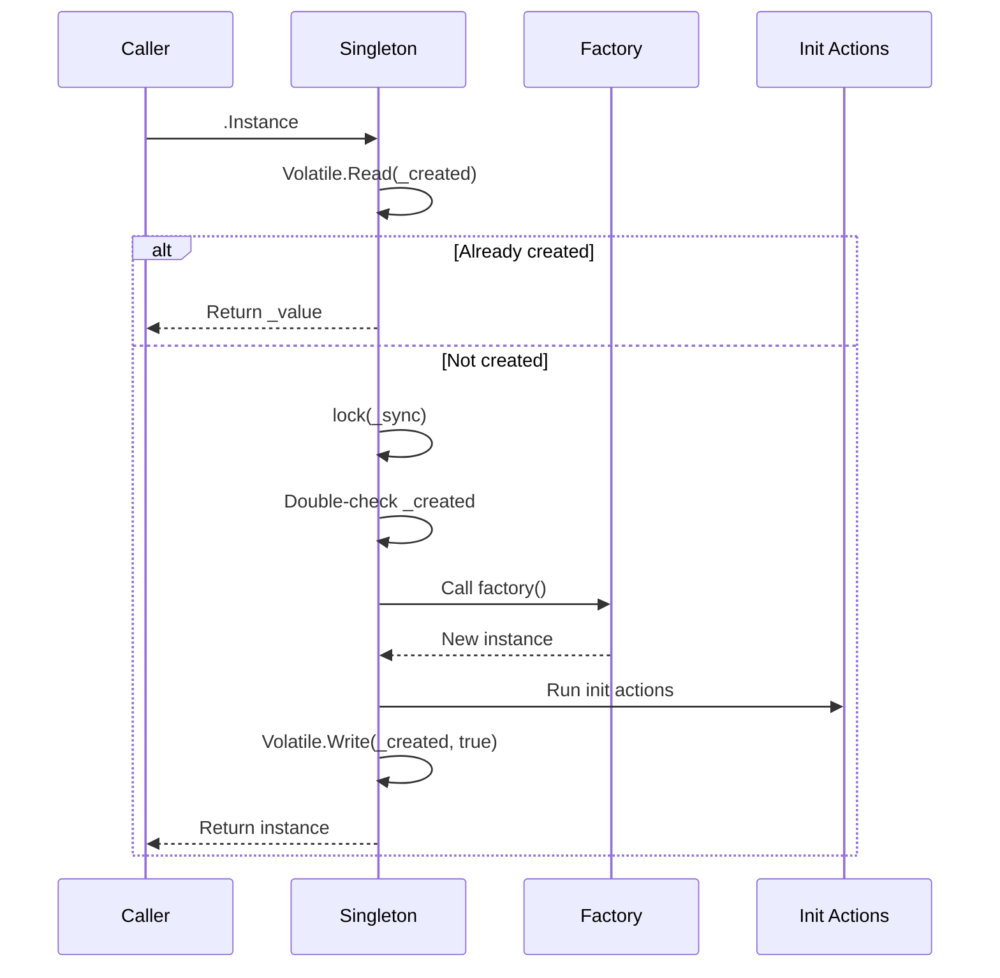
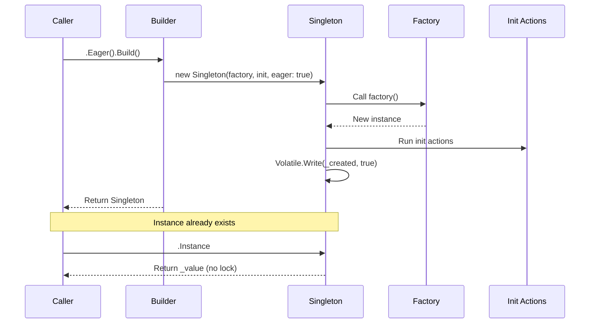

# Singleton Pattern API Reference

Complete API documentation for the Singleton pattern in PatternKit.

## Namespace

```csharp
using PatternKit.Creational.Singleton;
```

---

## Singleton\<T\>

Thread-safe singleton with fluent initialization and lazy/eager creation.

```csharp
public sealed class Singleton<T>
```

### Type Parameters

| Parameter | Description |
|-----------|-------------|
| `T` | The instance type |

### Delegates

```csharp
public delegate T Factory();
```

Factory delegate used to create the singleton instance.

### Static Methods

| Method | Returns | Description |
|--------|---------|-------------|
| `Create(Factory factory)` | `Builder` | Create builder with factory delegate |

### Instance Properties

| Property | Type | Description |
|----------|------|-------------|
| `Instance` | `T` | Gets the singleton instance, creating on first access if lazy |

### Exceptions

| Property | Exception | Condition |
|----------|-----------|-----------|
| `Instance` | (varies) | If factory or init throws |

### Example

```csharp
var singleton = Singleton<Cache>
    .Create(() => new Cache())
    .Init(c => c.WarmUp())
    .Build();

var cache = singleton.Instance; // Created here (lazy)
```

---

## Singleton\<T\>.Builder

Builder for configuring the singleton.

```csharp
public sealed class Builder
```

### Methods

| Method | Returns | Description |
|--------|---------|-------------|
| `Init(Action<T> initializer)` | `Builder` | Add initialization action (runs once) |
| `Eager()` | `Builder` | Create instance at Build() time |
| `Build()` | `Singleton<T>` | Build the singleton wrapper |

### Semantics

- **Init composes**: Multiple `Init` calls chain in order
- **Init runs once**: Initialization happens exactly once at creation
- **Eager is optional**: Default is lazy creation on first access
- **Factory required**: Must be provided at `Create` time

### Exceptions

| Method | Exception | Condition |
|--------|-----------|-----------|
| `Create` | `ArgumentNullException` | Factory is null |

---

## Creation Flow

### Lazy Creation (Default)



### Eager Creation



---

## Thread Safety

| Component | Thread-Safe |
|-----------|-------------|
| `Builder` | No - single-threaded configuration |
| `Singleton<T>` | Yes - immutable after build |
| `Instance` | Yes - double-checked locking |
| Init actions | Thread-safe (run exactly once) |

### Implementation Notes

- Uses `Volatile.Read`/`Write` for memory barriers
- Double-checked locking pattern with dedicated lock object
- Factory and init run in the lock, ensuring single execution
- No reflection or LINQ in access path

### Memory Model

```csharp
// Fast path - no lock if already created
public T Instance => Volatile.Read(ref _created) ? _value : CreateSlow();

// Slow path - lock and create
private T CreateSlow()
{
    if (Volatile.Read(ref _created)) return _value;  // Re-check
    lock (_sync)
    {
        if (_created) return _value;  // Double-check inside lock
        var v = _factory();
        _init?.Invoke(v);
        _value = v;
        Volatile.Write(ref _created, true);
        return _value;
    }
}
```

---

## Complete Example

```csharp
using PatternKit.Creational.Singleton;

// Define configuration class
public class AppConfiguration
{
    public string DatabaseConnection { get; private set; } = "";
    public string ApiKey { get; private set; } = "";
    public int MaxRetries { get; private set; } = 3;
    public TimeSpan Timeout { get; private set; } = TimeSpan.FromSeconds(30);

    public void LoadFromEnvironment()
    {
        DatabaseConnection = Environment.GetEnvironmentVariable("DB_CONNECTION")
            ?? throw new InvalidOperationException("DB_CONNECTION not set");
        ApiKey = Environment.GetEnvironmentVariable("API_KEY")
            ?? throw new InvalidOperationException("API_KEY not set");

        if (int.TryParse(Environment.GetEnvironmentVariable("MAX_RETRIES"), out var retries))
            MaxRetries = retries;

        if (int.TryParse(Environment.GetEnvironmentVariable("TIMEOUT_SECONDS"), out var timeout))
            Timeout = TimeSpan.FromSeconds(timeout);
    }

    public void Validate()
    {
        if (string.IsNullOrEmpty(DatabaseConnection))
            throw new InvalidOperationException("Invalid database connection");
        if (string.IsNullOrEmpty(ApiKey))
            throw new InvalidOperationException("Invalid API key");
        if (MaxRetries < 0)
            throw new InvalidOperationException("MaxRetries must be non-negative");
    }
}

// Create singleton wrapper
public static class Config
{
    private static readonly Singleton<AppConfiguration> _instance =
        Singleton<AppConfiguration>
            .Create(static () => new AppConfiguration())
            .Init(static c => c.LoadFromEnvironment())
            .Init(static c => c.Validate())
            .Eager()  // Fail fast on startup
            .Build();

    public static AppConfiguration Instance => _instance.Instance;

    // Convenience accessors
    public static string DatabaseConnection => Instance.DatabaseConnection;
    public static string ApiKey => Instance.ApiKey;
    public static int MaxRetries => Instance.MaxRetries;
    public static TimeSpan Timeout => Instance.Timeout;
}

// Usage throughout application
public class DatabaseService
{
    private readonly string _connectionString = Config.DatabaseConnection;
    private readonly int _maxRetries = Config.MaxRetries;

    public async Task<T> ExecuteWithRetryAsync<T>(Func<Task<T>> operation)
    {
        for (int i = 0; i <= _maxRetries; i++)
        {
            try
            {
                return await operation();
            }
            catch when (i < _maxRetries)
            {
                await Task.Delay(TimeSpan.FromSeconds(Math.Pow(2, i)));
            }
        }
        throw new InvalidOperationException("All retries exhausted");
    }
}
```

---

## Comparison with Other Patterns

### Singleton vs Factory

| Aspect | Singleton | Factory |
|--------|-----------|---------|
| Instance count | Exactly one | Many |
| Access | `.Instance` property | `.Create()` method |
| State | Shared globally | Independent per instance |
| Use case | Configuration, caches | Creating new objects |

### Singleton vs Dependency Injection

| Aspect | Singleton Pattern | DI Singleton |
|--------|-------------------|--------------|
| Registration | Static/explicit | Container-managed |
| Testing | Harder to mock | Easy to substitute |
| Lifetime | Application-wide | Scope-dependent |
| Flexibility | Less flexible | More flexible |

Recommendation: Use DI containers when possible; use this pattern for static infrastructure like logging and configuration that must be available before DI is configured.

---

## See Also

- [Overview](index.md)
- [Comprehensive Guide](guide.md)
- [Real-World Examples](real-world-examples.md)
