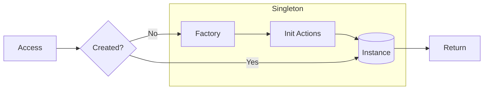

# Singleton Pattern Guide

Comprehensive guide to using the Singleton pattern in PatternKit.

## Overview

Singleton ensures a class has only one instance and provides a global point of access. This implementation adds fluent configuration, one-time initialization, and thread-safe lazy/eager creation.



## Getting Started

### Installation

```csharp
using PatternKit.Creational.Singleton;
```

### Basic Usage

```csharp
// Create a lazy singleton
var cache = Singleton<Cache>
    .Create(() => new Cache())
    .Init(c => c.WarmUp())
    .Build();

// Access the instance (created on first access)
var instance = cache.Instance;
```

### Eager Creation

```csharp
// Create immediately at Build() time
var config = Singleton<Configuration>
    .Create(() => LoadConfiguration())
    .Eager()
    .Build(); // Instance already exists
```

## Core Concepts

### The Factory Delegate

You provide a `Factory` delegate that creates the singleton instance:

```csharp
public delegate T Factory();
```

Common patterns:

```csharp
// Simple construction
.Create(() => new Service())

// With dependencies
.Create(() => new Service(
    connectionString,
    logger))

// Static lambda to avoid closures
.Create(static () => new StatelessService())
```

### Init Actions

One-time initialization runs after instance creation:

```csharp
var db = Singleton<Database>
    .Create(() => new Database(connectionString))
    .Init(db => db.OpenConnection())
    .Init(db => db.RunMigrations())
    .Init(db => db.SeedData())
    .Build();
```

Init actions compose in order and run exactly once.

### Lazy vs Eager

**Lazy (default)**: Instance created on first `Instance` access.

```csharp
var singleton = Singleton<Service>
    .Create(() => new Service())
    .Build();

// Nothing created yet
// ...later...
var svc = singleton.Instance; // Created here
```

**Eager**: Instance created immediately at `Build()` time.

```csharp
var singleton = Singleton<Service>
    .Create(() => new Service())
    .Eager()
    .Build(); // Created here

var svc = singleton.Instance; // Same instance
```

Use eager when:
- Initialization must complete before application starts
- You want to fail fast on construction errors
- The cost of first-access delay is unacceptable

## Common Patterns

### Configuration Service

```csharp
public static class AppConfig
{
    private static readonly Singleton<Configuration> _instance =
        Singleton<Configuration>
            .Create(static () => new Configuration())
            .Init(static c => c.LoadFromFile("appsettings.json"))
            .Init(static c => c.LoadFromEnvironment())
            .Init(static c => c.Validate())
            .Eager()  // Fail fast on invalid config
            .Build();

    public static Configuration Instance => _instance.Instance;
}

// Usage
var timeout = AppConfig.Instance.HttpTimeout;
```

### Connection Pool

```csharp
public class ConnectionPoolService
{
    private readonly Singleton<ConnectionPool> _pool;

    public ConnectionPoolService(string connectionString)
    {
        _pool = Singleton<ConnectionPool>
            .Create(() => new ConnectionPool(connectionString, maxSize: 100))
            .Init(p => p.WarmUp(minConnections: 10))
            .Build();
    }

    public IDbConnection GetConnection() =>
        _pool.Instance.Acquire();
}
```

### Logger Factory

```csharp
public static class Logging
{
    private static readonly Singleton<ILoggerFactory> _factory =
        Singleton<ILoggerFactory>
            .Create(static () => LoggerFactory.Create(builder =>
            {
                builder
                    .SetMinimumLevel(LogLevel.Information)
                    .AddConsole()
                    .AddFile("logs/app.log");
            }))
            .Eager()
            .Build();

    public static ILogger<T> GetLogger<T>() =>
        _factory.Instance.CreateLogger<T>();
}

// Usage
var logger = Logging.GetLogger<MyService>();
```

### Feature Flags

```csharp
public class FeatureFlags
{
    private static readonly Singleton<FeatureFlags> _instance =
        Singleton<FeatureFlags>
            .Create(static () => new FeatureFlags())
            .Init(static f => f.LoadFromConfig())
            .Init(static f => f.SetupRefreshTimer())
            .Build();

    public static FeatureFlags Instance => _instance.Instance;

    private Dictionary<string, bool> _flags = new();
    private Timer? _refreshTimer;

    private void LoadFromConfig()
    {
        // Load from config file or remote service
    }

    private void SetupRefreshTimer()
    {
        _refreshTimer = new Timer(_ => LoadFromConfig(),
            null, TimeSpan.FromMinutes(5), TimeSpan.FromMinutes(5));
    }

    public bool IsEnabled(string feature) =>
        _flags.TryGetValue(feature, out var enabled) && enabled;
}

// Usage
if (FeatureFlags.Instance.IsEnabled("new-checkout"))
{
    // New checkout flow
}
```

### Metrics Registry

```csharp
public class MetricsRegistry
{
    private readonly Singleton<MeterProvider> _provider;
    private readonly Dictionary<string, Counter<long>> _counters = new();
    private readonly object _lock = new();

    public MetricsRegistry(string serviceName)
    {
        _provider = Singleton<MeterProvider>
            .Create(() => Sdk.CreateMeterProviderBuilder()
                .SetResourceBuilder(ResourceBuilder.CreateDefault()
                    .AddService(serviceName))
                .AddPrometheusExporter()
                .Build())
            .Eager()
            .Build();
    }

    public Counter<long> GetCounter(string name)
    {
        lock (_lock)
        {
            if (!_counters.TryGetValue(name, out var counter))
            {
                var meter = new Meter(name);
                counter = meter.CreateCounter<long>(name);
                _counters[name] = counter;
            }
            return counter;
        }
    }
}
```

## Best Practices

### Use Static Lambdas

Avoid closure allocations:

```csharp
// Good - static lambda
.Create(static () => new Service())
.Init(static s => s.Initialize())

// Avoid - captures local variables
var config = LoadConfig();
.Create(() => new Service(config))  // Captures config
```

### Keep Init Idempotent

For testability and safety:

```csharp
.Init(static s =>
{
    if (!s.IsInitialized)
        s.Initialize();
})
```

### Prefer Dependency Injection

Singletons can complicate testing. Consider:

```csharp
// For DI containers
services.AddSingleton<IService>(sp =>
{
    var singleton = Singleton<Service>
        .Create(() => new Service(sp.GetRequiredService<ILogger>()))
        .Init(s => s.Initialize())
        .Build();
    return singleton.Instance;
});
```

### Handle Initialization Errors

```csharp
var singleton = Singleton<Database>
    .Create(() =>
    {
        try
        {
            return new Database(connectionString);
        }
        catch (Exception ex)
        {
            Log.Error("Failed to create database", ex);
            throw;
        }
    })
    .Init(db =>
    {
        if (!db.CanConnect())
            throw new InvalidOperationException("Cannot connect to database");
    })
    .Eager()  // Fail fast
    .Build();
```

## Thread Safety

| Component | Thread-Safe |
|-----------|-------------|
| `Builder` | No - single-threaded configuration |
| `Singleton<T>` | Yes - double-checked locking |
| `Instance` | Yes - volatile read with lock fallback |
| Init actions | Run exactly once, thread-safe |

### Implementation Details

```csharp
// Double-checked locking pattern
public T Instance => Volatile.Read(ref _created) ? _value : CreateSlow();

private T CreateSlow()
{
    lock (_sync)
    {
        if (_created) return _value;
        _value = _factory();
        _init?.Invoke(_value);
        Volatile.Write(ref _created, true);
        return _value;
    }
}
```

## Troubleshooting

### Initialization order issues

If singleton A depends on singleton B, ensure B is created first:

```csharp
// Option 1: Eager creation in dependency order
var b = Singleton<B>.Create(...).Eager().Build();
var a = Singleton<A>.Create(() => new A(b.Instance)).Build();

// Option 2: Access in Init
var a = Singleton<A>
    .Create(() => new A())
    .Init(a => a.SetDependency(SingletonB.Instance))
    .Build();
```

### Testing with singletons

Use wrapper interfaces:

```csharp
public interface IConfigProvider
{
    Configuration Config { get; }
}

public class SingletonConfigProvider : IConfigProvider
{
    public Configuration Config => ConfigSingleton.Instance;
}

// In tests
services.AddSingleton<IConfigProvider>(new MockConfigProvider());
```

### Memory leaks with Init

If Init captures references, they live as long as the singleton:

```csharp
// Potential issue - captures logger
var logger = GetLogger();
.Init(s => logger.Log("Initialized"))

// Better - resolve inside Init
.Init(s => GetLogger().Log("Initialized"))
```

## See Also

- [Overview](index.md)
- [API Reference](api-reference.md)
- [Real-World Examples](real-world-examples.md)
