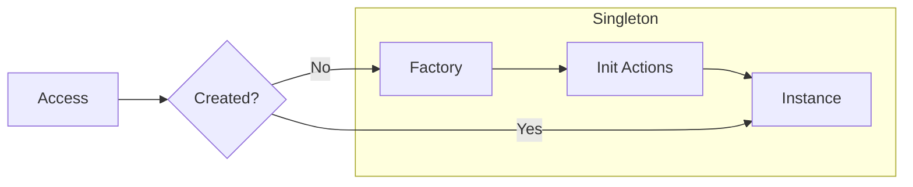

# Singleton Pattern

> **TL;DR**: Thread-safe singleton with fluent initialization and lazy/eager creation.

## Quick Example

```csharp
var cache = Singleton<Cache>
    .Create(() => new Cache())
    .Init(c => c.WarmUp())  // runs once at creation
    .Build();               // lazy by default

var instance1 = cache.Instance;  // created here
var instance2 = cache.Instance;  // same instance
ReferenceEquals(instance1, instance2); // true
```

## What It Is

Singleton ensures a class has only one instance and provides a global point of access to it. This implementation adds fluent configuration, one-time initialization, and choice of lazy or eager creation.

Key characteristics:

- **Single instance**: Only one instance exists per wrapper
- **Thread-safe**: Double-checked locking with volatile semantics
- **Lazy by default**: Instance created on first access
- **Eager option**: Create at Build() time
- **Init actions**: One-time setup composed in order
- **Immutable wrapper**: Safe after Build()

## When to Use

- **Global services**: Logging, configuration, caches
- **Resource coordination**: Connection pools, thread pools
- **Expensive initialization**: One-time setup with lazy creation
- **Stateless services**: No per-request state needed

## When to Avoid

- **Testing difficulties**: Singletons complicate unit testing
- **Hidden dependencies**: Prefer dependency injection
- **Stateful services**: Per-request state needs scoping
- **Multiple instances needed**: Use Factory instead

## Diagram



## Creation Modes

### Lazy (Default)

Instance created on first access:

```csharp
var singleton = Singleton<Service>
    .Create(() => new Service())
    .Init(s => s.Initialize())
    .Build();

// Instance created here, Init runs
var service = singleton.Instance;
```

### Eager

Instance created at Build() time:

```csharp
var singleton = Singleton<Service>
    .Create(() => new Service())
    .Init(s => s.Initialize())
    .Eager()  // create immediately
    .Build(); // Instance already exists
```

## Init Composition

Multiple Init calls compose in order:

```csharp
var singleton = Singleton<App>
    .Create(() => new App())
    .Init(a => a.LoadConfig())
    .Init(a => a.ConnectDatabase())
    .Init(a => a.StartServices())
    .Build();
```

## Best Practices

```csharp
// Prefer static lambdas to avoid closures
var singleton = Singleton<Cache>
    .Create(static () => new Cache())
    .Init(static c => c.Warm())
    .Build();

// Keep Init idempotent for testability
.Init(static c => {
    if (!c.IsInitialized)
        c.Initialize();
})
```

## See Also

- [Comprehensive Guide](guide.md) - Detailed usage and patterns
- [API Reference](api-reference.md) - Complete API documentation
- [Real-World Examples](real-world-examples.md) - Production-ready examples
- [Factory Pattern](../factory/index.md) - For multiple keyed instances
- [Builder Pattern](../builder/index.md) - For complex object construction
