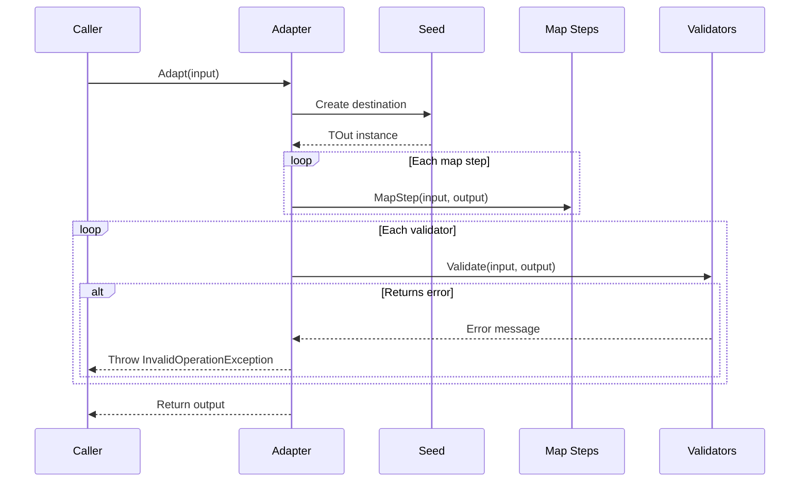
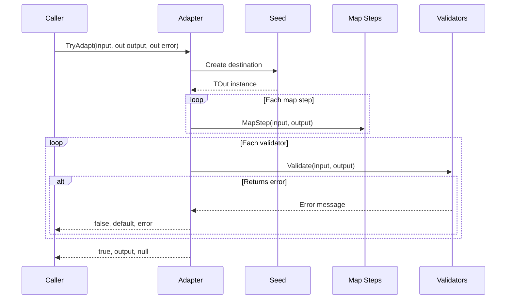

# Adapter Pattern API Reference

Complete API documentation for the Adapter pattern in PatternKit.

## Namespace

```csharp
using PatternKit.Structural.Adapter;
```

---

## Adapter\<TIn, TOut\>

Fluent adapter that maps input to output with ordered transformations and validation.

```csharp
public sealed class Adapter<TIn, TOut>
```

### Type Parameters

| Parameter | Description |
|-----------|-------------|
| `TIn` | Input type to adapt from |
| `TOut` | Output type to adapt to |

### Delegates

```csharp
public delegate TOut Seed();
public delegate TOut SeedFrom(in TIn input);
public delegate void MapStep(in TIn input, TOut output);
public delegate string? Validator(in TIn input, TOut output);
```

| Delegate | Description |
|----------|-------------|
| `Seed` | Creates destination without input |
| `SeedFrom` | Creates destination using input |
| `MapStep` | Transforms source data into destination |
| `Validator` | Returns error message or null if valid |

### Static Methods

| Method | Returns | Description |
|--------|---------|-------------|
| `Create(Seed seed)` | `Builder` | Create builder with parameterless seed |
| `Create(SeedFrom seedFrom)` | `Builder` | Create builder with input-aware seed |

### Instance Methods

| Method | Returns | Description |
|--------|---------|-------------|
| `Adapt(in TIn input)` | `TOut` | Adapt input, throws on validation failure |
| `TryAdapt(in TIn input, out TOut output, out string? error)` | `bool` | Safe adaptation, returns false on failure |

### Exceptions

| Method | Exception | Condition |
|--------|-----------|-----------|
| `Adapt` | `InvalidOperationException` | First validator returns non-null error |

### Example

```csharp
var adapter = Adapter<Source, Dest>
    .Create(static () => new Dest())
    .Map(static (in Source s, Dest d) => d.Name = s.Name)
    .Require(static (in Source _, Dest d) =>
        string.IsNullOrEmpty(d.Name) ? "Name required" : null)
    .Build();

var result = adapter.Adapt(source);
```

---

## Adapter\<TIn, TOut\>.Builder

Builder for configuring the adapter.

```csharp
public sealed class Builder
```

### Methods

| Method | Returns | Description |
|--------|---------|-------------|
| `Map(MapStep step)` | `Builder` | Append mapping step |
| `Require(Validator rule)` | `Builder` | Append validator |
| `Build()` | `Adapter<TIn, TOut>` | Build immutable adapter |

### Semantics

- **Mapping order preserved**: Steps run in registration order
- **Validation order preserved**: Validators run after all mapping; first error wins
- **Build captures state**: Further modifications don't affect built adapters

---

## AsyncAdapter\<TIn, TOut\>

Async adapter for I/O-bound transformations.

```csharp
public sealed class AsyncAdapter<TIn, TOut>
```

### Delegates

```csharp
public delegate TOut Seed();
public delegate TOut SeedFrom(in TIn input);
public delegate ValueTask MapStep(TIn input, TOut output, CancellationToken ct);
public delegate ValueTask<string?> Validator(TIn input, TOut output, CancellationToken ct);
```

### Static Methods

| Method | Returns | Description |
|--------|---------|-------------|
| `Create(Seed seed)` | `Builder` | Create builder with parameterless seed |
| `Create(SeedFrom seedFrom)` | `Builder` | Create builder with input-aware seed |

### Instance Methods

| Method | Returns | Description |
|--------|---------|-------------|
| `AdaptAsync(TIn input, CancellationToken ct)` | `ValueTask<TOut>` | Async adapt, throws on failure |
| `TryAdaptAsync(TIn input, CancellationToken ct)` | `ValueTask<(bool, TOut?, string?)>` | Safe async adaptation |

### Example

```csharp
var adapter = AsyncAdapter<Request, Response>
    .Create(static () => new Response())
    .Map(async static (Request r, Response resp, CancellationToken ct) =>
    {
        resp.Data = await service.GetAsync(r.Id, ct);
    })
    .Build();

var result = await adapter.AdaptAsync(request, cancellationToken);
```

---

## AsyncAdapter\<TIn, TOut\>.Builder

Builder for async adapter.

```csharp
public sealed class Builder
```

### Methods

| Method | Returns | Description |
|--------|---------|-------------|
| `Map(MapStep step)` | `Builder` | Append async mapping step |
| `Require(Validator rule)` | `Builder` | Append async validator |
| `Build()` | `AsyncAdapter<TIn, TOut>` | Build immutable adapter |

---

## Execution Flow

### Adapt Flow



### TryAdapt Flow



---

## Thread Safety

| Component | Thread-Safe |
|-----------|-------------|
| `Builder` | No - single-threaded configuration |
| `Adapter<TIn, TOut>` | Yes - immutable after build |
| `AsyncAdapter<TIn, TOut>` | Yes - immutable after build |
| `Adapt` / `AdaptAsync` | Yes - no shared state |

### Implementation Notes

- Arrays of delegates compiled at Build() time
- `in TIn` parameters avoid struct copies
- No LINQ, reflection, or allocations in adapt path
- Static lambdas recommended to avoid closure allocations

---

## Complete Example

```csharp
using PatternKit.Structural.Adapter;

// Define types
public record UserInput(string Email, string FirstName, string LastName, int Age);

public class CreateUserCommand
{
    public string Email { get; set; } = "";
    public string FirstName { get; set; } = "";
    public string LastName { get; set; } = "";
    public string FullName { get; set; } = "";
    public int Age { get; set; }
    public bool IsAdult { get; set; }
}

// Create adapter
public class UserInputAdapter
{
    private readonly Adapter<UserInput, CreateUserCommand> _adapter;

    public UserInputAdapter()
    {
        _adapter = Adapter<UserInput, CreateUserCommand>
            .Create(static () => new CreateUserCommand())
            .Map(static (in UserInput u, CreateUserCommand c) =>
                c.Email = u.Email?.Trim().ToLowerInvariant() ?? "")
            .Map(static (in UserInput u, CreateUserCommand c) =>
                c.FirstName = u.FirstName?.Trim() ?? "")
            .Map(static (in UserInput u, CreateUserCommand c) =>
                c.LastName = u.LastName?.Trim() ?? "")
            .Map(static (in UserInput u, CreateUserCommand c) =>
                c.FullName = $"{c.FirstName} {c.LastName}".Trim())
            .Map(static (in UserInput u, CreateUserCommand c) =>
                c.Age = u.Age)
            .Map(static (in UserInput u, CreateUserCommand c) =>
                c.IsAdult = u.Age >= 18)
            .Require(static (in UserInput _, CreateUserCommand c) =>
                IsValidEmail(c.Email) ? null : "Invalid email format")
            .Require(static (in UserInput _, CreateUserCommand c) =>
                string.IsNullOrEmpty(c.FirstName) ? "First name required" : null)
            .Require(static (in UserInput _, CreateUserCommand c) =>
                string.IsNullOrEmpty(c.LastName) ? "Last name required" : null)
            .Require(static (in UserInput _, CreateUserCommand c) =>
                c.Age is < 0 or > 150 ? "Invalid age" : null)
            .Build();
    }

    public CreateUserCommand Adapt(UserInput input) =>
        _adapter.Adapt(input);

    public bool TryAdapt(UserInput input, out CreateUserCommand? command, out string? error) =>
        _adapter.TryAdapt(input, out command, out error);

    private static bool IsValidEmail(string email) =>
        !string.IsNullOrEmpty(email) && email.Contains('@');
}

// Usage
var adapter = new UserInputAdapter();

// Success case
var command = adapter.Adapt(new UserInput("user@example.com", "John", "Doe", 25));

// Error handling
if (!adapter.TryAdapt(new UserInput("invalid", "", "Doe", 25), out var cmd, out var error))
{
    Console.WriteLine($"Validation failed: {error}");
}
```

---

## See Also

- [Overview](index.md)
- [Comprehensive Guide](guide.md)
- [Real-World Examples](real-world-examples.md)
