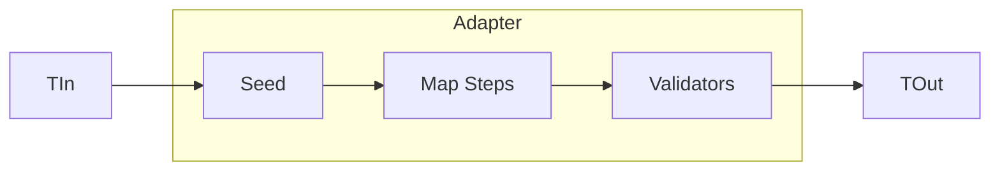

# Adapter Pattern Guide

Comprehensive guide to using the Adapter pattern in PatternKit.

## Overview

Adapter provides a fluent way to map objects from one type to another with ordered transformations and integrated validation. It's ideal for DTO projection, legacy integration, and input normalization.



## Getting Started

### Installation

```csharp
using PatternKit.Structural.Adapter;
```

### Basic Usage

```csharp
// Define source and destination types
public record User(int Id, string FirstName, string LastName, DateTime BirthDate);
public class UserDto
{
    public int Id { get; set; }
    public string FullName { get; set; } = "";
    public int Age { get; set; }
}

// Create adapter
var adapter = Adapter<User, UserDto>
    .Create(static () => new UserDto())
    .Map(static (in User u, UserDto d) => d.Id = u.Id)
    .Map(static (in User u, UserDto d) => d.FullName = $"{u.FirstName} {u.LastName}")
    .Map(static (in User u, UserDto d) => d.Age = CalculateAge(u.BirthDate))
    .Build();

var dto = adapter.Adapt(user);
```

## Core Concepts

### Seeding

Create the destination object before mapping:

**Parameterless seed** - when destination doesn't depend on input:
```csharp
.Create(static () => new Dest())
```

**Input-aware seed** - when destination needs input values:
```csharp
.Create(static (in Source s) => new Dest { Id = s.Id, Timestamp = s.Created })
```

### Mapping Steps

Map steps transform source data into the destination:

```csharp
.Map(static (in Source s, Dest d) => d.Name = s.Name)
.Map(static (in Source s, Dest d) => d.Price = s.Amount * s.Quantity)
.Map(static (in Source s, Dest d) => d.Status = MapStatus(s.Code))
```

Steps execute in registration order, allowing later steps to use values set by earlier steps.

### Validation

Validators run after all mapping steps:

```csharp
.Require(static (in Source _, Dest d) =>
    string.IsNullOrEmpty(d.Name) ? "Name is required" : null)
.Require(static (in Source _, Dest d) =>
    d.Price < 0 ? "Price must be positive" : null)
```

First validator returning a non-null message fails the adaptation.

### Safe Adaptation

Use `TryAdapt` to avoid exceptions:

```csharp
if (adapter.TryAdapt(source, out var result, out var error))
{
    // Use result
}
else
{
    // Handle error (first validation message)
    logger.LogWarning("Adaptation failed: {Error}", error);
}
```

## Common Patterns

### API Response Mapping

```csharp
public class ApiResponseAdapter
{
    private readonly Adapter<Order, OrderResponse> _adapter;

    public ApiResponseAdapter()
    {
        _adapter = Adapter<Order, OrderResponse>
            .Create(static (in Order o) => new OrderResponse { Id = o.Id })
            .Map(static (in Order o, OrderResponse r) =>
            {
                r.CustomerName = o.Customer.Name;
                r.CustomerEmail = o.Customer.Email;
            })
            .Map(static (in Order o, OrderResponse r) =>
            {
                r.Items = o.Items.Select(i => new OrderItemDto
                {
                    Sku = i.Sku,
                    Name = i.Product.Name,
                    Quantity = i.Quantity,
                    UnitPrice = i.UnitPrice
                }).ToList();
            })
            .Map(static (in Order o, OrderResponse r) =>
            {
                r.Subtotal = o.Items.Sum(i => i.Quantity * i.UnitPrice);
                r.Tax = r.Subtotal * o.TaxRate;
                r.Total = r.Subtotal + r.Tax;
            })
            .Map(static (in Order o, OrderResponse r) =>
            {
                r.Status = o.Status.ToString();
                r.CreatedAt = o.CreatedAt.ToString("O");
            })
            .Build();
    }

    public OrderResponse ToResponse(Order order) => _adapter.Adapt(order);
}
```

### Form Input Normalization

```csharp
var formAdapter = Adapter<FormInput, CreateUserCommand>
    .Create(static () => new CreateUserCommand())
    .Map(static (in FormInput f, CreateUserCommand c) =>
        c.Email = f.Email?.Trim().ToLowerInvariant())
    .Map(static (in FormInput f, CreateUserCommand c) =>
        c.FirstName = f.FirstName?.Trim())
    .Map(static (in FormInput f, CreateUserCommand c) =>
        c.LastName = f.LastName?.Trim())
    .Map(static (in FormInput f, CreateUserCommand c) =>
        c.Phone = NormalizePhone(f.Phone))
    .Require(static (in FormInput _, CreateUserCommand c) =>
        IsValidEmail(c.Email) ? null : "Invalid email format")
    .Require(static (in FormInput _, CreateUserCommand c) =>
        string.IsNullOrEmpty(c.FirstName) ? "First name required" : null)
    .Require(static (in FormInput _, CreateUserCommand c) =>
        string.IsNullOrEmpty(c.LastName) ? "Last name required" : null)
    .Build();
```

### Legacy System Integration

```csharp
// Adapt legacy COBOL-style record to modern model
var legacyAdapter = Adapter<LegacyRecord, ModernOrder>
    .Create(static () => new ModernOrder())
    .Map(static (in LegacyRecord r, ModernOrder o) =>
        o.OrderId = long.Parse(r.ORDERNUM.Trim()))
    .Map(static (in LegacyRecord r, ModernOrder o) =>
        o.CustomerName = $"{r.CUSTFIRST.Trim()} {r.CUSTLAST.Trim()}")
    .Map(static (in LegacyRecord r, ModernOrder o) =>
        o.Amount = decimal.Parse(r.AMOUNT.Replace(",", "")) / 100m)
    .Map(static (in LegacyRecord r, ModernOrder o) =>
        o.OrderDate = DateTime.ParseExact(r.ORDDATE, "yyyyMMdd", null))
    .Map(static (in LegacyRecord r, ModernOrder o) =>
        o.Status = r.ORDSTAT switch
        {
            "P" => OrderStatus.Pending,
            "C" => OrderStatus.Completed,
            "X" => OrderStatus.Cancelled,
            _ => OrderStatus.Unknown
        })
    .Build();
```

### Nested Object Mapping

```csharp
var adapter = Adapter<FullOrder, OrderSummary>
    .Create(static () => new OrderSummary())
    .Map(static (in FullOrder o, OrderSummary s) =>
    {
        s.OrderInfo = new OrderInfo
        {
            Id = o.Id,
            Number = o.OrderNumber,
            Date = o.CreatedAt
        };
    })
    .Map(static (in FullOrder o, OrderSummary s) =>
    {
        s.CustomerInfo = new CustomerInfo
        {
            Name = o.Customer.FullName,
            Email = o.Customer.Email,
            Phone = o.Customer.Phone
        };
    })
    .Map(static (in FullOrder o, OrderSummary s) =>
    {
        s.ShippingInfo = new ShippingInfo
        {
            Address = FormatAddress(o.ShippingAddress),
            Method = o.ShippingMethod.Name,
            EstimatedDelivery = o.EstimatedDelivery
        };
    })
    .Build();
```

## Async Adapter

For I/O-bound transformations, use `AsyncAdapter`:

```csharp
var asyncAdapter = AsyncAdapter<OrderRequest, EnrichedOrder>
    .Create(static () => new EnrichedOrder())
    .Map(async static (OrderRequest r, EnrichedOrder o, CancellationToken ct) =>
    {
        o.Customer = await customerService.GetAsync(r.CustomerId, ct);
    })
    .Map(async static (OrderRequest r, EnrichedOrder o, CancellationToken ct) =>
    {
        o.Products = await productService.GetManyAsync(r.ProductIds, ct);
    })
    .Map(async static (OrderRequest r, EnrichedOrder o, CancellationToken ct) =>
    {
        o.Pricing = await pricingService.CalculateAsync(o.Products, r.Quantity, ct);
    })
    .Build();

var order = await asyncAdapter.AdaptAsync(request, cancellationToken);
```

## Best Practices

### Use Static Lambdas

Avoid closures to prevent allocations:

```csharp
// Good - static lambda
.Map(static (in Source s, Dest d) => d.Name = s.Name)

// Avoid - captures external variable
var prefix = "Mr. ";
.Map((in Source s, Dest d) => d.Name = prefix + s.Name)  // Captures prefix
```

### Keep Validators Fast

Validators run on every adaptation:

```csharp
// Good - fast check
.Require(static (in Source _, Dest d) => d.Price >= 0 ? null : "Invalid price")

// Avoid - expensive operation
.Require(static (in Source _, Dest d) =>
    database.Exists(d.Id) ? null : "Not found")  // I/O in validator
```

### Use TryAdapt for User Input

```csharp
if (!adapter.TryAdapt(userInput, out var command, out var error))
{
    return BadRequest(new { Error = error });
}

// Process valid command
return Ok(await handler.Handle(command));
```

### Chain Adapters for Complex Transformations

```csharp
var step1 = Adapter<External, Intermediate>.Create()...Build();
var step2 = Adapter<Intermediate, Final>.Create()...Build();

var final = step2.Adapt(step1.Adapt(external));
```

## Thread Safety

| Component | Thread-Safe |
|-----------|-------------|
| `Builder` | No - single-threaded configuration |
| `Adapter<TIn, TOut>` | Yes - immutable after build |
| `Adapt` | Yes - no shared state |
| `TryAdapt` | Yes - no shared state |

## Troubleshooting

### Validation fails unexpectedly

Validators see the destination after all mapping. Check mapping order:

```csharp
// If validator checks d.Total, ensure it's set before validation
.Map(static (in S s, D d) => d.Subtotal = s.Price * s.Qty)
.Map(static (in S s, D d) => d.Tax = d.Subtotal * 0.1m)
.Map(static (in S s, D d) => d.Total = d.Subtotal + d.Tax)
.Require(static (in S _, D d) => d.Total > 0 ? null : "Total required")
```

### TryAdapt returns false but Adapt worked before

A validator started returning an error. Check validator predicates against current input.

### Destination properties not set

Ensure mapping steps actually assign values:

```csharp
// Wrong - expression without assignment
.Map(static (in S s, D d) => s.Name)

// Correct - assignment
.Map(static (in S s, D d) => d.Name = s.Name)
```

## See Also

- [Overview](index.md)
- [API Reference](api-reference.md)
- [Real-World Examples](real-world-examples.md)
