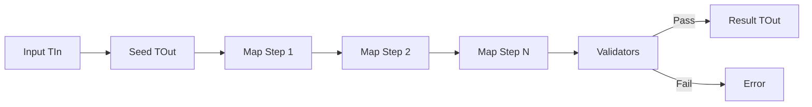

# Adapter Pattern

> **TL;DR**: Map and validate from one type to another with fluent, ordered transformations.

## Quick Example

```csharp
using PatternKit.Structural.Adapter;

public sealed record Source(string First, string Last, int Age);
public sealed class Dest { public string? FullName; public int Age; public bool Adult; }

var adapter = Adapter<Source, Dest>
    .Create(static () => new Dest())
    .Map(static (in Source s, Dest d) => d.FullName = $"{s.First} {s.Last}")
    .Map(static (in Source s, Dest d) => d.Age = s.Age)
    .Map(static (in Source s, Dest d) => d.Adult = s.Age >= 18)
    .Require(static (in Source _, Dest d) => string.IsNullOrWhiteSpace(d.FullName) ? "name required" : null)
    .Build();

var dto = adapter.Adapt(new Source("Ada", "Lovelace", 30));
```

## What It Is

Adapter converts one interface to another, making incompatible interfaces work together. PatternKit's implementation provides fluent, allocation-light mapping with integrated validation.

PatternKit provides two adapter variants:

| Variant | Description |
|---------|-------------|
| `Adapter<TIn, TOut>` | Synchronous mapping with validation |
| `AsyncAdapter<TIn, TOut>` | Async mapping for I/O-bound transformations |

Key characteristics:

- **Ordered mapping**: Steps execute in registration order
- **Input-aware seeding**: Create destination from source data
- **Integrated validation**: Run after mapping, first failure wins
- **Immutable**: Thread-safe after Build()
- **Zero reflection**: Delegate-based, AOT-friendly

## When to Use

- **DTO projection**: Map domain objects to API responses
- **Legacy integration**: Adapt old interfaces to new contracts
- **Normalization**: Transform and validate external input
- **Shape conversion**: Convert between incompatible types

## When to Avoid

- **One-to-one properties**: Use records with `with` expressions
- **Deep object graphs**: Consider specialized serialization
- **No validation needed**: Direct constructors may be simpler
- **Pure transformation**: Use LINQ Select or simple functions

## Diagram



## Adapter Variants

### Parameterless Seed

```csharp
var adapter = Adapter<Source, Dest>
    .Create(static () => new Dest())
    .Map(static (in Source s, Dest d) => d.Name = s.Name)
    .Build();
```

### Input-Aware Seed

```csharp
var adapter = Adapter<Source, Dest>
    .Create(static (in Source s) => new Dest { Id = s.Id })
    .Map(static (in Source s, Dest d) => d.Name = s.Name)
    .Build();
```

### Safe Adaptation

```csharp
if (!adapter.TryAdapt(input, out var result, out var error))
{
    // Handle validation failure without exception
    Console.WriteLine($"Validation failed: {error}");
}
```

## See Also

- [Comprehensive Guide](guide.md) - Detailed usage and patterns
- [API Reference](api-reference.md) - Complete API documentation
- [Real-World Examples](real-world-examples.md) - Production-ready examples
- [Bridge Pattern](../bridge/index.md) - For separating abstraction from implementation
- [Decorator Pattern](../decorator/index.md) - For adding behavior to objects
