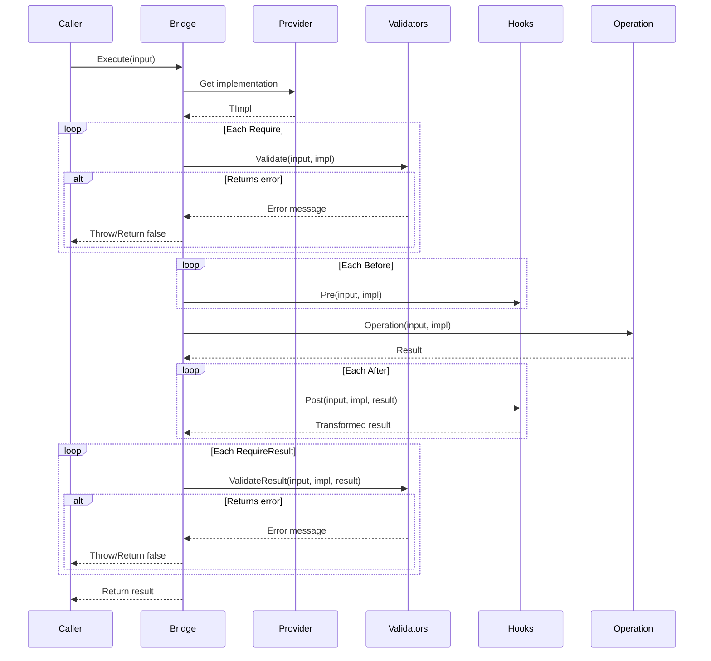

# Bridge Pattern API Reference

Complete API documentation for the Bridge pattern in PatternKit.

## Namespace

```csharp
using PatternKit.Structural.Bridge;
```

---

## Bridge\<TIn, TOut, TImpl\>

Decouples abstraction from implementation with hooks and validation.

```csharp
public sealed class Bridge<TIn, TOut, TImpl>
```

### Type Parameters

| Parameter | Description |
|-----------|-------------|
| `TIn` | Input type |
| `TOut` | Output type |
| `TImpl` | Implementation type |

### Delegates

```csharp
public delegate TImpl Provider();
public delegate TImpl ProviderFrom(in TIn input);
public delegate TOut Operation(in TIn input, TImpl impl);
public delegate void Pre(in TIn input, TImpl impl);
public delegate TOut Post(in TIn input, TImpl impl, TOut result);
public delegate string? Validate(in TIn input, TImpl impl);
public delegate string? ValidateResult(in TIn input, TImpl impl, in TOut result);
```

| Delegate | Description |
|----------|-------------|
| `Provider` | Obtains implementation without input |
| `ProviderFrom` | Obtains implementation based on input |
| `Operation` | Core work using the implementation |
| `Pre` | Before hook (preparation/logging) |
| `Post` | After hook (can transform result) |
| `Validate` | Pre-validation, returns error or null |
| `ValidateResult` | Post-validation on result |

### Static Methods

| Method | Returns | Description |
|--------|---------|-------------|
| `Create(Provider provider)` | `Builder` | Create with static provider |
| `Create(ProviderFrom providerFrom)` | `Builder` | Create with input-aware provider |

### Instance Methods

| Method | Returns | Description |
|--------|---------|-------------|
| `Execute(in TIn input)` | `TOut` | Execute, throws on validation failure |
| `TryExecute(in TIn input, out TOut output, out string? error)` | `bool` | Safe execution |

### Exceptions

| Method | Exception | Condition |
|--------|-----------|-----------|
| `Execute` | `InvalidOperationException` | Validation fails |
| `Build` | `InvalidOperationException` | Operation not configured |

---

## Bridge\<TIn, TOut, TImpl\>.Builder

Builder for configuring the bridge.

```csharp
public sealed class Builder
```

### Methods

| Method | Returns | Description |
|--------|---------|-------------|
| `Operation(Operation op)` | `Builder` | Set the core operation (required) |
| `Before(Pre hook)` | `Builder` | Add before hook |
| `After(Post hook)` | `Builder` | Add after hook |
| `Require(Validate v)` | `Builder` | Add pre-validation |
| `RequireResult(ValidateResult v)` | `Builder` | Add post-validation |
| `Build()` | `Bridge<TIn, TOut, TImpl>` | Build immutable bridge |

### Semantics

- **Operation required**: Must be set before Build()
- **Hooks ordered**: Before/After run in registration order
- **First failure wins**: Validators short-circuit on first error
- **Post can transform**: After hooks receive and return TOut

---

## Execution Flow



---

## Thread Safety

| Component | Thread-Safe |
|-----------|-------------|
| `Builder` | No - single-threaded configuration |
| `Bridge<TIn, TOut, TImpl>` | Yes - immutable after build |
| `Execute` | Yes - but TImpl must be thread-safe if shared |
| `TryExecute` | Yes - but TImpl must be thread-safe if shared |

### Implementation Notes

- Delegates compiled to arrays at Build() time
- `in` parameters avoid struct copies
- No LINQ or reflection in execution path
- TryExecute catches and returns exceptions as errors

---

## Complete Example

```csharp
using PatternKit.Structural.Bridge;

// Define types
public record DocumentRequest(string Content, string Format, string? Template = null);
public record Document(string Content, string MimeType, byte[] Data);

public interface IDocumentRenderer
{
    string Name { get; }
    bool CanRender(string format);
    byte[] Render(string content, string? template);
    string GetMimeType();
}

// Create bridge
public class DocumentBridge
{
    private readonly Bridge<DocumentRequest, Document, IDocumentRenderer> _bridge;

    public DocumentBridge(IRendererFactory factory)
    {
        _bridge = Bridge<DocumentRequest, Document, IDocumentRenderer>
            .Create((in DocumentRequest r) => factory.GetRenderer(r.Format))
            // Pre-validation
            .Require(static (in DocumentRequest r, IDocumentRenderer _) =>
                string.IsNullOrEmpty(r.Content) ? "Content required" : null)
            .Require(static (in DocumentRequest r, IDocumentRenderer renderer) =>
                !renderer.CanRender(r.Format) ? $"Cannot render {r.Format}" : null)
            // Before hooks
            .Before(static (in DocumentRequest r, IDocumentRenderer renderer) =>
                Console.WriteLine($"Rendering {r.Format} with {renderer.Name}"))
            // Core operation
            .Operation(static (in DocumentRequest r, IDocumentRenderer renderer) =>
                new Document(
                    Content: r.Content,
                    MimeType: renderer.GetMimeType(),
                    Data: renderer.Render(r.Content, r.Template)))
            // After hooks
            .After(static (in DocumentRequest r, IDocumentRenderer renderer, Document doc) =>
            {
                Console.WriteLine($"Rendered {doc.Data.Length} bytes");
                return doc;
            })
            // Post-validation
            .RequireResult(static (in DocumentRequest _, IDocumentRenderer __, in Document doc) =>
                doc.Data.Length > 10_000_000 ? "Document exceeds 10MB limit" : null)
            .Build();
    }

    public Document Render(DocumentRequest request) =>
        _bridge.Execute(request);

    public bool TryRender(DocumentRequest request, out Document? document, out string? error) =>
        _bridge.TryExecute(request, out document, out error);
}

// Usage
var bridge = new DocumentBridge(rendererFactory);

// Success case
var doc = bridge.Render(new DocumentRequest("<h1>Hello</h1>", "pdf"));

// With error handling
if (!bridge.TryRender(new DocumentRequest("", "pdf"), out var result, out var error))
{
    Console.WriteLine($"Failed: {error}");
}
```

---

## Comparison with Other Patterns

| Pattern | When to Use |
|---------|-------------|
| **Bridge** | Separate abstraction from implementation with hooks |
| **Adapter** | Convert one interface to another |
| **Strategy** | Select algorithm by predicate |
| **Factory** | Create instances by key |

## See Also

- [Overview](index.md)
- [Comprehensive Guide](guide.md)
- [Real-World Examples](real-world-examples.md)
