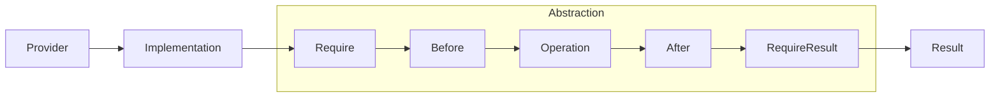

# Bridge Pattern Guide

Comprehensive guide to using the Bridge pattern in PatternKit.

## Overview

Bridge decouples an abstraction from its implementation so both can vary independently. This implementation provides a fluent way to compose the abstraction with hooks, validation, and implementation selection.



## Getting Started

### Installation

```csharp
using PatternKit.Structural.Bridge;
```

### Basic Usage

```csharp
public record RenderJob(string Content, string Format);
public interface IRenderer { string Render(string content); }

var bridge = Bridge<RenderJob, string, IRenderer>
    .Create(static (in RenderJob j) => GetRenderer(j.Format))
    .Operation(static (in RenderJob j, IRenderer r) => r.Render(j.Content))
    .Build();

var html = bridge.Execute(new RenderJob("<p>Hello</p>", "html"));
```

## Core Concepts

### Provider

The provider obtains the implementation for each execution:

**Static provider** - same implementation every time:
```csharp
.Create(static () => new DefaultRenderer())
```

**Input-aware provider** - select based on input:
```csharp
.Create(static (in RenderJob j) => j.Format switch
{
    "pdf" => new PdfRenderer(),
    "html" => new HtmlRenderer(),
    _ => new TextRenderer()
})
```

### Operation

The core work that uses the implementation:

```csharp
.Operation(static (in RenderJob j, IRenderer r) => r.Render(j.Content))
```

This is required - a bridge must have an operation.

### Before/After Hooks

Add cross-cutting concerns:

```csharp
.Before(static (in Job j, IRenderer r) => Metrics.Start($"render.{r.Name}"))
.Before(static (in Job j, IRenderer r) => Log.Info($"Rendering {j.Format}"))
.Operation(static (in Job j, IRenderer r) => r.Render(j.Content))
.After(static (in Job j, IRenderer r, string result) => Metrics.Stop())
.After(static (in Job j, IRenderer r, string result) => $"<!-- generated -->{result}")
```

- Before hooks run in registration order
- After hooks can transform the result
- After hooks also run in registration order

### Validation

Pre-validation (before operation):
```csharp
.Require(static (in Job j, IRenderer _) =>
    string.IsNullOrEmpty(j.Content) ? "Content required" : null)
.Require(static (in Job j, IRenderer r) =>
    !r.CanHandle(j.Format) ? "Unsupported format" : null)
```

Post-validation (after operation):
```csharp
.RequireResult(static (in Job _, IRenderer __, in string result) =>
    result.Length > 1_000_000 ? "Output too large" : null)
```

First failing validator stops execution.

## Common Patterns

### Multi-Tenant Rendering

```csharp
public class TenantRenderBridge
{
    private readonly Bridge<RenderRequest, byte[], IRenderer> _bridge;

    public TenantRenderBridge(ITenantService tenantService)
    {
        _bridge = Bridge<RenderRequest, byte[], IRenderer>
            .Create((in RenderRequest r) =>
            {
                var tenant = tenantService.GetTenant(r.TenantId);
                return tenant.RendererType switch
                {
                    "premium" => new PremiumRenderer(tenant.Config),
                    "enterprise" => new EnterpriseRenderer(tenant.Config),
                    _ => new StandardRenderer()
                };
            })
            .Require(static (in RenderRequest r, IRenderer _) =>
                string.IsNullOrEmpty(r.TenantId) ? "Tenant required" : null)
            .Before(static (in RenderRequest r, IRenderer renderer) =>
                Log.Info($"Rendering for tenant {r.TenantId} using {renderer.Name}"))
            .Operation(static (in RenderRequest r, IRenderer renderer) =>
                renderer.Render(r.Document))
            .After(static (in RenderRequest r, IRenderer _, byte[] result) =>
            {
                Metrics.RecordRender(r.TenantId, result.Length);
                return result;
            })
            .RequireResult(static (in RenderRequest _, IRenderer __, in byte[] result) =>
                result.Length > 100_000_000 ? "Output exceeds limit" : null)
            .Build();
    }

    public byte[] Render(RenderRequest request) => _bridge.Execute(request);
}
```

### Storage Abstraction

```csharp
public class StorageBridge
{
    private readonly Bridge<StoreRequest, StoreResult, IStorage> _bridge;

    public StorageBridge()
    {
        _bridge = Bridge<StoreRequest, StoreResult, IStorage>
            .Create(static (in StoreRequest r) => r.StorageType switch
            {
                StorageType.S3 => new S3Storage(),
                StorageType.Azure => new AzureBlobStorage(),
                StorageType.Local => new LocalStorage(),
                _ => throw new NotSupportedException()
            })
            .Require(static (in StoreRequest r, IStorage _) =>
                r.Data.Length == 0 ? "Empty data" : null)
            .Require(static (in StoreRequest r, IStorage s) =>
                r.Data.Length > s.MaxSize ? $"Exceeds {s.MaxSize} limit" : null)
            .Before(static (in StoreRequest r, IStorage s) =>
                Log.Debug($"Storing {r.Data.Length} bytes to {s.Name}"))
            .Operation(static (in StoreRequest r, IStorage s) =>
                s.Store(r.Path, r.Data, r.Metadata))
            .After(static (in StoreRequest _, IStorage __, StoreResult result) =>
            {
                Metrics.RecordUpload(result.Path, result.Size);
                return result;
            })
            .Build();
    }

    public StoreResult Store(StoreRequest request) => _bridge.Execute(request);

    public bool TryStore(StoreRequest request, out StoreResult result, out string? error)
        => _bridge.TryExecute(request, out result, out error);
}
```

### Payment Processing

```csharp
public class PaymentBridge
{
    private readonly Bridge<PaymentRequest, PaymentResult, IPaymentGateway> _bridge;

    public PaymentBridge(IPaymentGatewayFactory gatewayFactory)
    {
        _bridge = Bridge<PaymentRequest, PaymentResult, IPaymentGateway>
            .Create((in PaymentRequest r) => gatewayFactory.GetGateway(r.GatewayId))
            .Require(static (in PaymentRequest r, IPaymentGateway _) =>
                r.Amount <= 0 ? "Invalid amount" : null)
            .Require(static (in PaymentRequest r, IPaymentGateway g) =>
                !g.SupportsCurrency(r.Currency) ? "Unsupported currency" : null)
            .Before(static (in PaymentRequest r, IPaymentGateway g) =>
            {
                Log.Info($"Processing {r.Amount} {r.Currency} via {g.Name}");
                Metrics.StartPayment(g.Name);
            })
            .Operation(static (in PaymentRequest r, IPaymentGateway g) =>
                g.Process(r))
            .After(static (in PaymentRequest r, IPaymentGateway g, PaymentResult result) =>
            {
                Metrics.EndPayment(g.Name, result.Success);
                if (!result.Success)
                    Log.Warn($"Payment failed: {result.Error}");
                return result;
            })
            .Build();
    }

    public PaymentResult Process(PaymentRequest request) => _bridge.Execute(request);
}
```

### Report Generation

```csharp
var reportBridge = Bridge<ReportRequest, Report, IReportGenerator>
    .Create(static (in ReportRequest r) => r.Format switch
    {
        "excel" => new ExcelGenerator(),
        "pdf" => new PdfGenerator(),
        "csv" => new CsvGenerator(),
        _ => new HtmlGenerator()
    })
    .Require(static (in ReportRequest r, IReportGenerator _) =>
        r.Data.Rows.Count == 0 ? "No data to report" : null)
    .Before(static (in ReportRequest r, IReportGenerator g) =>
        Log.Info($"Generating {r.Format} report with {r.Data.Rows.Count} rows"))
    .Operation(static (in ReportRequest r, IReportGenerator g) =>
        g.Generate(r.Data, r.Options))
    .After(static (in ReportRequest r, IReportGenerator _, Report report) =>
    {
        report.GeneratedAt = DateTime.UtcNow;
        report.GeneratedBy = r.UserId;
        return report;
    })
    .RequireResult(static (in ReportRequest _, IReportGenerator __, in Report r) =>
        r.SizeBytes > 50_000_000 ? "Report exceeds 50MB limit" : null)
    .Build();
```

## Best Practices

### Use Static Lambdas

Avoid closures:

```csharp
// Good - static
.Operation(static (in Job j, IRenderer r) => r.Render(j.Content))

// Avoid - captures
var config = LoadConfig();
.Operation((in Job j, IRenderer r) => r.Render(j.Content, config))
```

### Keep Implementation Thread-Safe

If using a shared provider, ensure the implementation is thread-safe:

```csharp
// Thread-safe singleton
var sharedRenderer = new ThreadSafeRenderer();
.Create(static () => sharedRenderer)

// Or create per-call
.Create(static (in Job _) => new Renderer())
```

### Use TryExecute for Expected Failures

```csharp
if (!bridge.TryExecute(request, out var result, out var error))
{
    return new Response { Success = false, Error = error };
}
return new Response { Success = true, Data = result };
```

### Separate Concerns in Hooks

```csharp
// Logging in Before
.Before(static (in Job j, IRenderer r) =>
    Log.Info($"Starting render: {j.Id}"))

// Metrics in After
.After(static (in Job j, IRenderer r, string result) =>
{
    Metrics.RecordRender(j.Id, result.Length);
    return result;
})

// Validation in Require
.Require(static (in Job j, IRenderer _) =>
    j.IsValid ? null : "Invalid job")
```

## Thread Safety

| Component | Thread-Safe |
|-----------|-------------|
| `Builder` | No - single-threaded configuration |
| `Bridge<TIn, TOut, TImpl>` | Yes - immutable after build |
| `Execute` | Yes - but implementation must be thread-safe |
| `TryExecute` | Yes - but implementation must be thread-safe |

## Troubleshooting

### "Operation(...) must be configured"

You forgot to add the operation:

```csharp
// Missing operation
var bad = Bridge<Job, string, Renderer>
    .Create(static () => new Renderer())
    .Build(); // Throws

// Fixed
var good = Bridge<Job, string, Renderer>
    .Create(static () => new Renderer())
    .Operation(static (in Job j, Renderer r) => r.Render(j))
    .Build();
```

### TryExecute returns false unexpectedly

Check validators - a Require or RequireResult is failing:

```csharp
// Debug by checking individual validators
.Require(static (in Job j, Renderer r) =>
{
    var error = j.IsValid ? null : "Invalid job";
    Console.WriteLine($"Validation: {error ?? "passed"}");
    return error;
})
```

### Concurrency issues

If using a shared implementation, ensure it's thread-safe:

```csharp
// Problem - shared mutable state
var renderer = new StatefulRenderer();
.Create(static () => renderer) // Same instance, may have race conditions

// Solution 1 - thread-safe implementation
var renderer = new ThreadSafeRenderer();

// Solution 2 - create per call
.Create(static (in Job _) => new Renderer())
```

## See Also

- [Overview](index.md)
- [API Reference](api-reference.md)
- [Real-World Examples](real-world-examples.md)
