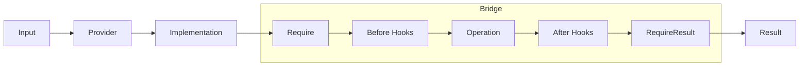

# Bridge Pattern

> **TL;DR**: Decouple abstraction from implementation so both can vary independently, with hooks and validation.

## Quick Example

```csharp
using PatternKit.Structural.Bridge;

public sealed record Job(string Data, string? Format = null);
public sealed class Renderer { public string Name; public Renderer(string name) => Name = name; }

var bridge = Bridge<Job, string, Renderer>
    .Create(static (in Job j) => new Renderer(j.Format ?? "default"))
    .Require(static (in Job j, Renderer _) => string.IsNullOrWhiteSpace(j.Data) ? "data required" : null)
    .Before(static (in Job _, Renderer r) => Console.WriteLine($"Using: {r.Name}"))
    .Operation(static (in Job j, Renderer r) => $"{r.Name}:{j.Data}")
    .After(static (in Job _, Renderer __, string s) => $"[{s}]")
    .Build();

var result = bridge.Execute(new Job("hello", Format: "pdf")); // "[pdf:hello]"
```

## What It Is

Bridge decouples an abstraction (what you want to do) from its implementation (how it's done) so both can vary independently. PatternKit's implementation adds pre/post hooks, validation, and a fluent API.

Key characteristics:

- **Provider-based**: Obtain implementation per-call or share a singleton
- **Before/After hooks**: Cross-cutting concerns around the operation
- **Pre/Post validation**: Guard rails with early failure
- **Immutable**: Thread-safe after Build()
- **Zero reflection**: Delegate-based, AOT-friendly

## When to Use

- **Multiple implementations**: Select renderer, storage, or transport by input
- **Policy separation**: Separate "what" from "how"
- **Cross-cutting hooks**: Add logging, metrics around operations
- **Input-driven selection**: Choose implementation based on request data

## When to Avoid

- **Single implementation**: A plain function suffices
- **Key-based routing**: Use Factory for registry patterns
- **First-match branching**: Use Strategy for predicate-based selection
- **No pre/post needs**: Direct delegation is simpler

## Diagram



## Execution Flow

1. **Provider** → obtain implementation
2. **Require** → pre-validation (fail fast)
3. **Before hooks** → prepare/log
4. **Operation** → core work using implementation
5. **After hooks** → transform result
6. **RequireResult** → post-validation
7. **Return** final result

## Bridge Variants

### Input-Aware Provider

```csharp
var bridge = Bridge<Job, byte[], IRenderer>
    .Create(static (in Job j) => j.Format switch
    {
        "pdf" => new PdfRenderer(),
        "html" => new HtmlRenderer(),
        _ => new TextRenderer()
    })
    .Operation(static (in Job j, IRenderer r) => r.Render(j.Data))
    .Build();
```

### Shared Implementation

```csharp
var sharedRenderer = new Renderer("shared");
var bridge = Bridge<Job, string, Renderer>
    .Create(static () => sharedRenderer)
    .Operation(static (in Job j, Renderer r) => r.Render(j.Data))
    .Build();
```

### Safe Execution

```csharp
if (!bridge.TryExecute(new Job(""), out var result, out var error))
{
    // Handle validation failure without exception
    Console.WriteLine($"Failed: {error}");
}
```

## See Also

- [Comprehensive Guide](guide.md) - Detailed usage and patterns
- [API Reference](api-reference.md) - Complete API documentation
- [Real-World Examples](real-world-examples.md) - Production-ready examples
- [Adapter Pattern](../adapter/index.md) - For interface conversion
- [Strategy Pattern](../../behavioral/strategy/index.md) - For algorithm selection
