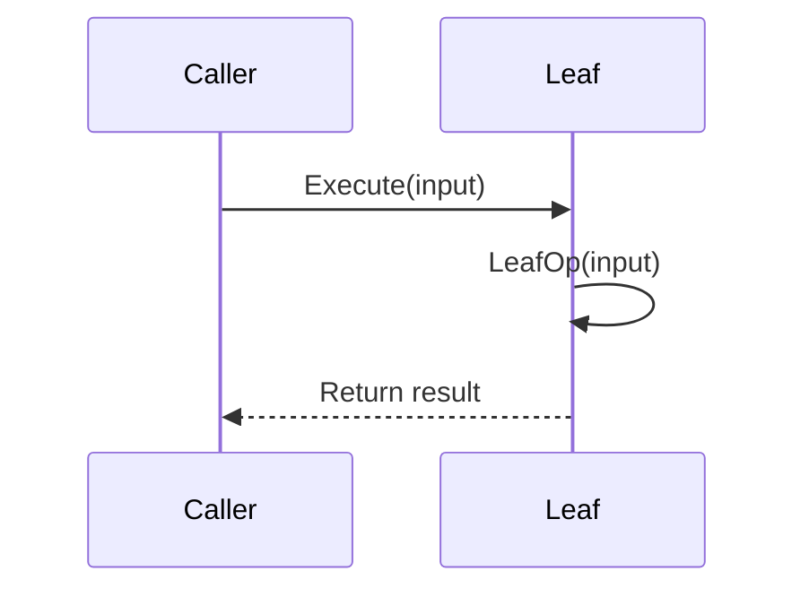
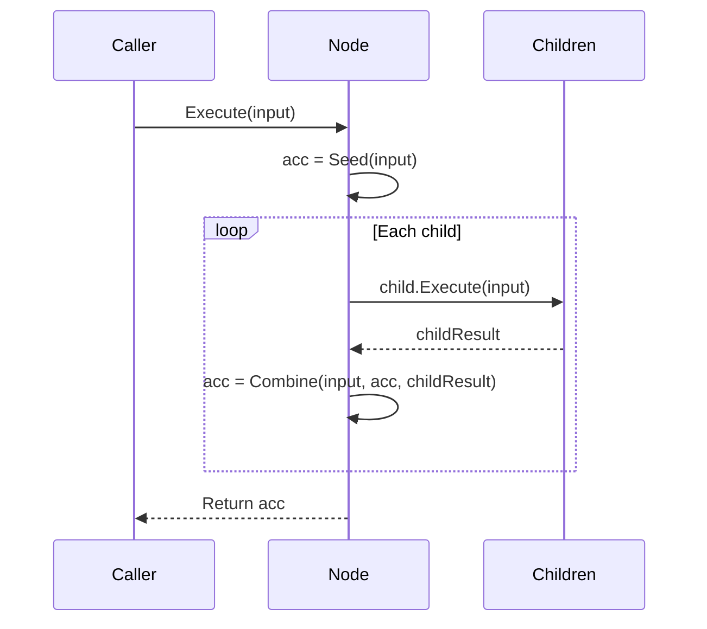

# Composite Pattern API Reference

Complete API documentation for the Composite pattern in PatternKit.

## Namespace

```csharp
using PatternKit.Structural.Composite;
```

---

## Composite\<TIn, TOut\>

Tree structure where leaves compute directly and nodes fold child results.

```csharp
public sealed class Composite<TIn, TOut>
```

### Type Parameters

| Parameter | Description |
|-----------|-------------|
| `TIn` | Input type for execution |
| `TOut` | Output type (uniform for leaves and nodes) |

### Delegates

```csharp
public delegate TOut LeafOp(in TIn input);
public delegate TOut Seed(in TIn input);
public delegate TOut Combine(in TIn input, TOut acc, TOut childResult);
```

| Delegate | Description |
|----------|-------------|
| `LeafOp` | Leaf computation from input |
| `Seed` | Initial accumulator for node |
| `Combine` | Fold function for child results |

### Static Methods

| Method | Returns | Description |
|--------|---------|-------------|
| `Leaf(LeafOp op)` | `Builder` | Create leaf builder |
| `Node(Seed seed, Combine combine)` | `Builder` | Create node builder |

### Instance Methods

| Method | Returns | Description |
|--------|---------|-------------|
| `Execute(in TIn input)` | `TOut` | Execute the composite tree |

### Example

```csharp
var composite = Composite<int, int>
    .Node(static (in int _) => 0, static (in int _, int a, int r) => a + r)
    .AddChildren(
        Composite<int, int>.Leaf(static (in int x) => x),
        Composite<int, int>.Leaf(static (in int _) => 10))
    .Build();

var result = composite.Execute(5); // 5 + 10 = 15
```

---

## Composite\<TIn, TOut\>.Builder

Builder for configuring leaves and nodes.

```csharp
public sealed class Builder
```

### Methods

| Method | Returns | Description |
|--------|---------|-------------|
| `AddChild(Builder child)` | `Builder` | Add child (no-op on leaves) |
| `AddChildren(params Builder[] children)` | `Builder` | Add multiple children |
| `Build()` | `Composite<TIn, TOut>` | Build immutable composite |

### Semantics

- **Leaf vs Node**: Determined at creation (`Leaf(...)` vs `Node(...)`)
- **Child order preserved**: Children execute and combine in registration order
- **Leaves ignore children**: AddChild/AddChildren are no-ops on leaves
- **Empty node**: Returns `Seed(input)` with no children

---

## Execution Flow

### Leaf Execution



### Node Execution



---

## Thread Safety

| Component | Thread-Safe |
|-----------|-------------|
| `Builder` | No - single-threaded configuration |
| `Composite<TIn, TOut>` | Yes - immutable after build |
| `Execute` | Yes - no shared mutable state |

### Implementation Notes

- Children stored as arrays at Build() time
- Execution is tight loop, no LINQ or reflection
- `in TIn` parameters avoid struct copies
- Static lambdas recommended to avoid closures

---

## Complete Example

```csharp
using PatternKit.Structural.Composite;

// Define a pricing structure
public class PriceCalculator
{
    private readonly Composite<OrderContext, decimal> _calculator;

    public PriceCalculator()
    {
        _calculator = Composite<OrderContext, decimal>
            .Node(
                static (in OrderContext _) => 0m,
                static (in OrderContext _, decimal acc, decimal amount) => acc + amount)
            .AddChildren(
                // Base price
                Composite<OrderContext, decimal>.Leaf(
                    static (in OrderContext c) => c.Items.Sum(i => i.Price * i.Quantity)),
                // Tax
                Composite<OrderContext, decimal>
                    .Node(
                        static (in OrderContext _) => 0m,
                        static (in OrderContext _, decimal acc, decimal tax) => acc + tax)
                    .AddChildren(
                        // State tax
                        Composite<OrderContext, decimal>.Leaf(
                            static (in OrderContext c) =>
                                c.Items.Sum(i => i.Price * i.Quantity) * c.StateTaxRate),
                        // Local tax
                        Composite<OrderContext, decimal>.Leaf(
                            static (in OrderContext c) =>
                                c.Items.Sum(i => i.Price * i.Quantity) * c.LocalTaxRate)),
                // Shipping
                Composite<OrderContext, decimal>.Leaf(
                    static (in OrderContext c) => c.ShippingMethod switch
                    {
                        "express" => 15.99m,
                        "standard" => 5.99m,
                        "free" => 0m,
                        _ => 9.99m
                    }),
                // Discounts (negative)
                Composite<OrderContext, decimal>
                    .Node(
                        static (in OrderContext _) => 0m,
                        static (in OrderContext _, decimal acc, decimal discount) => acc + discount)
                    .AddChildren(
                        // Coupon discount
                        Composite<OrderContext, decimal>.Leaf(
                            static (in OrderContext c) =>
                                c.CouponDiscount.HasValue ? -c.CouponDiscount.Value : 0m),
                        // Member discount
                        Composite<OrderContext, decimal>.Leaf(
                            static (in OrderContext c) =>
                                c.IsMember ? -(c.Items.Sum(i => i.Price * i.Quantity) * 0.05m) : 0m)))
            .Build();
    }

    public decimal Calculate(OrderContext context) =>
        _calculator.Execute(context);
}

public record OrderContext(
    List<OrderItem> Items,
    string ShippingMethod,
    decimal StateTaxRate,
    decimal LocalTaxRate,
    bool IsMember,
    decimal? CouponDiscount);

public record OrderItem(string Sku, decimal Price, int Quantity);

// Usage
var context = new OrderContext(
    Items: new List<OrderItem>
    {
        new("SKU001", 29.99m, 2),
        new("SKU002", 49.99m, 1)
    },
    ShippingMethod: "standard",
    StateTaxRate: 0.06m,
    LocalTaxRate: 0.02m,
    IsMember: true,
    CouponDiscount: 10m);

var calculator = new PriceCalculator();
var total = calculator.Calculate(context);
// Base: 109.97 + State tax: 6.60 + Local tax: 2.20 + Shipping: 5.99 - Coupon: 10 - Member: 5.50 = 109.26
```

---

## Comparison with Other Patterns

| Pattern | When to Use |
|---------|-------------|
| **Composite** | Part-whole hierarchies with uniform operations |
| **Chain** | Sequential processing with stop/continue |
| **Strategy** | First-match branching among operations |
| **Visitor** | Operations across different node types |

## See Also

- [Overview](index.md)
- [Comprehensive Guide](guide.md)
- [Real-World Examples](real-world-examples.md)
