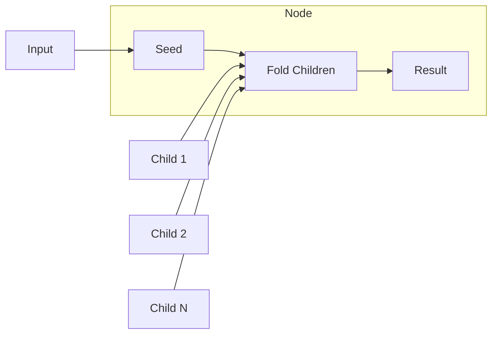

# Composite Pattern Guide

Comprehensive guide to using the Composite pattern in PatternKit.

## Overview

Composite composes objects into tree structures and lets you treat individual objects and compositions uniformly. Leaves compute directly; composites fold their children's results.



## Getting Started

### Installation

```csharp
using PatternKit.Structural.Composite;
```

### Basic Usage

```csharp
// Define leaves
var addFive = Composite<int, int>.Leaf(static (in int x) => x + 5);
var double = Composite<int, int>.Leaf(static (in int x) => x * 2);

// Compose into a node
var combined = Composite<int, int>
    .Node(
        static (in int _) => 0,                           // Seed
        static (in int _, int acc, int result) => acc + result)  // Combine
    .AddChildren(addFive, double)
    .Build();

combined.Execute(10); // (10+5) + (10*2) = 15 + 20 = 35
```

## Core Concepts

### Leaves

Leaves are terminal nodes that compute a value directly:

```csharp
var leaf = Composite<int, string>.Leaf(static (in int x) => $"Value: {x}");
var result = leaf.Execute(42); // "Value: 42"
```

### Nodes

Nodes contain children and fold their results:

```csharp
var node = Composite<int, int>
    .Node(
        static (in int input) => 0,  // Seed from input
        static (in int input, int acc, int childResult) => acc + childResult)  // Combine
    .AddChildren(child1, child2, child3)
    .Build();
```

Execution:
1. `acc = Seed(input)` → initial accumulator
2. For each child: `acc = Combine(input, acc, child.Execute(input))`
3. Return final `acc`

### Seed Function

The seed initializes the accumulator:

```csharp
// Constant seed
.Node(static (in int _) => 0, ...)  // Start at 0

// Input-dependent seed
.Node(static (in int x) => x, ...)  // Start at input value

// Complex seed
.Node(static (in Config c) => new Result { Timestamp = c.StartTime }, ...)
```

### Combine Function

The combine function folds each child result:

```csharp
// Sum
static (in int _, int acc, int r) => acc + r

// Max
static (in int _, int acc, int r) => Math.Max(acc, r)

// String concatenation
static (in string _, string acc, string r) => acc + r

// List accumulation
static (in Query _, List<Item> acc, List<Item> r) => { acc.AddRange(r); return acc; }
```

## Common Patterns

### File System Size Calculator

```csharp
public interface IFileSystemEntry
{
    Composite<Unit, long> ToComposite();
}

public class File : IFileSystemEntry
{
    public string Name { get; }
    public long Size { get; }

    public Composite<Unit, long> ToComposite() =>
        Composite<Unit, long>.Leaf((in Unit _) => Size).Build();
}

public class Directory : IFileSystemEntry
{
    public string Name { get; }
    public List<IFileSystemEntry> Children { get; } = new();

    public Composite<Unit, long> ToComposite()
    {
        var builder = Composite<Unit, long>
            .Node(
                static (in Unit _) => 0L,
                static (in Unit _, long acc, long size) => acc + size);

        foreach (var child in Children)
        {
            builder.AddChild(child.ToComposite().ToBuilder());
        }

        return builder.Build();
    }
}

// Usage
var root = new Directory("root")
{
    Children = {
        new File("a.txt") { Size = 100 },
        new Directory("sub") {
            Children = {
                new File("b.txt") { Size = 200 },
                new File("c.txt") { Size = 300 }
            }
        }
    }
};

var sizeCalculator = root.ToComposite();
var totalSize = sizeCalculator.Execute(default); // 600
```

### Expression Evaluator

```csharp
public abstract class Expression
{
    public abstract Composite<Dictionary<string, int>, int>.Builder ToComposite();
}

public class Constant : Expression
{
    public int Value { get; }
    public Constant(int value) => Value = value;

    public override Composite<Dictionary<string, int>, int>.Builder ToComposite() =>
        Composite<Dictionary<string, int>, int>.Leaf((in Dictionary<string, int> _) => Value);
}

public class Variable : Expression
{
    public string Name { get; }
    public Variable(string name) => Name = name;

    public override Composite<Dictionary<string, int>, int>.Builder ToComposite() =>
        Composite<Dictionary<string, int>, int>.Leaf(
            (in Dictionary<string, int> vars) => vars.TryGetValue(Name, out var v) ? v : 0);
}

public class Add : Expression
{
    public Expression Left { get; }
    public Expression Right { get; }

    public override Composite<Dictionary<string, int>, int>.Builder ToComposite() =>
        Composite<Dictionary<string, int>, int>
            .Node(
                static (in Dictionary<string, int> _) => 0,
                static (in Dictionary<string, int> _, int acc, int r) => acc + r)
            .AddChildren(Left.ToComposite(), Right.ToComposite());
}

public class Multiply : Expression
{
    public Expression Left { get; }
    public Expression Right { get; }

    public override Composite<Dictionary<string, int>, int>.Builder ToComposite() =>
        Composite<Dictionary<string, int>, int>
            .Node(
                static (in Dictionary<string, int> _) => 1,
                static (in Dictionary<string, int> _, int acc, int r) => acc * r)
            .AddChildren(Left.ToComposite(), Right.ToComposite());
}

// Usage: (x + 5) * 2
var expr = new Multiply
{
    Left = new Add { Left = new Variable("x"), Right = new Constant(5) },
    Right = new Constant(2)
};

var evaluator = expr.ToComposite().Build();
var result = evaluator.Execute(new Dictionary<string, int> { ["x"] = 10 }); // 30
```

### Menu Rendering

```csharp
public class MenuItem
{
    public string Label { get; }
    public List<MenuItem> Children { get; } = new();
    public bool IsSubmenu => Children.Count > 0;

    public Composite<int, string>.Builder ToRenderComposite()
    {
        if (!IsSubmenu)
        {
            return Composite<int, string>.Leaf(
                (in int indent) => new string(' ', indent * 2) + "- " + Label);
        }

        return Composite<int, string>
            .Node(
                (in int indent) => new string(' ', indent * 2) + "+ " + Label + "\n",
                static (in int _, string acc, string r) => acc + r + "\n")
            .AddChildren(Children
                .Select(c => c.ToRenderComposite())
                .ToArray());
    }
}

// Build menu
var menu = new MenuItem("File")
{
    Children = {
        new MenuItem("New"),
        new MenuItem("Open"),
        new MenuItem("Recent") {
            Children = {
                new MenuItem("Document1.txt"),
                new MenuItem("Document2.txt")
            }
        },
        new MenuItem("Exit")
    }
};

var renderer = menu.ToRenderComposite().Build();
Console.WriteLine(renderer.Execute(0));
```

### Price Calculator with Discounts

```csharp
public record CartContext(decimal Subtotal, bool IsMember, string? CouponCode);

var discountCalculator = Composite<CartContext, decimal>
    .Node(
        static (in CartContext _) => 0m,
        static (in CartContext _, decimal acc, decimal discount) => acc + discount)
    .AddChildren(
        // Member discount
        Composite<CartContext, decimal>.Leaf(
            static (in CartContext c) => c.IsMember ? c.Subtotal * 0.1m : 0m),
        // Bulk discount
        Composite<CartContext, decimal>.Leaf(
            static (in CartContext c) => c.Subtotal > 100 ? c.Subtotal * 0.05m : 0m),
        // Coupon discount
        Composite<CartContext, decimal>.Leaf(
            static (in CartContext c) => c.CouponCode == "SAVE20" ? c.Subtotal * 0.2m : 0m))
    .Build();

var context = new CartContext(150m, IsMember: true, CouponCode: "SAVE20");
var totalDiscount = discountCalculator.Execute(context);
// Member: 15 + Bulk: 7.5 + Coupon: 30 = 52.5
```

## Best Practices

### Use Static Lambdas

```csharp
// Good
.Leaf(static (in int x) => x * 2)
.Node(static (in int _) => 0, static (in int _, int a, int r) => a + r)

// Avoid
var multiplier = 2;
.Leaf((in int x) => x * multiplier)  // Captures variable
```

### Choose Appropriate Seed

```csharp
// For sum: start at 0
.Node(static (in int _) => 0, ...)

// For product: start at 1
.Node(static (in int _) => 1, ...)

// For min: start at max value
.Node(static (in int _) => int.MaxValue, ...)

// For string: start empty or with prefix
.Node(static (in string _) => "", ...)
```

### Handle Empty Composites

Empty composites return `Seed(input)`:

```csharp
var empty = Composite<int, int>
    .Node(static (in int x) => x, static (in int _, int a, int r) => a + r)
    .Build();  // No children

empty.Execute(5); // Returns 5 (the seed)
```

### Keep Trees Shallow

Deep recursion can cause stack issues:

```csharp
// Prefer wider trees over deeper ones
var wide = Composite<int, int>
    .Node(...)
    .AddChildren(child1, child2, child3, child4, child5)  // Wide
    .Build();

// Be cautious with very deep nesting
var deep = child1  // child1 contains child2 contains child3...
```

## Thread Safety

| Component | Thread-Safe |
|-----------|-------------|
| `Builder` | No - single-threaded configuration |
| `Composite<TIn, TOut>` | Yes - immutable after build |
| `Execute` | Yes - no shared mutable state |

## Troubleshooting

### Wrong accumulation result

Check your seed and combine functions:

```csharp
// Debug by printing intermediate values
.Node(
    static (in int x) => { Console.WriteLine($"Seed: 0"); return 0; },
    static (in int _, int acc, int r) => {
        Console.WriteLine($"Combine: {acc} + {r} = {acc + r}");
        return acc + r;
    })
```

### AddChild has no effect on leaves

Leaves ignore children by design:

```csharp
var leaf = Composite<int, int>.Leaf(static (in int x) => x);
leaf.AddChild(anotherLeaf);  // Ignored! Leaf stays a leaf
```

### Exceptions in leaf or combine

Exceptions bubble up from your delegates. Wrap if needed:

```csharp
.Leaf((in int x) => {
    try { return RiskyOperation(x); }
    catch { return DefaultValue; }
})
```

## See Also

- [Overview](index.md)
- [API Reference](api-reference.md)
- [Real-World Examples](real-world-examples.md)
