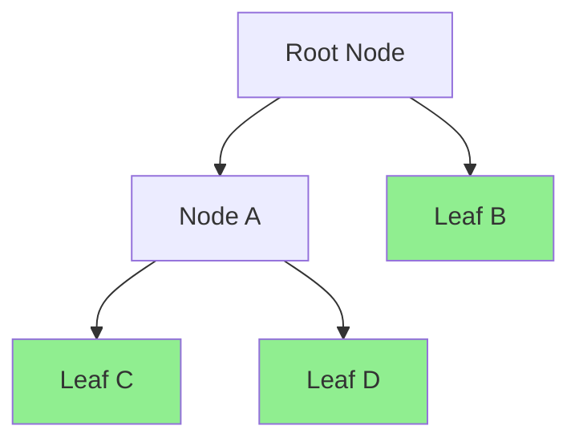

# Composite Pattern

> **TL;DR**: Treat individual objects and compositions of objects uniformly through tree structures.

## Quick Example

```csharp
using PatternKit.Structural.Composite;

// Sum of two leaves
var calc = Composite<int, int>
    .Node(static (in int _) => 0, static (in int _, int acc, int r) => acc + r)
    .AddChildren(
        Composite<int, int>.Leaf(static (in int x) => x),
        Composite<int, int>.Leaf(static (in int _) => 2))
    .Build();

calc.Execute(5); // 7
```

## What It Is

Composite lets you compose objects into tree structures to represent part-whole hierarchies. You can treat individual objects (leaves) and compositions (nodes) uniformly through the same interface.

Key characteristics:

- **Uniform interface**: Leaves and nodes expose the same `Execute` method
- **Tree structure**: Nodes contain children, leaves are terminal
- **Fold semantics**: Nodes combine child results using seed + combine
- **Immutable**: Thread-safe after Build()
- **Zero reflection**: Delegate-based, AOT-friendly

## When to Use

- **Part-whole hierarchies**: File systems, org charts, UI components
- **Recursive structures**: Expression trees, document outlines
- **Uniform operations**: Calculate totals, render recursively
- **Aggregation**: Combine results from multiple sources

## When to Avoid

- **No hierarchy needed**: Single function suffices
- **Dynamic branching**: Use Strategy for predicate-based selection
- **Side effects with stop/continue**: Use Chain patterns
- **Heterogeneous results**: Composite requires uniform TOut

## Diagram



## Execution Model

### Leaf Execution

```csharp
// Leaf simply returns its operation result
var leaf = Composite<int, string>.Leaf(static (in int x) => $"value: {x}");
leaf.Execute(5); // "value: 5"
```

### Node Execution

```csharp
// Node: acc = Seed(input), then fold children
var node = Composite<int, int>
    .Node(
        static (in int _) => 0,           // Seed
        static (in int _, int acc, int r) => acc + r)  // Combine
    .AddChildren(leaf1, leaf2, leaf3)
    .Build();

// Execute: 0 + child1.Execute() + child2.Execute() + child3.Execute()
```

## Composite Variants

### Numeric Aggregation

```csharp
var sum = Composite<int, int>
    .Node(static (in int _) => 0, static (in int _, int a, int r) => a + r)
    .AddChildren(...)
    .Build();

var max = Composite<int, int>
    .Node(static (in int x) => x, static (in int _, int a, int r) => Math.Max(a, r))
    .AddChildren(...)
    .Build();
```

### String Concatenation

```csharp
var join = Composite<string, string>
    .Node(
        static (in string _) => "<",
        static (in string _, string a, string r) => a + r)
    .AddChildren(
        Composite<string, string>.Leaf(static (in string s) => s.ToUpper()),
        Composite<string, string>.Leaf(static (in string _) => ">"))
    .Build();

join.Execute("hello"); // "<HELLO>"
```

### Nested Composites

```csharp
var nested = Composite<int, string>
    .Node(static (in int _) => "<", static (in int _, string a, string r) => a + r)
    .AddChildren(
        Composite<int, string>
            .Node(static (in int _) => "L:", static (in int _, string a, string r) => a + r)
            .AddChildren(
                Composite<int, string>.Leaf(static (in int _) => "a"),
                Composite<int, string>.Leaf(static (in int _) => "b")),
        Composite<int, string>.Leaf(static (in int _) => "|c"))
    .Build();

nested.Execute(0); // "<L:ab|c"
```

## See Also

- [Comprehensive Guide](guide.md) - Detailed usage and patterns
- [API Reference](api-reference.md) - Complete API documentation
- [Real-World Examples](real-world-examples.md) - Production-ready examples
- [Chain Pattern](../../behavioral/chain/index.md) - For sequential processing with stop/continue
- [Strategy Pattern](../../behavioral/strategy/index.md) - For predicate-based selection
