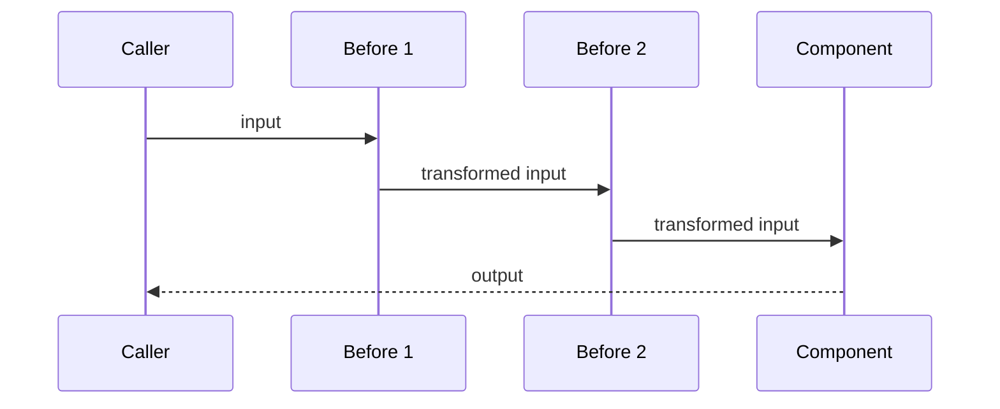
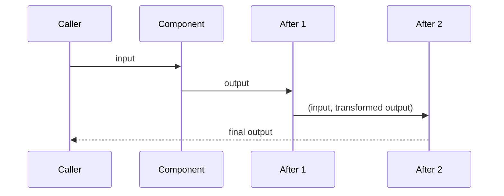
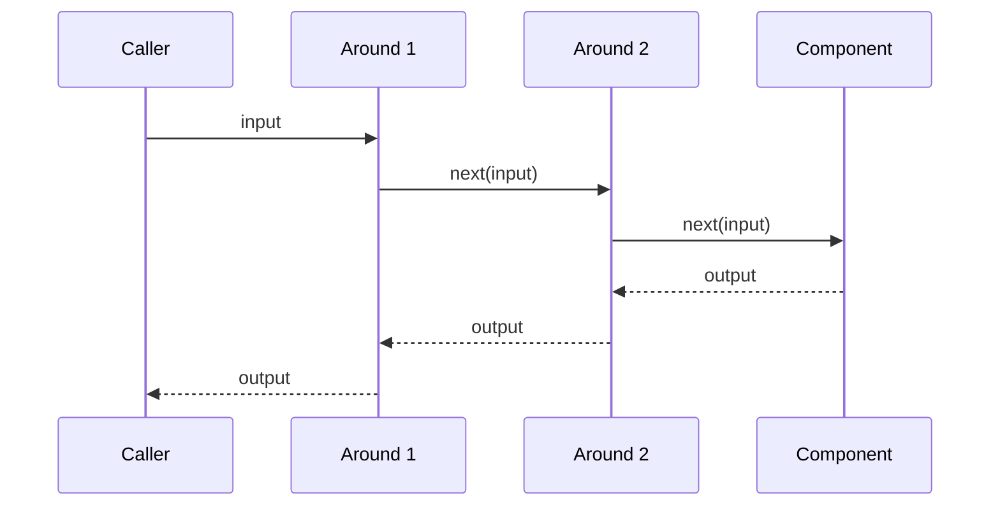
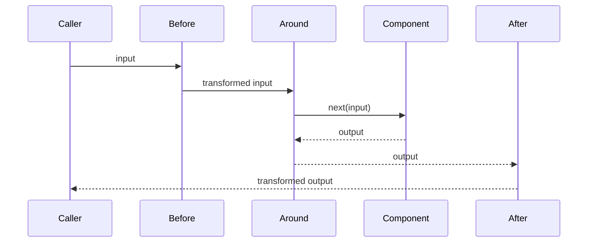

# Decorator Pattern API Reference

Complete API documentation for the Decorator pattern in PatternKit.

## Namespace

```csharp
using PatternKit.Structural.Decorator;
```

---

## Decorator\<TIn, TOut\>

Fluent wrapper for components with layered Before, After, and Around decorators.

```csharp
public sealed class Decorator<TIn, TOut>
```

### Type Parameters

| Parameter | Description |
|-----------|-------------|
| `TIn` | Input type |
| `TOut` | Output type |

### Delegates

```csharp
public delegate TOut Component(TIn input);
public delegate TIn BeforeTransform(TIn input);
public delegate TOut AfterTransform(TIn input, TOut output);
public delegate TOut AroundTransform(TIn input, Component next);
```

| Delegate | Description |
|----------|-------------|
| `Component` | The base operation being decorated |
| `BeforeTransform` | Input transformation |
| `AfterTransform` | Output transformation (receives input and output) |
| `AroundTransform` | Full wrapper with control over next invocation |

### Static Methods

| Method | Returns | Description |
|--------|---------|-------------|
| `Create(Component component)` | `Builder` | Create builder with base component |

### Instance Methods

| Method | Returns | Description |
|--------|---------|-------------|
| `Execute(in TIn input)` | `TOut` | Execute decorated component |

### Example

```csharp
var decorator = Decorator<int, int>
    .Create(static x => x * 2)
    .Before(static x => Math.Abs(x))
    .After(static (input, result) => result + input)
    .Around((x, next) => {
        Console.WriteLine($"Input: {x}");
        return next(x);
    })
    .Build();

var result = decorator.Execute(-5); // 15
```

---

## Decorator\<TIn, TOut\>.Builder

Builder for configuring decorators.

```csharp
public sealed class Builder
```

### Methods

| Method | Returns | Description |
|--------|---------|-------------|
| `Before(BeforeTransform transform)` | `Builder` | Add input transformation |
| `After(AfterTransform transform)` | `Builder` | Add output transformation |
| `Around(AroundTransform transform)` | `Builder` | Add full wrapper |
| `Build()` | `Decorator<TIn, TOut>` | Build immutable decorator |

### Semantics

- **Before**: Transforms input before component; chains in registration order
- **After**: Transforms output after component; receives both input and output
- **Around**: Full control over execution; must call `next` to proceed
- **Order**: Before → Around → Component → After (for each layer)

---

## Execution Flow

### Before Decorators



### After Decorators



### Around Decorators



### Combined Flow



---

## Thread Safety

| Component | Thread-Safe |
|-----------|-------------|
| `Builder` | No - single-threaded configuration |
| `Decorator<TIn, TOut>` | Yes - immutable after build |
| `Execute` | Yes - but decorator logic may not be |

### Implementation Notes

- Decorators stored as arrays at Build() time
- No reflection in execution path
- Static lambdas recommended to avoid closures
- Thread-safety of captured state is caller's responsibility

---

## Complete Example

```csharp
using PatternKit.Structural.Decorator;

// Define a service operation
public class UserService
{
    private readonly Decorator<GetUserRequest, User?> _getUser;
    private readonly IUserRepository _repository;
    private readonly ICache _cache;
    private readonly ILogger _logger;

    public UserService(
        IUserRepository repository,
        ICache cache,
        ILogger<UserService> logger)
    {
        _repository = repository;
        _cache = cache;
        _logger = logger;

        _getUser = Decorator<GetUserRequest, User?>
            .Create(request => _repository.GetById(request.UserId))
            // Validate input
            .Before(request =>
            {
                if (request.UserId <= 0)
                    throw new ArgumentException("Invalid user ID");
                return request;
            })
            // Add caching
            .Around((request, next) =>
            {
                var cacheKey = $"user:{request.UserId}";
                if (_cache.TryGet<User>(cacheKey, out var cached))
                    return cached;

                var user = next(request);
                if (user != null)
                    _cache.Set(cacheKey, user, TimeSpan.FromMinutes(5));

                return user;
            })
            // Add logging
            .Around((request, next) =>
            {
                _logger.LogDebug("Getting user {UserId}", request.UserId);
                var user = next(request);
                _logger.LogDebug("Got user {UserId}: {Found}",
                    request.UserId, user != null);
                return user;
            })
            // Add metrics
            .Around((request, next) =>
            {
                var sw = Stopwatch.StartNew();
                try
                {
                    var user = next(request);
                    Metrics.RecordSuccess("get_user", sw.ElapsedMilliseconds);
                    return user;
                }
                catch (Exception ex)
                {
                    Metrics.RecordFailure("get_user", sw.ElapsedMilliseconds);
                    throw;
                }
            })
            // Transform null to exception if required
            .After((request, user) =>
            {
                if (user == null && request.Required)
                    throw new UserNotFoundException(request.UserId);
                return user;
            })
            .Build();
    }

    public User? GetUser(int userId, bool required = false) =>
        _getUser.Execute(new GetUserRequest(userId, required));
}

public record GetUserRequest(int UserId, bool Required = false);

// Usage
var user = userService.GetUser(123);
var requiredUser = userService.GetUser(456, required: true); // Throws if not found
```

---

## Comparison with Other Patterns

| Pattern | When to Use |
|---------|-------------|
| **Decorator** | Add behavior without modifying component |
| **Proxy** | Control access to component |
| **Chain** | Sequential processing with stop/continue |
| **Bridge** | Separate abstraction from implementation |

## See Also

- [Overview](index.md)
- [Comprehensive Guide](guide.md)
- [Real-World Examples](real-world-examples.md)
