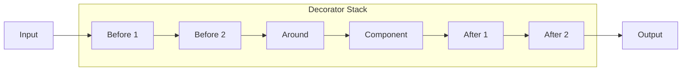

# Decorator Pattern Guide

Comprehensive guide to using the Decorator pattern in PatternKit.

## Overview

Decorator dynamically attaches additional responsibilities to an object. PatternKit's implementation provides a fluent, allocation-light way to wrap any component with ordered decorators that transform input, output, or wrap entire execution.



## Getting Started

### Installation

```csharp
using PatternKit.Structural.Decorator;
```

### Basic Usage

```csharp
// Create a decorated component
var doubled = Decorator<int, int>
    .Create(static x => x * 2)
    .Before(static x => Math.Abs(x))  // Ensure positive
    .After(static (input, result) => result + 1)  // Add 1 to result
    .Build();

var result = doubled.Execute(-5); // |-5| = 5, *2 = 10, +1 = 11
```

## Core Concepts

### The Component

The base operation being decorated:

```csharp
// Simple function
.Create(static x => x * 2)

// Method reference
.Create(myService.ProcessItem)

// Complex operation
.Create(request =>
{
    var data = repository.GetData(request.Id);
    return transformer.Transform(data);
})
```

### Before Decorators

Transform input before it reaches the component:

```csharp
.Before(static x => x.Trim())                    // Normalize string
.Before(static x => x < 0 ? 0 : x)               // Clamp negative
.Before(static x => x ?? throw new ArgumentNullException())  // Validate
```

Multiple Before decorators chain in registration order:

```csharp
.Before(static x => x + 10)  // First: 5 → 15
.Before(static x => x * 2)   // Second: 15 → 30
// Then component receives 30
```

### After Decorators

Transform output after the component executes:

```csharp
.After(static (input, result) => result * 2)     // Double result
.After(static (input, result) => $"[{result}]")  // Wrap result
.After(static (input, result) => new Response { Data = result, Input = input })
```

After receives both input and output, enabling input-dependent transformations.

### Around Decorators

Full control over execution:

```csharp
.Around((input, next) =>
{
    // Before calling component
    Console.WriteLine($"Calling with {input}");

    // Invoke next layer (or component)
    var result = next(input);

    // After component returns
    Console.WriteLine($"Returned {result}");

    return result;
})
```

Around can:
- Skip calling `next()` entirely (short-circuit)
- Modify input before calling `next()`
- Modify result before returning
- Add error handling, retry logic, etc.

## Common Patterns

### Caching Decorator

```csharp
public Decorator<TKey, TValue> WithCaching<TKey, TValue>(
    Func<TKey, TValue> component,
    IDictionary<TKey, TValue> cache)
{
    return Decorator<TKey, TValue>
        .Create(component)
        .Around((key, next) =>
        {
            if (cache.TryGetValue(key, out var cached))
                return cached;

            var result = next(key);
            cache[key] = result;
            return result;
        })
        .Build();
}

// Usage
var cache = new ConcurrentDictionary<int, int>();
var cachedFib = WithCaching(Fibonacci, cache);
var result = cachedFib.Execute(40); // Cached after first call
```

### Logging Decorator

```csharp
public Decorator<TIn, TOut> WithLogging<TIn, TOut>(
    Func<TIn, TOut> component,
    ILogger logger)
{
    return Decorator<TIn, TOut>
        .Create(component)
        .Around((input, next) =>
        {
            var correlationId = Guid.NewGuid();
            logger.LogInformation("[{CorrelationId}] Executing with input: {Input}",
                correlationId, input);

            try
            {
                var result = next(input);
                logger.LogInformation("[{CorrelationId}] Completed with result: {Result}",
                    correlationId, result);
                return result;
            }
            catch (Exception ex)
            {
                logger.LogError(ex, "[{CorrelationId}] Failed with exception",
                    correlationId);
                throw;
            }
        })
        .Build();
}
```

### Retry Decorator

```csharp
public Decorator<TIn, TOut> WithRetry<TIn, TOut>(
    Func<TIn, TOut> component,
    int maxRetries = 3,
    TimeSpan? initialDelay = null)
{
    var delay = initialDelay ?? TimeSpan.FromSeconds(1);

    return Decorator<TIn, TOut>
        .Create(component)
        .Around((input, next) =>
        {
            Exception? lastException = null;

            for (int attempt = 0; attempt <= maxRetries; attempt++)
            {
                try
                {
                    return next(input);
                }
                catch (Exception ex) when (attempt < maxRetries)
                {
                    lastException = ex;
                    var waitTime = TimeSpan.FromTicks(delay.Ticks * (long)Math.Pow(2, attempt));
                    Thread.Sleep(waitTime);
                }
            }

            throw new AggregateException(
                $"Failed after {maxRetries + 1} attempts",
                lastException!);
        })
        .Build();
}
```

### Validation Decorator

```csharp
var validated = Decorator<CreateUserRequest, User>
    .Create(request => userService.Create(request))
    .Before(request =>
    {
        var errors = new List<string>();

        if (string.IsNullOrEmpty(request.Email))
            errors.Add("Email is required");
        else if (!request.Email.Contains('@'))
            errors.Add("Invalid email format");

        if (string.IsNullOrEmpty(request.Name))
            errors.Add("Name is required");

        if (request.Age < 0 || request.Age > 150)
            errors.Add("Invalid age");

        if (errors.Count > 0)
            throw new ValidationException(errors);

        return request;
    })
    .Build();
```

### Authorization Decorator

```csharp
var authorized = Decorator<DeleteRequest, bool>
    .Create(request => repository.Delete(request.Id))
    .Before(request =>
    {
        if (!request.User.HasPermission("delete"))
            throw new UnauthorizedAccessException("Delete permission required");

        if (!request.User.CanAccessResource(request.Id))
            throw new UnauthorizedAccessException("Access denied to resource");

        return request;
    })
    .Around((request, next) =>
    {
        auditLog.LogAttempt(request.User, "delete", request.Id);
        var result = next(request);
        auditLog.LogSuccess(request.User, "delete", request.Id);
        return result;
    })
    .Build();
```

### Metrics Decorator

```csharp
var metered = Decorator<Query, QueryResult>
    .Create(query => database.Execute(query))
    .Around((query, next) =>
    {
        var stopwatch = Stopwatch.StartNew();
        var tags = new[] { $"query:{query.Name}" };

        try
        {
            var result = next(query);
            stopwatch.Stop();

            metrics.RecordHistogram("query.duration", stopwatch.ElapsedMilliseconds, tags);
            metrics.Increment("query.success", tags);
            metrics.RecordGauge("query.rows", result.RowCount, tags);

            return result;
        }
        catch (Exception ex)
        {
            stopwatch.Stop();

            metrics.RecordHistogram("query.duration", stopwatch.ElapsedMilliseconds, tags);
            metrics.Increment("query.failure", tags);
            metrics.Increment($"query.error.{ex.GetType().Name}", tags);

            throw;
        }
    })
    .Build();
```

### Circuit Breaker Decorator

```csharp
public class CircuitBreakerDecorator<TIn, TOut>
{
    private readonly Decorator<TIn, TOut> _decorated;
    private int _failureCount;
    private DateTime _circuitOpenedAt;
    private readonly int _threshold;
    private readonly TimeSpan _resetTimeout;
    private readonly object _lock = new();

    public CircuitBreakerDecorator(
        Func<TIn, TOut> component,
        int threshold = 5,
        TimeSpan? resetTimeout = null)
    {
        _threshold = threshold;
        _resetTimeout = resetTimeout ?? TimeSpan.FromSeconds(30);

        _decorated = Decorator<TIn, TOut>
            .Create(component)
            .Around((input, next) =>
            {
                lock (_lock)
                {
                    if (_failureCount >= _threshold)
                    {
                        if (DateTime.UtcNow - _circuitOpenedAt < _resetTimeout)
                            throw new CircuitBreakerOpenException();

                        _failureCount = 0; // Reset for half-open state
                    }
                }

                try
                {
                    var result = next(input);
                    lock (_lock) _failureCount = 0;
                    return result;
                }
                catch
                {
                    lock (_lock)
                    {
                        _failureCount++;
                        if (_failureCount >= _threshold)
                            _circuitOpenedAt = DateTime.UtcNow;
                    }
                    throw;
                }
            })
            .Build();
    }

    public TOut Execute(TIn input) => _decorated.Execute(input);
}
```

## Composing Decorators

### Layered Composition

Build complex behavior from simple decorators:

```csharp
var apiClient = Decorator<ApiRequest, ApiResponse>
    .Create(request => httpClient.Send(request))
    .Before(ValidateRequest)           // Validate input
    .Around(AddAuthentication)         // Add auth headers
    .Around(AddCaching)                // Cache responses
    .Around(AddRetry)                  // Retry on failure
    .Around(AddCircuitBreaker)         // Prevent cascade failures
    .Around(AddLogging)                // Log all calls
    .Around(AddMetrics)                // Record metrics
    .After(TransformResponse)          // Normalize response
    .Build();
```

### Execution Order

```
Input
  ↓
Before 1 (first registered)
  ↓
Before 2
  ↓
Around (outermost → innermost)
  ↓
Component
  ↓
Around (innermost → outermost)
  ↓
After 1 (innermost)
  ↓
After 2
  ↓
Output
```

## Best Practices

### Use Static Lambdas

```csharp
// Good - no allocation
.Before(static x => x.Trim())

// Avoid - captures closure
var prefix = "log: ";
.Before(x => prefix + x)
```

### Separate Concerns

```csharp
// Good - one responsibility per decorator
.Around(AddLogging)
.Around(AddCaching)
.Around(AddRetry)

// Avoid - multiple concerns mixed
.Around((x, next) => {
    Log();
    var cached = CheckCache();
    if (cached != null) return cached;
    var result = Retry(() => next(x));
    Cache(result);
    return result;
})
```

### Order Matters

```csharp
// Caching before retry (don't retry for cached results)
.Around(AddCaching)
.Around(AddRetry)

// Validation before processing
.Before(Validate)
.Around(Process)
```

### Build Once, Use Many

```csharp
// Good - build once
var decorator = Decorator<int, int>.Create(...).Build();
for (int i = 0; i < 1000; i++)
    decorator.Execute(i);

// Avoid - rebuild each time
for (int i = 0; i < 1000; i++)
    Decorator<int, int>.Create(...).Build().Execute(i);
```

## Thread Safety

| Component | Thread-Safe |
|-----------|-------------|
| `Builder` | No - single-threaded configuration |
| `Decorator<TIn, TOut>` | Yes - immutable after build |
| `Execute` | Yes - but decorator logic may not be |

Note: While the decorator itself is thread-safe, your Around/Before/After logic must also be thread-safe if accessed from multiple threads.

## Troubleshooting

### Unexpected execution order

Remember: Before chains forward, After chains backward:

```csharp
.Before(x => x + 1)  // First
.Before(x => x * 2)  // Second (receives result of first)
// Input 5 → 6 → 12

.After((_, r) => r + 1)  // Receives component output
.After((_, r) => r * 2)  // Receives result of first After
// Component returns 10 → 11 → 22
```

### Around not calling next

If you forget to call `next()`, the inner layers never execute:

```csharp
// Wrong - never calls component
.Around((x, next) => {
    Log(x);
    return default;  // Oops, forgot next(x)!
})

// Correct
.Around((x, next) => {
    Log(x);
    return next(x);
})
```

### Closure capturing issues

```csharp
// Problem - captures i by reference
for (int i = 0; i < 10; i++)
    builder.Around((x, next) => { Log(i); return next(x); });

// Solution - capture value
for (int i = 0; i < 10; i++)
{
    var captured = i;
    builder.Around((x, next) => { Log(captured); return next(x); });
}
```

## See Also

- [Overview](index.md)
- [API Reference](api-reference.md)
- [Real-World Examples](real-world-examples.md)
